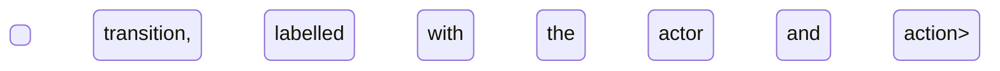

# Elimu Bora Help Center Content Rewrite

> **Date:** 2026-05-19
> **Repository:** `elimubora-docs` (the public Mintlify help center at `help.elimuboraerp.com`)
> **Status:** Approved design. Implementation plan to follow.

## Summary

Rewrite all 18 content pages in the Elimu Bora help center for accuracy and depth. The meta files (`AGENTS.md`, `CONTRIBUTING.md`, `README.md`, `docs.json`) are already correct and are not touched. The navigation locked in `docs.json` is not changed.

Every page is derived from the product itself: the source-of-truth docs under `~/Code/elimubora/docs/`, crosschecked against the codebase under `~/Code/elimubora` when a doc's `Last verified` SHA is stale or when the page touches guardian-facing behaviour. The audience is non-technical school staff, so content is task-oriented, image-rich, and exhaustive on statuses and transitions per `CONTRIBUTING.md`.

## Background

The current `.mdx` content is largely marketing-style prose with material inaccuracies and gaps. Known problems include:

- Five broken internal links across `introduction.mdx` and `roles-permissions.mdx`.
- False claims that students log in to the system. In reality, students do not log in. Guardians do log in to the tenant Filament panel under a locked, read-only `Guardian` role with access scoped to their own children's records.
- A duplicate "Who uses Elimu Bora" section in `introduction.mdx`.
- A stub `staff/overview.mdx` with no real content.
- A "cannot create custom roles" FAQ in `roles-permissions.mdx` that contradicts the product: tenants can and do create custom roles via the `RoleResource`.

Beyond these, every page is shallow. Module pages do not enumerate the records (models) that staff actually work with, do not document statuses exhaustively, and do not explain transitions.

## Goals

- Replace every page with content derived strictly from the product, written for non-technical school staff.
- Document every record (model) in each module by name, with a plain-English meaning.
- Document every workflow that staff perform, named with verb-led titles such as "Admit a student" or "Record a payment", rather than as abstract CRUD.
- Document every status a record can be in, what each status means, who can act, and how transitions are triggered. Render the lifecycle as a Mermaid `stateDiagram-v2`.
- Document the guardian read-only view per module, anchored in the authoritative paragraph in `project-overview.md`.
- Fix all five broken internal links.
- Remove the false student-login claims everywhere they appear.
- Collapse the duplicate "Who uses" section.
- Replace the `staff/overview.mdx` stub with the full page.

## Non-goals

- Do not change `docs.json` navigation.
- Do not change `AGENTS.md`, `CONTRIBUTING.md`, `README.md`, or `docs.json`.
- Do not invent product behaviour. If the source doc and the codebase disagree, the codebase wins and the source doc maintainer is flagged in the commit body.
- Do not document claims that cannot be verified against the source docs or the codebase.

## Approach

Per-page verify-then-write. For each page:

1. Read the matching source doc under `~/Code/elimubora/docs/`. Read cross-cutting docs (`project-overview.md`, `conventions.md`) where the page touches guardian access, roles, modules, or multitenancy.
2. Read the source doc's `Last verified` SHA. If it is older than the guardian-portal merge commit `253e249`, and the page touches guardian-facing behaviour, crosscheck the relevant Filament resources and policies in `~/Code/elimubora` for hidden actions and scoped queries. For `modules/users`, do a full codebase crosscheck. `identity.md` is verified at `bb871a9`, which is 71 commits behind HEAD.
3. For every status documented, open the matching enum in `~/Code/elimubora/app/Enums/` and confirm the cases. Trace transitions in the resource, observer, or service.
4. For every form field or action documented, confirm the label in the Filament resource.
5. Write the page from the skeleton below.
6. Run `mint broken-links` from the repository root.
7. Commit.

This approach is preferred over a verify-all-first sweep or a codebase-first rewrite because the source docs are designated as the canonical reference in `AGENTS.md` and are current except for `identity.md`. Targeted crosschecks suffice.

## Module page skeleton

Every module page follows this shape. Variants are noted below for non-module pages.

```
---
title: "<Module name as shown in the sidebar>"
description: "<One sentence stating the user-visible purpose>"
icon: "<lucide-icon-name>"
---

<One short paragraph: what the module does and who uses it.>

<Optional-module note (only on optional modules):
  <Note>This is an optional module. A school can enable or
  disable it under Settings.</Note>
>

## Records you'll work with
<A short table mapping every model in the module to a plain-English meaning,
one row per model. Every model in the source doc's Domain model section
appears here.>

| Record | What it is |
|---|---|
| <Record> | <Plain-English definition> |

## What you can do
<CardGroup of anchor cards linking to the workflow groups below.
Include only when the page has three or more groups.>

## <Workflow group, named by area of work>

### <Verb-led workflow name>
<Lead with the goal. Steps block. Screenshot placeholder. Name what each
step changes in the system: which records are created or updated, and
what status moves.>

[Insert screenshot: <specific page, modal, or form with named fields and
visible state>]

## Statuses and lifecycle

### <Record name> statuses
| Status | What it means | Who can act | What they can do |



## How records relate
<erDiagram, only when relationships are non-trivial.>

## Reports and analytics
<Each report: name, filters available, intended audience, where it lives
in the panel.>

## What guardians see
<Short paragraph stating read-only access and which child-scoped records
are visible. List actions hidden from the Guardian role. Skip the section
only when the module exposes nothing to guardians.>

## FAQs and troubleshooting
<AccordionGroup>
```

### Rules baked into every page

- Active voice and second person.
- Match product UI labels exactly. Verify against the Filament resource when in doubt.
- No em-dashes, no emojis, no informal language.
- Headings at `##` and `###` only. The page H1 comes from frontmatter `title`.
- Screenshot placeholders follow the format in `CONTRIBUTING.md`. The description names the page, the fields or controls, and any state worth showing. Vague placeholders such as `[Insert screenshot: the page]` are not acceptable.
- Statuses are exhaustive. Transitions are labelled with the actor and the action. Reversibility is stated.

### Non-module page variant

Get Started pages (`introduction`, `quickstart`, `roles-permissions`, `staff/overview`, `guardians/overview`) and the Settings page (`settings/overview`) use a trimmed variant of the same skeleton. The `Records you'll work with` table is replaced by a short glossary or omitted. Statuses appear only where a record on the page has a status. `erDiagram` is omitted by default.

## Workflow inventory

The inventory below is the coverage check, not the final table of contents. Final wording lands during writing. Records come from the Domain model section of each source doc. Workflow groups and their verb-led workflows are derived from the source doc's CRUD and Workflows sections.

### `modules/users` (source: `identity.md`, verified `bb871a9`, stale)

- **Records:** Student, Teacher, Staff, Guardian, StudentGuardian link, User (tenant account), Role.
- **Sign in to your panel:** First sign-in for staff, password reset, locked accounts.
- **Students:** Admit a student, Edit a student profile, Bulk-import students, Transfer a student between streams, Promote students at year-end, Deactivate or archive a student.
- **Teachers and staff:** Onboard a teacher, Onboard a non-teaching staff member, Edit a profile, Assign roles to a staff account, Deactivate a staff account.
- **Guardians:** Register a guardian, Link a guardian to one or more students, Update guardian contacts, Set the primary guardian, Unlink a guardian.

### `modules/curriculum` (source: `curriculum.md`, verified `9074bf7`)

- **Records:** Curriculum, CurriculumStage, GradeLevel, GradeStream, Subject, Pathway, GradingScale.
- **Set up the curriculum:** Choose a curriculum (CBC or 8-4-4), Add stages, Add grade levels, Add streams per grade level.
- **Subjects and pathways:** Add a subject, Assign a subject to a grade level, Create a senior school pathway, Place a student into a pathway.
- **Grading scales:** Define a grading scale, Apply a grading scale to a subject or grade.
- **Cleanup:** Force-delete an empty stage.

### `modules/academic-years` (source: `academic-years.md`, verified `9074bf7`)

- **Records:** AcademicYear, Term.
- **Set up the year:** Create an academic year, Define terms, Set start and end dates.
- **Run the year:** Activate a year, Activate a term, Close a term, Close a year, Read the current year and term anywhere in the system.
- **Statuses with diagram:** `AcademicYearStatus`, `TermStatus`.

### `modules/attendance` (pattern-setter; source: `attendance.md`, verified `c4e60f6`)

- **Records:** Register, Attendance, AttendanceFollowUp.
- **Daily registers:** Generate today's registers, Mark a register (morning, afternoon), Confirm a register, Edit a marked register, View a register's history.
- **Follow-up on absences:** Open a follow-up, Add notes, Resolve a follow-up, View a student's absence history.
- **Guardian notifications:** How absence and late notifications reach guardians, Resend a notification.
- **Statuses with diagram:** Register lifecycle, Follow-up lifecycle.

### `modules/assessments` (source: `academics.md`, verified `9074bf7`)

- **Records:** Assessment, StudentGrade, ReportCard.
- **Assessments:** Create an assessment (CAT, end-term, project), Configure the rubric, Open for entry, Close for entry.
- **Grades:** Enter grades for a subject, Bulk-import grades, Edit a grade before publish, View student performance.
- **Report cards:** Generate report cards for a term, Add class teacher remarks, Publish report cards, Download a report card PDF, Republish after a correction.
- **Statuses with diagram:** `AssessmentStatus`, ReportCard publish lifecycle.

### `modules/timetable` (source: `timetable.md`, verified `9074bf7`)

- **Records:** Timetable, Lesson, SchoolDayPeriod.
- **Configure school days:** Define school day periods, Set the weekly structure.
- **Build a timetable:** Create a teacher's timetable, Add lessons, Renew a timetable for the next term, View a class timetable.
- **Run lessons:** Expand recurring lessons, Cancel a lesson, Substitute a lesson.
- **Guardian access:** The Timetable resource is hidden from the Guardian role (codebase commit `4fc6fd4`). Documented explicitly.

### `modules/events` (source: `events.md`, verified `9074bf7`)

- **Records:** Event, EventAttendee, EventAttachment.
- **Plan events:** Create an event, Add attachments, Set the event type, Set start and end times.
- **Invite attendees:** Resolve recipients (school-wide, grade, stream, individual), Send invitations.
- **Reminders:** Configure event reminders, Send a manual reminder.
- **Term markers:** Read system-generated term markers on the calendar.

### `modules/finance` (source: `finance.md`, verified `c4e60f6`)

- **Records:** Billable, BillableVariant, Discount, Invoice, InvoiceLine, InvoicePayment, Earmark, Wallet, MpesaPaymentIntent, PaymentIntegration.
- **Set up fees:** Create a billable, Add a billable variant, Define a discount, Choose a pricing model.
- **Invoices:** Generate termly invoices, Edit an invoice line, Cancel an invoice, View an invoice's balance and history.
- **Payments:** Record a cash or bank payment, Trigger an M-Pesa STK push, Reconcile an M-Pesa Paybill (C2B) deposit, Refund a payment, Apply a credit note.
- **Wallets:** Top up a wallet, Spend from a wallet (canteen flow), Read the wallet ledger.
- **Earmarks:** Lock funds with an earmark, Release earmarked funds, Read the earmark ledger.
- **Integrations:** Configure M-Pesa, Configure a payment integration.
- **Statuses with diagram:** `InvoiceStatus`, `PaymentStatus`, `EarmarkStatus`, `QuotationStatus`.
- **Guardian view:** Read-only invoices, payments, wallets, earmarks for the guardian's own children. Action buttons (Record Payment, Lock Funds, Top Up) are hidden from the Guardian role.

### `modules/inventory` (source: `inventory.md`, verified `9074bf7`)

- **Records:** Product, Inventory, InventoryMovement, Supplier, Purchase, PurchaseItem, StockRequisition, LowStockAlert.
- **Catalogue:** Add a product, Edit a product, Categorise products.
- **Suppliers:** Add a supplier, Edit a supplier, Review a supplier's purchase history.
- **Purchases:** Create a purchase, Receive a purchase into stock, Cancel a purchase.
- **Stock:** View stock levels, Adjust stock, View movement history.
- **Requisitions:** Submit a stock requisition, Approve or reject a requisition, Issue stock against an approved requisition, Mark a requisition received.
- **Low-stock alerts:** Review alerts, Resolve an alert.
- **Statuses with diagram:** `PurchaseStatus`, `RequisitionStatus`, `AlertStatus`.

### `modules/sports` (source: `sports.md`, verified `9074bf7`)

- **Records:** Sport, Team, TeamMember, Fixture, Competition, MatchResult, IndividualResult, Award, ExternalSchool, House, HousePointEntry.
- **Sports setup:** Add a sport, Add a house, Add an external school.
- **Teams:** Create a team, Select the roster, Edit a team.
- **Competitions and fixtures:** Create a competition, Schedule a fixture, Generate a knockout bracket.
- **Results:** Record a team result, Record an individual result, Award trophies.
- **Inter-house points:** Read the automatic sweep on result publish, Record a manual house-points entry, Read house standings.

### `modules/clubs` (source: `clubs.md`, verified `9074bf7`)

- **Records:** Club, ClubMembership, ClubMeeting, MeetingAttendance, ClubActivity.
- **Set up clubs:** Create a club, Set the patron and student leaders, Set the membership policy.
- **Membership:** Add a member, Remove a member.
- **Meetings:** Schedule a meeting, Take attendance, Edit attendance.
- **Activities:** Log a club activity, See it mirrored on the calendar.
- **Reminders:** Configure meeting reminders.

### `modules/activity-log` (source: `activity-log.md`, verified `9074bf7`)

- **Records:** Activity entry.
- **Audit trail:** Browse the audit log, Filter by subject, causer, or event, Read an entry's full payload.
- **Module-gated jobs:** Read `module_gate` entries that the system writes when a job is suppressed.
- **Note up front:** The module is technically optional but functionally always on. Disabling it only hides the UI viewer; writes still happen.

### `introduction.mdx`

- What Elimu Bora is (CBC and 8-4-4, multi-tenant, school staff workflows).
- Who uses it: school leadership, teaching staff, non-teaching staff, guardians (read-only). Students do not log in.
- How the platform is organised: tenant subdomain, the tenant panel, optional modules.
- Modules at a glance: a CardGroup linking each of the 12 module pages.
- Next steps: Quickstart and Roles and permissions cards.
- Folds in: collapses the duplicate "Who uses" section; fixes the four broken links on this page.

### `quickstart.mdx`

- Sign in to the tenant subdomain with the Super Admin account.
- Configure the school identity (name, logo, contacts).
- Choose the curriculum and build grade levels, streams, subjects.
- Create the academic year and terms; activate the current term.
- Add staff and assign roles.
- Add students and link guardians.
- If Finance is enabled, set up billables and generate the first invoices.
- Start daily operations (registers, lessons).
- Drops unverified claims (MFA, "Settings → Modules" labels) unless confirmed in the codebase.

### `roles-permissions.mdx`

- Concept: permission-based RBAC. Permissions are the source of truth; roles bundle them.
- The 17 pre-seeded roles: name, intended user, default permission scope.
- Locked roles: Super Admin (full access), Guardian (read-only). Cannot be edited or deleted.
- The 14 permission groups: Identity, AcademicStructure, Curriculum, Academics, Attendance, Finance, Inventory, Sports, Clubs, Events, Library, Health, Boarding, Settings. Library, Health, and Boarding exist for future modules.
- Workflows: Create a custom role, Edit a role's permissions, Assign one or more roles to a user, Combine roles (additive).
- Role-scoped visibility: teachers see their stream, guardians see their children.
- Folds in: rewrites the false "cannot create custom roles" FAQ; fixes the broken `/modules/Users#staff` link.

### `staff/overview.mdx`

- What this page is: a map of which staff roles do what, linking out to the module pages where the work happens.
- Teaching staff: Class teachers, Subject teachers, Heads of department. What each does and where.
- Non-teaching staff: Bursar, Registrar, HR, Librarian, Storekeeper, Nurse, Matron. What each does and where. Library, Health, and Boarding are permission groups whose modules are not yet built; that is stated explicitly.
- How role assignment works (cross-link to roles-permissions).
- First sign-in.

### `guardians/overview.mdx`

- Concept: guardians log in to the tenant panel under the locked Guardian role. Read-only. Scoped to their own children.
- Access: how the school provisions the account, first sign-in, password reset.
- What you can see: your children's profiles, attendance, published report cards, invoices, payments, wallets, earmarks, events your child is invited to, clubs and sports.
- What you cannot do: no edits, no payments initiated from the panel, no wallet top-ups from the panel. The school records payments. M-Pesa STK push prompts originate from a school action and arrive on the guardian's phone.
- Notifications: M-Pesa receipts, attendance and late alerts, report card publish notices reach you regardless of whether you log in.
- Multiple children: how the scoping works.
- Folds in: removes the false "Pay Now" claim, the "child selector dashboard widget" claim, and the "mobile app" claim unless verified.

### `settings/overview.mdx`

- School profile (name, logo, contacts, primary colour).
- Modules: enable or disable optional modules.
- Integrations: M-Pesa, mail, anything else surfaced in the panel.
- Roles and permissions entry point (cross-link to roles-permissions).
- Actual Settings pages in the Filament panel are verified before writing.

## Known-issue map

| Issue | Fixed in | How |
|---|---|---|
| Broken `/roles/Overview` | `introduction.mdx` | Rewrite the Next Steps card to point to `/roles-permissions`. |
| Broken `/guardians/Overview` | `introduction.mdx` | Lowercase to `/guardians/overview`. |
| Broken `/resources/links` | `introduction.mdx` | Drop the card; the global navbar already exposes Contact Us. |
| Broken `/roles-and-access` | `introduction.mdx` | Repoint to `/roles-permissions`. |
| Broken `/modules/Users#staff` | `roles-permissions.mdx` | Repoint to `/staff/overview`. |
| False "students log in" claim | `introduction.mdx`, `roles-permissions.mdx`, `guardians/overview.mdx` | Removed during rewrite. Replaced with the accurate statement from `project-overview.md`. |
| Duplicate "Who uses Elimu Bora" | `introduction.mdx` | Collapsed to a single section. |
| `staff/overview.mdx` is a stub | `staff/overview.mdx` | Full content per the outline above. |
| False "cannot create custom roles" FAQ | `roles-permissions.mdx` | Replaced with the accurate statement from `conventions.md`. |

## Sequencing

One commit per page. The order is:

1. The design spec itself (this document).
2. `modules/finance` (primary pattern-setter, reviewed closely). Finance has the most records, the most lifecycle statuses, the most cross-module dependencies, and the heaviest guardian-portal restrictions, so it stress-tests every part of the page skeleton.
3. `modules/users` (secondary pattern-setter, reviewed closely). Identity is depended on by every other module and exercises the polymorphic, role-scoped patterns the rest of the modules inherit. Reviewing it second confirms the skeleton holds for the foundational module too.
4. `modules/attendance`, `modules/curriculum`, `modules/academic-years`, `modules/assessments`, `modules/timetable`, `modules/events`, `modules/inventory`, `modules/sports`, `modules/clubs`, `modules/activity-log`.
5. `introduction`, `quickstart`, `roles-permissions`, `staff/overview`, `guardians/overview`, `settings/overview`.

That is 1 spec commit + 18 page commits = 19 commits.

## Branching and commit conventions

- One feature branch: `docs/content-rewrite`, off `main`. Already created.
- Commit message style follows the repo's convention (`docs(<page-slug>): ...`). Each commit body cites the source-doc SHA verified against and notes any codebase crosscheck. The harness sign-off trailer is appended.
- A single pull request is opened after the pattern-setter (`modules/attendance`) is reviewed and approved. Subsequent commits push to the same branch and appear in the same PR.

## Stopping points for review

1. Spec written and committed: reviewed before any page work begins.
2. `modules/finance` written and committed: reviewed closely. Primary pattern-setter; lessons here update the skeleton before any other module page is written.
3. `modules/users` written and committed: reviewed closely. Secondary pattern-setter; confirms the skeleton holds for the foundational identity module.
4. Each subsequent page written and committed: short review per page, since the pattern is locked after the two pattern-setters.
5. PR opened: reviewed before merge.

## Verification commands

- `mint broken-links` before each commit.
- Optional: `mint dev` for local preview at `http://localhost:3000`.

## Out of scope

- Changes to `docs.json` navigation.
- Changes to `AGENTS.md`, `CONTRIBUTING.md`, `README.md`, `docs.json`.
- New screenshots. Placeholders are added with specific descriptions per `CONTRIBUTING.md`.
- Refactors to product code or product documentation.