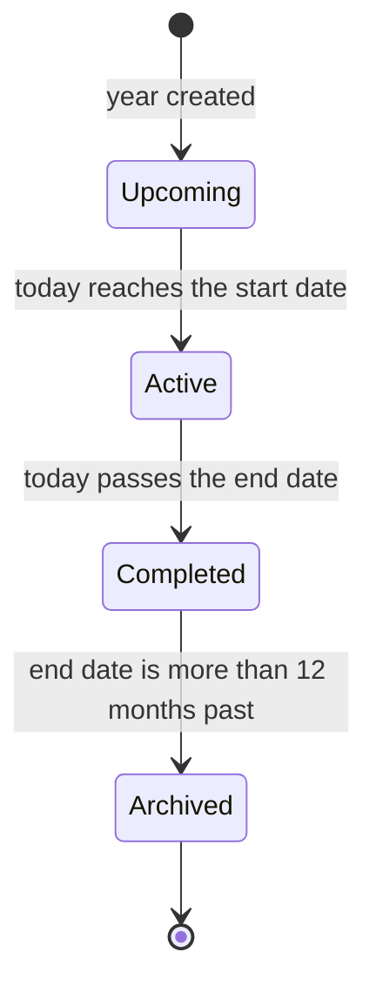

Academic Years & Terms is the calendar spine of the school. Every register a teacher marks, every assessment a class teacher enters, every invoice a bursar raises, and every event the school posts to its calendar carries a term and an academic year, so this is the time axis the rest of the panel hangs off of. School leadership does the once-per-year setup here, typically the Super Admin running through it after onboarding. Teachers, bursars, and guardians never edit these records; they read the current year and term everywhere it is shown.

## Records you'll work with

| Record | What it is |
|---|---|
| Academic year | A single school year (for example, **Academic Year 2026**), with a start date and an end date. Carries a lifecycle status (Upcoming, Active, Completed, or Archived) that the system maintains automatically based on today's date. Has exactly three terms. |
| Term | A division of the academic year, three per year (Term 1, Term 2, Term 3). Carries its own start and end dates, an optional mid-term break, a computed count of school days, and its own lifecycle status (Upcoming, Active, or Completed). |

## Set up the year

Setup is done once per academic year, typically before Term 1 opens. By default, only the **Super Admin** can read or edit academic years and terms; to let a Director or a Principal run this setup, the Super Admin grants the **Academic Years** and **Terms** permissions on that role under [Settings → Roles & Permissions](/roles-permissions).

### Create the academic year

<Steps>
  <Step title="Open Academic Years">
    In the sidebar, go to **Settings → Academic Years**, or open `/settings/academic-years`. Click **New academic year** in the page header.
  </Step>
  <Step title="Enter the year and name">
    Enter the **Year** as a four-digit value (for example, **2026**). The system will reject anything that is not four digits, and a year that already exists for your school. Enter the **Name** the panel should use for the year (the field is pre-filled with **Academic Year**, so the typical entry is **Academic Year 2026**).
  </Step>
  <Step title="Set the start and end dates">
    Pick the **Start Date** (the first day of Term 1) and the **End Date** (the last day of Term 3). The end date must come after the start date.
  </Step>
  <Step title="Save">
    Click **Create**. The year is saved in **Upcoming** status. Three **Term** rows are created automatically with estimated dates that divide your year into three roughly equal stretches with a two-week break between them. Each term also appears on the school calendar as a **Term Opening** marker and a **Term Closing** marker (see [Events](/modules/events)).
  </Step>
</Steps>

[Insert screenshot: New academic year form at /settings/academic-years/create showing the Basic Information section with Year and Name fields, and the Academic Year Dates section with Start Date and End Date pickers]

### Refine the auto-generated terms

The three terms the system creates have estimated dates; they will not match the Ministry calendar exactly. Open each term and tweak the dates, then add a mid-term break if your school takes one.

<Note>
  **You will need:** the academic year already created. Each year has its three terms generated automatically the moment the year is saved, so there is no separate step to add them.
</Note>

<Steps>
  <Step title="Open Terms">
    Go to **Settings → Terms**, or open `/settings/terms`. The list shows every term across every year; use the **Academic Year** filter to focus on the year you just created.
  </Step>
  <Step title="Edit a term">
    Click **Edit** on Term 1. The **Academic Year** and **Term Number** fields are locked because the term was created against a specific year and ordinal; tweak the **Name**, **Start Date**, and **End Date** to match the Ministry calendar.
  </Step>
  <Step title="Add a mid-term break (optional)">
    If the term has a mid-term break, fill in the **Break Start Date** and **Break End Date** in the **Mid-Term Break** section. Both dates must fall inside the term. Leave them blank if there is no break.
  </Step>
  <Step title="Save">
    Save. The system recomputes **School Days** (the count of weekdays in the term, excluding the mid-term break and any school-wide holiday days), updates the **Term Opening** and **Term Closing** calendar markers, and adds (or removes) a **Mid-Term Break** marker on the calendar. Repeat for Term 2 and Term 3.
  </Step>
</Steps>

[Insert screenshot: Edit term form at /settings/terms/{id}/edit showing the Academic Year and Term Number selects locked, the Name field, the Term Dates section with Start Date and End Date pickers, and the Mid-Term Break section with optional Break Start Date and Break End Date pickers]

### Add a term manually

Adding a term by hand is the exception, not the rule. The three terms ship with every new academic year, so the usual flow is to edit those instead. Use this workflow when one of the auto-generated terms was deleted and you need to recreate it.

<Note>
  **You will need:** the parent academic year. The **Academic Year** picker on the term form only shows years in **Upcoming** or **Active** status; terms cannot be added under a **Completed** or **Archived** year.
</Note>

<Steps>
  <Step title="Open the new term form">
    Go to **Settings → Terms** and click **New term**.
  </Step>
  <Step title="Pick the year and the term number">
    Pick the **Academic Year** and the **Term Number** (1, 2, or 3). Each year can have only one term per number, so the picker will reject a number that is already taken under the chosen year.
  </Step>
  <Step title="Name the term and set dates">
    Enter the **Name** (for example, **Term 1, 2026**), and set the **Start Date** and **End Date**. Optionally fill in the **Mid-Term Break** dates.
  </Step>
  <Step title="Save">
    Save. The term lands in **Upcoming** status and its **Term Opening**, **Term Closing**, and (optional) **Mid-Term Break** calendar markers are written.
  </Step>
</Steps>

### Delete a term or an academic year

<Note>
  **You will need:** an academic year that is not **Active**. The system blocks the deletion of an Active year because doing so would orphan the school's registers, assessments, invoices, and events. Wait until the year completes, or correct the dates on the year and let the daily status check transition it out of Active.
</Note>

Open the year or the term from its list page and click **Delete** in the header. Both are soft deletes, so the row disappears from the active list but is kept on file. Deleting a term also removes the term's **Term Opening**, **Term Closing**, and **Mid-Term Break** calendar markers; user-created events scoped to that term stay in place.

## Run the year

Once the year and its terms are set up, the panel does the running for you. Statuses move from **Upcoming** to **Active** and on to **Completed** automatically as today's date crosses each row's start and end dates, so there is no Activate or Close button to press. The two things to know are where the current year and term show up on screen, and what changes when an editable year or term becomes a read-only historical record.

### Read the current year and term

The current year and term surface in two places on the leadership dashboard. Both are hidden from guardians.

- **Dashboard filters.** At the top of the **Dashboard** page, an **Academic Year** picker and an **Academic Term** picker default to the year and term that contain today. Changing either filter re-scopes every widget on the page to the selected period; clearing them shows data across every year or every term.
- **Academic Year widget.** A leadership-only stats panel on the dashboard that shows the year's name, what percentage of the year has elapsed, and how many of the year's three terms have completed.
- **Current Term widget.** A second leadership-only stats panel showing the term's name, the days remaining until it ends, and term progress as a percentage of the term's total school days. If today falls between two terms (an inter-term break), the widget reads **No Active Term**.

Throughout the rest of the panel, the year and term appear as plain labels: on a report card's heading, on an invoice's term row, on a register's date, on an event's date, on a class timetable.

[Insert screenshot: Dashboard at / showing the Academic Year and Academic Term filter selects at the top, the Academic Year leadership widget (Academic Year name, Year Progress %, Terms Completed) and the Current Term leadership widget (Current Term name, Days Remaining, Term Progress %)]

### When a year or term becomes read-only

An academic year and each of its terms can be edited freely while they are still **Upcoming** or **Active**, with two small exceptions:

- The **Year** value on an academic year locks once the year reaches **Active** status; the four-digit label is fixed for the rest of the year's life.
- The **Start Date** on a year and on each term locks once that date has passed; once a term has actually started, you cannot move its start backwards or forwards.

Once a year's or a term's end date has passed, the entire row becomes a **read-only historical record**. The **Edit** action disappears from the list; the view stays available so anyone with the right permission can read the year and the registers, assessments, invoices, and events that were scoped to its terms, but nothing on the row can be changed. This protects the school's audit trail and reporting against late edits to a closed year.

## Statuses and lifecycle

Both lifecycle status lists run on the same rule: the panel compares today's date to the row's start and end dates each day, just after midnight, and stamps the right status. Reversibility is bounded by the dates: editing a future start date on a still-upcoming year is fine; once today has crossed those dates, the row has moved on.

### Academic year statuses

| Status | What it means | Who can act | What they can do |
|---|---|---|---|
| Upcoming | The year has not begun (today is before the **Start Date**). New years default here. | Leadership with the Academic Years permission | Edit the year and all three of its terms freely; delete the year if needed. |
| Active | The year has begun and is still in progress (the **Start Date** has been reached and the **End Date** has not been passed). | Leadership with the Academic Years permission | Edit the **Name**, the **End Date**, and refine future term dates. The **Year** field is locked; the **Start Date** is locked. The year cannot be deleted while Active. |
| Completed | The year's **End Date** has passed within the last 12 months. The row is now a read-only historical record. | (none) | Read the year and pull historical reports from the modules that scoped to its terms. |
| Archived | The year's **End Date** has been past for more than 12 months. Same read-only behaviour as Completed; the separate status simply distinguishes long-term history from a recently-closed year. | (none) | Read the year. |

There is no panel action that moves a year back to a previous status. Once a year is Completed, editing the dates does not pull it back to Active; you would need to rebuild that period in a fresh year, which is not a normal pattern.

### Term statuses

Terms follow the same pattern with one fewer step: they do not have an Archived state. A term simply stays Completed indefinitely, inheriting historical context from its parent year.

| Status | What it means | Who can act | What they can do |
|---|---|---|---|
| Upcoming | The term has not begun (today is before the **Start Date**). Auto-generated terms default here. | Leadership with the Terms permission | Edit any field except **Academic Year** and **Term Number**; delete the term. |
| Active | The term has begun and is still in progress. | Leadership with the Terms permission | Edit the **Name**, the **End Date**, and the **Mid-Term Break** dates if the break has not yet started. **Academic Year**, **Term Number**, and **Start Date** are locked. |
| Completed | The term's **End Date** has passed. The term is a read-only historical record. | (none) | Read the term and pull historical reports from the modules that scoped to it. |

## How records relate

A few user-visible relationships are worth keeping in mind:

- Each academic year has exactly three terms, named Term 1, Term 2, and Term 3. The system creates the three rows the moment the year is created, so the school never has to add them by hand on a normal year.
- Every operational record in the system carries a term, and most also carry an academic year: registers, assessments, invoices, events, fixtures, club meetings. That is why the year and term context appears on every report and every status badge across the modules: it is the time the record belongs to.
- A term's **School Days** count excludes its mid-term break and any school-wide holiday days. Changing the term dates, or adding or removing the mid-term break, recomputes the count automatically.

## Reports and analytics

Academic Years & Terms does not own its own downloadable reports. The year and term context shows up everywhere the other modules report: every [Finance](/modules/finance#reports-and-analytics), [Attendance](/modules/attendance#reports-and-analytics), and [Assessments](/modules/assessments) export carries a term column, and most can be filtered by term and academic year. The two on-screen reports for the year and the term themselves are the **Academic Year** and **Current Term** widgets on the leadership dashboard, described in [Read the current year and term](#read-the-current-year-and-term).

## What guardians see

Guardians do not see the **Academic Years** or **Terms** pages: those resources sit under **Settings**, which guardians cannot open at all. The **Academic Year** and **Current Term** dashboard widgets are also hidden from guardians, along with the dashboard's year and term filter pickers.

The year and term still reach guardians indirectly, as plain labels on every record their child is on: every report card, every invoice, every register, every event. The labels are read-only on the guardian side, exactly as they are on the staff side.

## FAQs and troubleshooting

<AccordionGroup>
  <Accordion title="Why can't I see the Academic Years or Terms pages?">
    By default, only the **Super Admin** holds the permissions that open the Academic Years and Terms resources. To let a Director, a Principal, or another role read or edit them, the Super Admin grants the **Academic Years** and **Terms** permissions to that role under [Settings → Roles & Permissions](/roles-permissions) and saves. The two resources appear in the sidebar under **Settings → Academic Structure** for anyone who holds the permission.
  </Accordion>

  <Accordion title="The auto-generated term dates are off. Do I have to recreate the year?">
    No. The dates the system writes for the three terms are estimates that divide the year into three roughly equal stretches with a two-week gap between them. They are meant to be tweaked. Open **Settings → Terms**, edit each term, and adjust the **Start Date** and **End Date** to match the Ministry calendar. The system recomputes school days and updates the calendar markers automatically.
  </Accordion>

  <Accordion title="Can I rename a term, or move it to a different year?">
    You can rename a term; the **Name** field is editable while the term is still Upcoming or Active. You cannot move a term to a different academic year, and you cannot change a term's number (1, 2, or 3) after it has been created: both fields are locked the moment the term exists. If a term was created under the wrong year, delete it and add a new term under the right year.
  </Accordion>

  <Accordion title="Can two terms be Active at the same time?">
    No. Terms in the same year run back-to-back, not in parallel, so on any given day only the one term whose date range contains today is Active. If today falls in the gap between two terms (a holiday break), no term is Active; the **Current Term** dashboard widget reads **No Active Term**.
  </Accordion>

  <Accordion title="What does the daily school days number on a term mean?">
    It is the count of weekdays in the term, excluding the mid-term break and any school-wide holiday days. The count refreshes automatically whenever a term's start date, end date, or mid-term break dates change. Modules that need a working-day count for the term (for example, attendance reporting) read this value.
  </Accordion>

  <Accordion title="How do I record a half-term break?">
    Open the term under **Settings → Terms**, fill in **Break Start Date** and **Break End Date** in the **Mid-Term Break** section, and save. A **Mid-Term Break** marker appears on the school calendar, and the term's school-day count drops to exclude the break window. Daily registers are not generated for dates inside the break.
  </Accordion>

  <Accordion title="Why can't I edit this old year or term?">
    Once the end date of a year or a term has passed, the row becomes a read-only historical record. The system protects past years and terms from late edits because the registers, assessments, invoices, and events scoped to them have been read, paid, audited, and reported on, and editing the dates after the fact would invalidate that history. The view page is still available so you can read what was there.
  </Accordion>

  <Accordion title="Why can't I delete this academic year?">
    The year is in **Active** status. The system blocks the deletion of an Active year because every other module (Finance, Attendance, Assessments, Events, Sports, Clubs) has records tied to its terms, and deleting it would orphan them. Wait for the year to complete, or correct the dates on the year if it was created with the wrong window and let the next daily status check transition it out of Active.
  </Accordion>

  <Accordion title="What happens to a guardian's in-flight invoices when a term ends?">
    Invoices keep the term they were issued against; closing the term does not write them off, cancel them, or roll them forward. A Pending or Partial invoice from a closed term stays open with the same balance, the overdue scan still runs on it, and the guardian can still pay it through any of the usual channels (see [Finance](/modules/finance#record-payments)).
  </Accordion>
</AccordionGroup>
