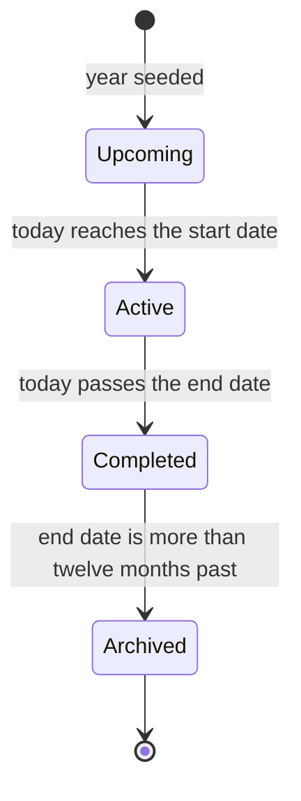
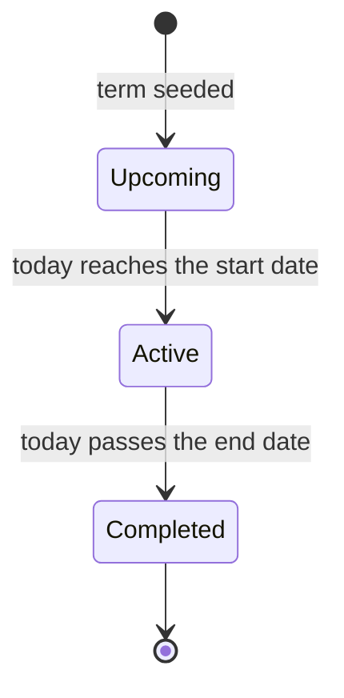

Academic Years & Terms is the calendar spine of the school. Every register a teacher marks, every assessment a class teacher enters, every invoice a bursar raises, and every event the school posts to its calendar carries a term and an academic year, so this is the time axis the rest of the panel hangs off of. Schools do not run this module: years and terms are seeded for your tenant when the school is onboarded, and their statuses move on their own as today's date crosses each row's start and end dates. Teachers, bursars, registrars, and guardians read the current year and term where the system displays it.

<Note>
  Academic years and terms are pre-seeded and maintained by the system. There is no setup work for a school to do here. Each academic year ships with its three terms (Term 1, Term 2, Term 3) already in place, with the Kenya Ministry of Education calendar filled in, and the lifecycle statuses (Upcoming, Active, Completed, Archived) flip on their own each day as today enters and leaves each row's date range. The module cannot be disabled.
</Note>

## Records you'll work with

| Record | What it is |
|---|---|
| Academic year | A single school year, such as **Academic Year 2026**, with a start date, an end date, and a lifecycle status. Every school year has exactly three terms. |
| Term | A division of the academic year, three per year, numbered Term 1, Term 2, and Term 3. Carries its own start and end dates, an optional mid-term break window, a count of school days for the term, and a lifecycle status. |

## Read the current year and term

The current year and term reach school staff in two places: as named context on the leadership dashboard, and as a plain label on every record across the rest of the system that is scoped to a term.

### On the dashboard

The **Dashboard** is the one screen built around the current year and term. Three pieces of UI work together:

- **Academic Year and Academic Term filter pickers** at the top of the page default to the year and term that contain today. Changing either picker re-scopes every widget on the page to the selected period; clearing them shows data across every year or every term.
- The **Academic Year** widget shows the active year's name, what percentage of the year has elapsed, and how many of the year's three terms have completed.
- The **Current Term** widget shows the active term's name, the days remaining until the term ends, and a percentage showing how much of the term's date range has elapsed, alongside the term's School Days count. If today falls between two terms (an inter-term break), the widget reads **No Active Term**.

The two widgets are visible to staff (school leadership, teachers, bursars, registrars, and other non-guardian roles); they are hidden from guardians.

[Insert screenshot: Dashboard at / showing the Academic Year and Academic Term filter pickers across the top, the Academic Year widget (Academic Year name, Year Progress %, Terms Completed of 3) and the Current Term widget (Current Term name, Days Remaining, Term Progress %)]

### Everywhere else

Outside the dashboard, the year and the term surface as plain labels on every record that is scoped to a term. A bursar opening an invoice sees the term it was raised against. A class teacher opening a register sees the date and, on each end-of-term report, the term name. A class teacher generating report cards picks the term to publish. A guardian reading a published report card sees the term in the heading. None of these labels are editable, on either the staff or the guardian side; they come straight from the seeded year and term records.

## Statuses and lifecycle

Both lifecycle status lists run on the same rule: each day, just after midnight, the system compares today's date to each row's start and end dates and stamps the right status. Nothing on the panel manually activates, completes, or archives a year or a term.

### Academic year statuses

| Status | What it means |
|---|---|
| Upcoming | The year has not begun. Today is before the year's **Start Date**. New years sit here until their start date arrives. |
| Active | The year has begun and is still in progress. Today is on or after the **Start Date** and on or before the **End Date**. |
| Completed | The year's **End Date** has passed within the last twelve months. The row is now a read-only historical record; reports for the year are still pullable from every other module. |
| Archived | The year's **End Date** has been past for more than twelve months. Same read-only behaviour as Completed; the separate status simply distinguishes long-term history from a recently-closed year. |

The transitions are one-way and date-driven. There is no path back to a previous status.

### Term statuses

Terms follow the same pattern with one fewer step: they do not carry a separate Archived state. A term stays Completed indefinitely, inheriting historical context from its parent year.

| Status | What it means |
|---|---|
| Upcoming | The term has not begun. Today is before the term's **Start Date**. |
| Active | The term has begun and is still in progress. Today is on or after the **Start Date** and on or before the **End Date**. |
| Completed | The term's **End Date** has passed. The term is a read-only historical record; assessments, registers, and invoices scoped to it stay readable from their owning modules. |

## How records relate

A few user-visible relationships are worth keeping in mind:

- Each academic year has exactly three terms, named Term 1, Term 2, and Term 3.
- Each term may have a mid-term break with its own start and end dates. Daily registers (see [Attendance](/modules/attendance)) are not generated for dates inside the break.
- Each term carries a **School Days** count visible on the Terms list: the count of weekdays in the term, minus the mid-term break and any seeded public-holiday or religious-holiday days.
- Kenyan public, Christian, and Muslim holidays are seeded onto the school calendar (see [Events](/modules/events)) so they appear in plain view alongside the term timeline.
- Every operational record in the system carries a term, and most also carry an academic year: registers, assessments, invoices, events, fixtures, and club meetings. That is why the year and term context appears on every report and every status badge across the rest of the panel: it is the time the record belongs to.

## Reports and analytics

Academic Years & Terms does not own its own downloadable reports. The two on-screen reports for the year and the term themselves are the **Academic Year** and **Current Term** widgets on the leadership dashboard, described in [Read the current year and term](#read-the-current-year-and-term). The year and term context shows up on every other module's reports: every [Finance](/modules/finance#reports-and-analytics), [Attendance](/modules/attendance#reports-and-analytics), and [Assessments](/modules/assessments) export carries a term column, and most can be filtered by term and academic year.

## What guardians see

Guardians do not see academic-year or term records as their own pages. The **Academic Year** widget and the **Current Term** widget on the **Dashboard** are both hidden from the Guardian role.

The year and term still reach guardians as plain labels on every record their child is on: every report card carries the term it was generated for, every invoice carries the term it was raised against, every register and event carries its date in the academic year, and the timetable for their child's stream is tied to a term. The labels are read-only on the guardian side, exactly as they are on the staff side.

## FAQs and troubleshooting

<AccordionGroup>
  <Accordion title="How does the system decide which year and term are current?">
    By comparing today's date to each row's **Start Date** and **End Date**. The academic year that contains today is the current year; the term within that year that contains today is the current term. The check runs each day just after midnight, and the dashboard widgets and filter pickers update automatically.
  </Accordion>

  <Accordion title="Can two terms be Active at the same time?">
    No. Terms in the same year run back-to-back, not in parallel, so on any given day at most one term is Active. If today falls in the gap between two terms (a holiday break), no term is Active; the **Current Term** dashboard widget reads **No Active Term**.
  </Accordion>

  <Accordion title="What does the School Days number on a term mean?">
    It is the count of weekdays in the term, minus the term's own mid-term break window and minus any seeded public-holiday or religious-holiday days that fall inside the term. Modules that need a working-day count for the term (for example, attendance reporting) read this value.
  </Accordion>

  <Accordion title="How do half-term breaks work?">
    Each term that has a mid-term break is seeded with the break's start and end dates. The term's School Days count drops to exclude the break, and daily registers (see [Attendance](/modules/attendance)) are not generated for dates inside the break window.
  </Accordion>

  <Accordion title="What happens to in-flight invoices when a term ends?">
    Invoices keep the term they were raised against; the term moving to **Completed** does not write them off, cancel them, or roll them forward. A Pending or Partial invoice from a closed term stays open with the same balance, the overdue scan still runs on it, and the guardian can still pay it through any of the usual channels (see [Finance](/modules/finance#record-payments)).
  </Accordion>

  <Accordion title="What if a date on the seeded academic year or term needs to change?">
    The seeded year and term dates follow the Kenya Ministry of Education calendar and are not edited from the panel; on a school's side there is no setup or correction step here. If a Ministry circular shifts a term-opening, term-closing, or mid-term break date, the platform team updates the seeded calendar for your school. Contact support with the circular reference and the affected dates.
  </Accordion>
</AccordionGroup>
