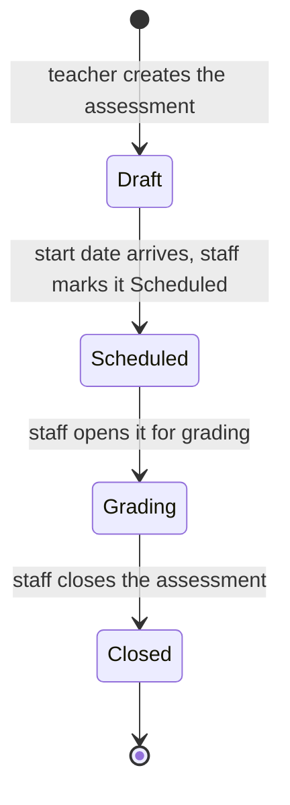
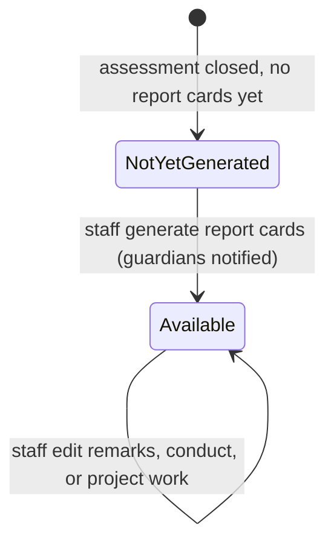

Assessments & Report Cards is where the school turns a term's work into a grade. A teacher sets up an assessment (a test, an exam, or a project) for a grade level and the subjects it covers, keys in each student's marks, and the system works out the percentage, the grade, and the class position. At the end, leadership generates a per-student report card that gathers every subject mark, the average, the overall grade, the class position, and an attendance summary into one document, ready to download or read on the guardian's own login. Teachers run the assessment and grade-entry work; school leadership oversees it and generates the report cards. Guardians read their own children's report cards and are notified each time one is ready.

## Records you'll work with

| Record | What it is |
|---|---|
| Assessment | A test, exam, or project set for one grade level (and optionally one stream) in a term, covering one or more subjects. Each examined subject carries its own paper type and total marks. Carries a lifecycle status (Draft, Scheduled, Grading, Closed). |
| Student grade | One student's mark for one subject of one assessment. Holds the raw score, the percentage worked out against that subject's total marks, the resolved grade (from the assessment's grading scale), and an optional teacher remark. |
| Report card | A per-student summary of one assessment: every subject mark, the average, the overall grade, the class position, and an attendance summary, plus space for teacher remarks, principal remarks, conduct ratings, and project work. Generated once the assessment is closed. |

## What you can do

<CardGroup cols={2}>
  <Card title="Run assessments" icon="file-pen" href="#run-assessments">
    Create an assessment, move it through its stages, and close it.
  </Card>

  <Card title="Enter grades" icon="pencil" href="#enter-grades">
    Key in or import each student's marks while the assessment is open for grading.
  </Card>

  <Card title="Report cards" icon="file-chart-column" href="#report-cards">
    Generate report cards, add remarks and conduct, and download them.
  </Card>
</CardGroup>

## Run assessments

An assessment is one test, exam, or project. It is scoped to a curriculum, a grade level, an optional single stream, and a term, and it lists the subjects being examined. Open **Assessments** in the sidebar (under **Assessments & Grading**), or go to `/assessments`.

### Create an assessment

<Note>
  **You will need:** the curriculum, grade level, optional stream, and grading scale the assessment is marked against, plus the subjects being examined. These ship pre-seeded under [Curriculum](/modules/curriculum) and are ready to pick. The **Start Date** must fall inside a term so the assessment is anchored to the right point in the year; terms are seeded under [Academic Years & Terms](/modules/academic-years).
</Note>

<Steps>
  <Step title="Open the form">
    Go to **Assessments** and click **New assessment**.
  </Step>
  <Step title="Fill in the assessment details">
    In **Assessment Details**, pick the **Curriculum**, then the **Grade Level**, then the **Stream (Optional)** (leave it on **All Streams** to cover the whole grade level), and the **Grading Scale** the marks are graded against. Enter a **Name** (for example, "Term 1 End of Term Exam"), pick the **Category** (**Formative** or **Summative**), and set the **Start Date** and an optional **End Date**.
  </Step>
  <Step title="Add the subjects examined">
    In the **Subjects** section, click **Add Subject** for each subject the assessment covers. For each one, pick the **Subject**, the **Type** (**Paper 1 - Multiple Choice**, **Paper 2 - Structured Questions**, or **Paper 3 - Practical**), and the **Total Marks** (the mark ceiling used to work out percentages, defaulting to 100).
  </Step>
  <Step title="Save">
    Click **Create**. The assessment is saved as a **Draft** and anchored to the term that contains its start date. While the start date is still in the future, the Draft stays fully editable.
  </Step>
</Steps>

[Insert screenshot: New assessment form at /assessments/create showing the Assessment Details section (Curriculum, Grade Level, Stream, Grading Scale, Name, Category, Start Date, End Date) and the Subjects repeater with Subject, Type, and Total Marks columns]

### Edit a draft assessment

A draft can be edited only while its **Start Date** is still in the future. Open the assessment from **Assessments** and click **Edit** to change any detail or adjust the subject list. Once the start date arrives, editing locks: the **Edit** action is replaced by **Mark as Scheduled** (see below), and the assessment's details are fixed from that point on.

### Move an assessment through its stages

An assessment moves through four stages. Each move is made by hand from the assessment's view page; the system does not advance the stages on a timer. Open the assessment to see the action for its current stage.

<Steps>
  <Step title="Mark as Scheduled">
    Once the start date has arrived, open the assessment and click **Mark as Scheduled**. This locks the assessment from further editing and moves it to **Scheduled**. The subject teachers and the guardians of students in the grade level or stream are notified that the assessment is set.
  </Step>
  <Step title="Open for Grading">
    When the assessment has been sat and you are ready to record marks, click **Open for Grading**. The status moves to **Grading**, the **Enter Grades** action becomes available, and the subject teachers are reminded to key in their marks.
  </Step>
  <Step title="Close Assessment">
    Once every mark is in, click **Close Assessment**. The modal offers two paths: **Close & Generate Reports Now** closes the assessment and immediately generates report cards for every student who has grades, then takes you to the Report Cards list; **Close & Generate Reports Later** just closes the assessment so you can generate the report cards from the Report Cards page when you are ready. Either way the status moves to **Closed** and grade entry is locked.
  </Step>
</Steps>

<Note>
  Closing is final. There is no action that moves a closed assessment back to **Grading**, so confirm every mark is entered before you close. After closing, the **Assessment Performance Report** download becomes available on the view page, and the only remaining step is generating report cards if you chose to do that later.
</Note>

[Insert screenshot: Assessment view page at /assessments/{id} showing the status badge and the header action for the current stage (Mark as Scheduled, Open for Grading, Enter Grades, Close Assessment, or Generate Report Cards)]

## Enter grades

Grades are keyed in on a dedicated grid, one subject at a time, with the percentage and grade worked out for each student as you type. The grid is reachable only while the assessment is in the **Grading** stage.

### Key in grades for a subject

<Note>
  **You will need:** the assessment to be in the **Grading** stage. Open it for grading first (see [Move an assessment through its stages](#move-an-assessment-through-its-stages)). The **Enter Grades** action is hidden on Draft, Scheduled, and Closed assessments, and opening the grade grid for an assessment that is not in Grading sends you back to the assessment with a notice.
</Note>

<Steps>
  <Step title="Open the grade grid">
    On the assessment's view page (or from the **Enter Grades** action on the Assessments list), click **Enter Grades**.
  </Step>
  <Step title="Pick a subject">
    Use the **Subject** selector at the top. Each option shows how many students are graded so far out of the total for that subject, with a tick once the subject is complete, so you can see your progress at a glance.
  </Step>
  <Step title="Type each student's score">
    The grid lists every student in the grade level or stream who takes the chosen subject, with their admission number, name, and stream. Type the raw **Score** in the score column; the form rejects a score above the subject's total marks. The **%** and **Grade** columns fill in automatically from the grading scale as you type, colour-coded by performance.
  </Step>
  <Step title="Add a remark (optional)">
    Type an optional **Remarks** note for any student in the remarks column. It is saved against that student's grade for the subject.
  </Step>
  <Step title="Switch subjects and finish">
    Pick the next subject and repeat. Scores save as you go. Clearing a student's score removes that grade. When every subject reads complete, the assessment is ready to close.
  </Step>
</Steps>

[Insert screenshot: Enter Grades page at /assessments/{id}/grades showing the Subject selector with its progress count, and the student grid with columns Adm No., Student Name, Stream, Score, Remarks, %, and Grade]

### Import grades from a spreadsheet

When marks are already collected in a spreadsheet, import them instead of typing each one. On the **Assessments** list, click **Import Student Grades**, follow the importer to map your columns, and upload. The import reports how many rows succeeded and failed when it finishes.

### Editing grades

While the assessment is in **Grading**, grades stay fully editable: return to the grade grid and change any score or remark as often as you need. Once the assessment is **Closed**, grade entry is locked and the grid is no longer reachable, so make every correction before closing.

## Report cards

A report card is a frozen, per-student summary of one assessment. It gathers the student's subject marks, average, overall grade, and class position, and pulls in an attendance summary for the term up to the assessment. When the [Sports](/modules/sports) and [Clubs](/modules/clubs) modules are enabled, a sports and a clubs summary are included too. Open **Report Cards** in the sidebar, or go to `/report-cards`.

### Generate report cards

<Note>
  **You will need:** the assessment to be **Closed** with grades entered. Report cards are built only for students who have at least one grade in the assessment, and only closed assessments can be picked. If you closed the assessment with **Close & Generate Reports Now**, the cards already exist and this step is done.
</Note>

<Steps>
  <Step title="Start generation">
    On the **Report Cards** list, click **Generate Report Cards**. (You can also use the **Generate Report Cards** action on a closed assessment's own view page.)
  </Step>
  <Step title="Pick the assessment">
    Pick the closed **Assessment** from the list. Only closed assessments appear.
  </Step>
  <Step title="Generate">
    Confirm. The system builds one report card per student who has grades, working out each student's average, overall grade, and class position, and capturing the attendance summary. As each card is created, the student's guardians are notified that the report card is available.
  </Step>
</Steps>

[Insert screenshot: Report Cards list at /report-cards showing columns Adm No., Student, Class, Assessment, Average, Grade badge, Position, and Generated date, with the Download All PDFs, Class Results Sheet, and Generate Report Cards header actions]

### Add remarks, conduct, and project work

Once a report card exists, open it from **Report Cards** to add the qualitative parts that scores alone do not cover. Each opens its own modal:

- **Edit Remarks** records the **Teacher's Remarks** and the **Principal's Remarks**.
- **Edit Conduct** rates the student on classroom conduct, work completion, working with others, time management, cleanliness and grooming, communication, and respect, each on an A to D scale with an optional comment.
- **Edit Project Work** captures project performance rows (performance area, skill tested, a rating, and comments) plus a teacher's comment and a guardian's comment.

Edits save straight onto the report card. Because the card is already visible to the student's guardians, any change you save here is reflected the next time they open it.

[Insert screenshot: Report card view at /report-cards/{id} showing the subject grade breakdown, average, overall grade, class position, attendance summary, and the Download PDF, Edit Remarks, Edit Conduct, and Edit Project Work header actions]

### Correct a report card

There is no "unpublish" step. The subject marks and the class ranking on a card are fixed once the assessment is closed, because a closed assessment cannot be reopened and report cards are generated only once. What you can still change are the written parts: use **Edit Remarks**, **Edit Conduct**, or **Edit Project Work** and save, and the change is live for the guardian immediately.

### Download report cards

Report cards download as PDFs. There are three download paths:

- On a single report card's view page, **Download PDF** produces that one student's report card.
- On the **Report Cards** list, **Download All PDFs** packages one PDF per student for a chosen assessment (optionally one stream) into a ZIP.
- On the **Report Cards** list, **Class Results Sheet** produces a results sheet for a chosen assessment (optionally one stream), ordered by class position, as a landscape PDF or an Excel file.

## Statuses and lifecycle

Assessments carry a four-stage status. Report cards do not carry a status of their own; their lifecycle is described below the assessment table.

### Assessment statuses

| Status | What it means | Who can act | What they can do |
|---|---|---|---|
| Draft | Being assembled. New assessments default here, and stay editable while the start date is in the future. | Teachers, leadership | Edit the details and subjects (until the start date arrives), delete the draft, or mark it scheduled once the start date arrives. |
| Scheduled | The start date has arrived and the assessment is set. Editing is locked. Subject teachers and affected guardians are notified. | Teachers, leadership | Open the assessment for grading. |
| Grading | The assessment has been sat and marks can be keyed in. Subject teachers are reminded to enter grades. | Subject teachers, leadership | Enter and edit grades, then close the assessment. |
| Closed | Marks are in and the assessment is locked. Report cards can be generated, and the performance report can be downloaded. | Leadership, teachers | Generate report cards; download the performance report. Grade entry is locked. |

The stages move one way only. There is no panel action that returns an assessment to an earlier stage, so once an assessment is closed its grades are fixed.

### Report card lifecycle

A report card has no Draft or Published toggle. It either exists or it does not. Generating it from a closed assessment is what makes it real, and a card is generated only once: a closed assessment cannot be reopened, so the grades behind the card and the ranking built from them are final. From the moment a card is generated it is visible to the student's guardians and they are notified. The only changes after that are the written parts, the teacher and principal remarks, the conduct ratings, and the project work, edited directly on the card. There is no action in the panel to hide or withdraw a card once it has been generated.

### Categorical values used on forms

These are not lifecycles. They appear on form pickers when setting up an assessment.

- **Category:** Formative (ongoing evaluation such as quizzes and homework) or Summative (end-of-period evaluation such as final exams and end-of-term projects). Set once on the assessment.
- **Type:** Paper 1 - Multiple Choice, Paper 2 - Structured Questions, or Paper 3 - Practical. Set per examined subject, so one assessment can mix paper types across its subjects.

## How records relate

A few user-visible relationships are worth keeping in mind:

- An assessment covers one grade level (and optionally one stream) and a set of subjects. Each student who sits it gets one grade per subject, and the percentage on each grade is worked out against that subject's own total marks, so subjects marked out of different totals still compare fairly.
- Each grade resolves to a grade on the assessment's grading scale, which is owned by [Curriculum](/modules/curriculum#grading-scales). Changing a grading scale's bands changes how future marks are graded; report cards keep the grade they were generated with.
- A report card belongs to one student and one assessment, so a student has one report card per assessment. Its class position is the student's rank by average among everyone graded in that assessment.
- A report card's attendance summary is drawn from the [Attendance](/modules/attendance) registers for the term up to the assessment, so attendance must have been marked for the figures to be meaningful.
- Every assessment is anchored to a term, and the term and academic year appear on the report card heading (see [Academic Years & Terms](/modules/academic-years)).

## Reports and analytics

All exports stream straight to your device. The first two live on the Assessments pages; the rest live on the Report Cards pages.

| Report | Where | Filters | Output |
|---|---|---|---|
| Subject Performance | **Subject Performance** header action on the **Assessments** list | Assessment (required, closed only), optional grade level, optional stream, format | PDF or Excel of per-subject statistics (average, highest, lowest) for the assessment |
| Assessment Performance Report | **Assessment Performance Report** header action on a single assessment's view page (visible only when the assessment is **Closed**) | Optional stream | Portrait PDF covering every subject of the assessment, with a student ranking |
| Class Results Sheet | **Class Results Sheet** header action on the **Report Cards** list | Assessment (required, closed only), optional stream, format | Landscape PDF or Excel of the assessment's results ordered by class position |
| Download All PDFs | **Download All PDFs** header action on the **Report Cards** list | Assessment (required, closed only), optional stream | ZIP of one report card PDF per student |
| Report card PDF | **Download PDF** header action on a single report card | None (single student) | Portrait PDF of that student's report card |

The exports inherit the permission of the page they sit on, so anyone who can read the assessments or report cards can pull them.

## What guardians see

Guardians sign in to the same tenant subdomain as staff. Their account holds the locked **Guardian** role, which is read-only and scoped to their own children. In this area, a guardian can read:

- **Report Cards** — a list and view restricted to their own children's report cards. Each card shows the subject marks, average, overall grade, class position, attendance summary, and any teacher and principal remarks, conduct, and project work the school added.
- **Download PDF** on any of their children's report cards.
- The **Academic Overview** tab on each child's profile, which lists the child's report cards with the average, grade, and position, and links through to the full card.

The Guardian role does **not** see:

- The **Assessments** sidebar entry or any assessment page. Guardians never see the assessment list, the grade grid, or in-progress marks.
- Any **Generate Report Cards** action.
- The **Edit Remarks**, **Edit Conduct**, or **Edit Project Work** actions on a report card. The card is read-only for guardians.
- Other guardians' children. The report card list is filtered to the guardian's own children before any other check, so even a direct link to a non-linked child's card is denied.

Even without logging in, guardians receive an email and an in-panel notification:

- When an assessment for their child's grade level or stream is scheduled.
- When a child scores below the school's low-grade threshold on a subject (the child's class teacher is alerted too).
- When a child's report card is generated and ready to read.

## FAQs and troubleshooting

<AccordionGroup>
  <Accordion title="Can a teacher edit a grade after it has been entered?">
    Yes, freely, as long as the assessment is still in the **Grading** stage. Return to the **Enter Grades** grid and change the score or remark. Once the assessment is **Closed**, the grid is locked and scores can no longer be changed, so check every mark before closing. There is no action to move a closed assessment back to Grading.
  </Accordion>

  <Accordion title="Can a report card be unpublished after guardians have seen it?">
    No, and there is no switch to do so. Report cards have no publish or unpublish state: once generated, a card is visible to the student's guardians. The subject marks and the ranking are fixed, because a closed assessment cannot be reopened and cards are generated only once. What you can still change are the written parts: open the card and use **Edit Remarks**, **Edit Conduct**, or **Edit Project Work**, and the change shows the next time the guardian opens it.
  </Accordion>

  <Accordion title="Why is the Generate Report Cards button not offering an assessment I expect?">
    Only **Closed** assessments can have report cards generated, so the picker lists closed assessments only. If the assessment you want is missing, it is still in Draft, Scheduled, or Grading; close it first (see [Move an assessment through its stages](#move-an-assessment-through-its-stages)). An assessment with no grades entered will close but produce no report cards, since cards are built only for students who have at least one grade.
  </Accordion>

  <Accordion title="A student was added to the stream after grades were entered. Will they get a report card?">
    Only if a grade is entered for them while the assessment is still in **Grading**. The grade grid lists the students currently in the grade level or stream who take the subject, so add the late student's grade before you close the assessment; they are then included when the report cards are generated. Once the assessment is closed it cannot be reopened and grades can no longer be added, so a student with no grade will not have a card for that assessment.
  </Accordion>

  <Accordion title="Why can a teacher not see an assessment another teacher created?">
    Teachers see only the assessments tied to streams they own or subjects they teach. An assessment for a grade level, stream, or subject outside a teacher's assignments does not appear on their list. Leadership and administrators are not scoped this way and see every assessment. To change what a teacher can reach, adjust their stream and subject assignments under [Users & Identity](/modules/users#manage-teachers).
  </Accordion>

  <Accordion title="How is a student's class position worked out?">
    Each student's average across the subjects they were graded in is ranked against every other student graded in the same assessment, with 1 being the highest. The position and the total number of students both print on the report card (for example, 3 / 45).
  </Accordion>

  <Accordion title="What happens to a student who missed a paper?">
    Leave that subject's score blank: no grade is recorded for it, and the report card averages only the subjects the student was actually graded in. If you would rather record a zero, enter 0 as the score so it counts toward the average.
  </Accordion>
</AccordionGroup>
