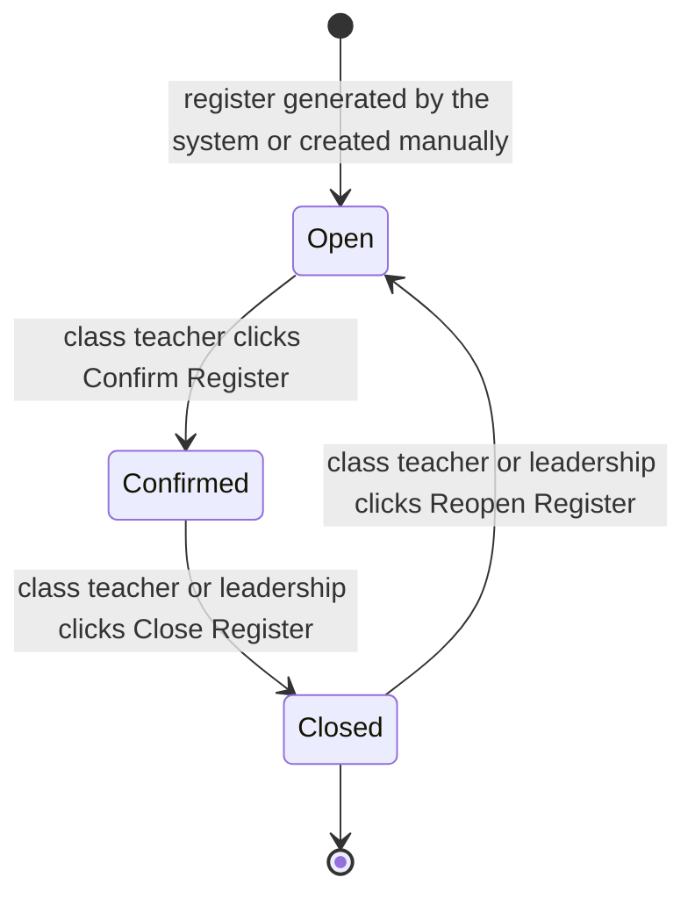
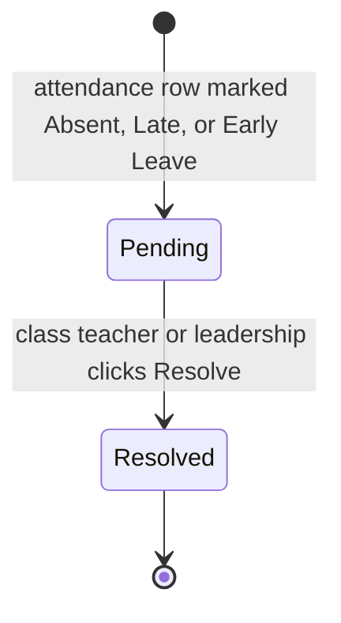

Attendance is how the school records who showed up each day: students, teachers, and non-teaching staff alike. Each register is one sheet for one date, one session (morning or afternoon), and, for student registers, one class stream. Class teachers run it day to day, marking their stream's register and confirming the sheet at the end of each session. School leadership pulls reports and watches for patterns. Guardians read their child's attendance through their own login but never touch the register itself.

<Note>
  Attendance is an optional module. A school can enable or disable it under Settings. When Attendance is disabled, the **Registers** and **Pending Follow-ups** sidebar entries disappear, daily registers stop being generated, and absence, late, and follow-up notifications stop going out. The Attendance tab on a student, teacher, or staff profile shows a locked message until the module is re-enabled. Existing attendance records are kept in place and are visible again once the module is turned back on.
</Note>

## Records you'll work with

| Record | What it is |
|---|---|
| Register | One attendance sheet, scoped to a date, a session, a register type (Student, Teacher, or Staff) and, for student registers, one class stream. Carries a lifecycle status (Open, In progress, Confirmed, Closed) and stamps the user who confirmed it. |
| Attendance row | One attendee's entry on a register. Created automatically when the register is populated, one row per attendee. Holds the attendance status (Present, Late, Absent, Early Leave, or Activity Leave), expected and actual check-in and check-out times, and any free-text notes. |
| Attendance follow-up | A request for an explanation, raised the moment an attendance row is marked Absent, Late, or Early Leave. Holds a lifecycle status (Pending or Resolved), a resolution note, the staff member who resolved it, and an optional supporting document. |

## What you can do

<CardGroup cols={2}>
  <Card title="Daily registers" icon="clipboard-list" href="#daily-registers">
    Open today's pre-generated sheet, mark attendees, confirm, close, or reopen.
  </Card>

  <Card title="Follow up on absences" icon="message-circle-warning" href="#follow-up-on-absences">
    Record a reason and attach evidence for every flagged absence.
  </Card>

  <Card title="Guardian notifications" icon="bell" href="#guardian-notifications">
    What is sent to guardians and to leadership when a register is marked.
  </Card>

  <Card title="Reports" icon="file-chart-column" href="#reports-and-analytics">
    Class attendance, staff attendance, and absenteeism exports.
  </Card>
</CardGroup>

## Daily registers

A register is one sheet for one date, one session (morning or afternoon), and, for student registers, one class stream. The school never has to create them by hand on a normal day: the system generates them automatically at the start of each weekday session. Class teachers open the day's register for their stream, flip statuses, and confirm.

### Open today's register

<Note>
  **You will need:** the day's register to have been generated. The system creates registers automatically at the start of each weekday session for every active class stream and one school-wide register each for teachers and non-teaching staff. Registers are only generated for dates that fall inside an active term, set up under [Academic Years](/modules/academic-years). Outside an active term, no auto-generation happens; see [Generate a register manually](#generate-a-register-manually) for the fallback.
</Note>

<Steps>
  <Step title="Open Registers">
    In the sidebar, click **Registers**. Today's unconfirmed student registers carry a count badge over the **Registers** menu entry so class teachers can spot their sheet quickly.
  </Step>
  <Step title="Pick your register">
    Click the row for your class and session. The view page opens with the **Attendance Records** tab below the register summary.
  </Step>
</Steps>

[Insert screenshot: Registers list at /registers showing columns Register, Type, Date, Session, Class, Attendees, Status badge, and the count badge over the Registers navigation entry]

### Generate a register manually

Use the manual creator when the auto-generation did not produce a sheet, for example on a weekend, on a public holiday, or when a stream was added partway through a session.

<Note>
  **You will need:** an active term that covers the date you pick. The manual action lets you back-date a register up to today; future dates are not allowed.
</Note>

<Steps>
  <Step title="Open Registers and click Create Register">
    On the **Registers** list, click **Create Register** in the page header.
  </Step>
  <Step title="Pick the register type">
    Pick **Student (Class)**, **Teachers**, or **Staff**. For a student register, the **Class** picker appears so you can pick the grade and stream.
  </Step>
  <Step title="Pick the date and session">
    Pick the **Date** (defaults to today) and the **Session** (**Morning** or **Afternoon**).
  </Step>
  <Step title="Save">
    Confirm. The system first checks for an existing register that matches your selection; if one already exists, you are redirected to it instead of creating a duplicate. Otherwise the new register is created, populated with one row per attendee, and opens on the view page.
  </Step>
</Steps>

### Mark a register

The **Attendance Records** tab on the register lists every attendee with one radio button per status: **P – Present**, **L – Late**, **A – Absent**, **E.L – Early Leave**, **A.L – Activity Leave**. Click the radio under the status that matches each attendee. Marking an attendee Absent, Late, or Early Leave opens a pending follow-up on that row automatically.

<Steps>
  <Step title="Mark each attendee">
    Click the radio button under the column that matches each attendee. The row updates immediately and a status-updated toast appears. The table is searchable by name or ID and can be filtered by status from the column header.
  </Step>
  <Step title="Use Mark All Present or Mark All Absent for the bulk path">
    Above the grid, click **Mark All Present** to set every row to Present in one step, then come back and adjust any exceptions. **Mark All Absent** is the reverse and is useful when most of the class is away (for example, a field trip); it also opens a pending follow-up for every row.
  </Step>
  <Step title="Use the bulk actions for a selection">
    Tick the checkboxes on a few rows, then open the bulk action menu and click **Mark Present**, **Mark Absent**, or **Mark Late** to update only the selected rows.
  </Step>
  <Step title="Record times and notes (optional)">
    On any row, click **Edit** to open a modal with **Check-in Time**, **Check-out Time**, and **Notes** fields. Times are stored alongside the status; notes are free text.
  </Step>
</Steps>

[Insert screenshot: Register view page at /registers/{id} showing the Attendance Records tab with one row per student, the P/L/A/E.L/A.L radio columns, the Mark All Present and Mark All Absent header actions, the bulk action menu, and the per-row Edit action]

### Confirm a register

Confirming the register is the class teacher's sign-off. It stamps **Confirmed By** with the signed-in teacher and **Confirmed At** with the timestamp, and moves the register's status to **Confirmed**.

<Note>
  **You will need:** every attendee on the register to be marked the way you want them recorded. After confirming, the marking grid stays editable until the register is closed; if you confirm and then notice a mistake, fix the row in place and the change saves to the register.
</Note>

<Steps>
  <Step title="Click Confirm Register">
    On the register's view page, click **Confirm Register** in the page header and confirm in the modal.
  </Step>
  <Step title="Verify the badge">
    The status badge flips to **Confirmed**. The Confirm action is replaced by **Close Register**.
  </Step>
</Steps>

### Close a register

Closing locks the sheet. Once closed, the marking grid is read-only, no more status changes, no more notes. Closing is the final step before a sheet becomes part of the audit trail and can be downloaded as a PDF.

<Steps>
  <Step title="Click Close Register">
    On a confirmed register, click **Close Register** in the page header. A confirmation modal warns that no further changes can be made; confirm.
  </Step>
  <Step title="Download the PDF if needed">
    Once closed, the **Download Report** action appears in the header. Click it for a portrait PDF of the register sheet, listing every attendee with their status, check-in and check-out times, and any notes.
  </Step>
</Steps>

### Reopen a closed register

Reopen is the escape hatch when a closed register needs to be reworked.

<Note>
  **You will need:** the register to be in **Closed** status. The **Reopen Register** action is hidden on Open, In progress, and Confirmed registers. To rework a confirmed register, either edit the rows directly while it is still Confirmed, or close it first and then reopen.
</Note>

<Steps>
  <Step title="Click Reopen Register">
    On a closed register, click **Reopen Register** in the page header and confirm.
  </Step>
  <Step title="Mark and re-confirm">
    The status flips back to **Open**, the confirmation stamps are cleared, and the marking grid is editable again. Make the corrections and re-confirm.
  </Step>
</Steps>

## Follow up on absences

When an attendance row is marked **Absent**, **Late**, or **Early Leave**, the system raises a pending follow-up on that row automatically. The follow-up holds the explanation, who the guardian spoke to, what the reason was, and any supporting document such as a medical note. Resolving the follow-up does not change the attendance status; it records the reason for the record.

### See pending follow-ups

<Steps>
  <Step title="Open Pending Follow-ups">
    In the sidebar, click **Pending Follow-ups**. The page lists every unresolved follow-up across the school, with a count badge over the menu entry for at-a-glance triage.
  </Step>
  <Step title="Filter the list">
    Use the **Status** filter at the top to flip between Pending and Resolved (Pending is the default), and the **Attendance Status** filter to narrow to Absent, Late, or Early Leave rows.
  </Step>
  <Step title="Open the matching register">
    On any row, the **View Register** action takes you to the source register so you can see the row in context.
  </Step>
</Steps>

[Insert screenshot: Pending Follow-ups list at /register-follow-ups showing columns Status badge, Attendee, Register, Type, Date, Session, Attendance, Notes, Document, Resolved By, and the Resolve and View Register actions]

### Resolve a follow-up

<Note>
  **You will need:** the follow-up to be in **Pending** status. Resolved follow-ups stay on the list for the audit trail but are no longer actionable.
</Note>

<Steps>
  <Step title="Click Resolve">
    From **Pending Follow-ups**, or from a register's **Follow-ups** tab, click **Resolve** on the row.
  </Step>
  <Step title="Enter resolution notes">
    The **Resolution Notes** field is required. Record what the guardian said, the reason given, and any next step. The field accepts a few lines of free text.
  </Step>
  <Step title="Attach a supporting document (optional)">
    Use **Supporting Document (Optional)** to upload a PDF or image up to 5 MB, typically a medical note, a permission letter, or a screenshot of a guardian's message.
  </Step>
  <Step title="Save">
    Submit. The follow-up status flips to **Resolved**, the **Resolved By** column is stamped with your name, and the resolution time is recorded.
  </Step>
</Steps>

### Resolve several follow-ups at once

When the same explanation covers several rows (a stream-wide flu outbreak, a transport breakdown), use the bulk path.

<Steps>
  <Step title="Select the rows">
    On the **Pending Follow-ups** list, tick the checkboxes of every follow-up the same note covers.
  </Step>
  <Step title="Open the bulk menu and click Resolve Selected">
    From the bulk action menu, click **Resolve Selected**.
  </Step>
  <Step title="Enter the shared resolution note">
    Type one note that applies to every selected row, then confirm. Only rows still in **Pending** are resolved; any that are already resolved are skipped.
  </Step>
</Steps>

### View a student's absence history

The student profile carries an **Attendance** tab that lists every attendance row recorded for that student, with the follow-up status alongside.

<Steps>
  <Step title="Open the student">
    From **Students**, open the student's profile and switch to the **Attendance** tab.
  </Step>
  <Step title="Read the heatmap and the table">
    The tab opens with an attendance heatmap (one cell per day, coloured by status) above a paginated table. The table can be filtered by attendance status, follow-up status, or a date range.
  </Step>
  <Step title="Add a note or resolve from here">
    On any row, use **Add Note** to attach a comment, or **Resolve** to resolve the follow-up directly without leaving the student's profile. Both actions are hidden from the Guardian role.
  </Step>
</Steps>

The same **Attendance** tab is available on a teacher's profile and on a non-teaching staff member's profile, with the same heatmap, the same filters, and the same actions.

## Guardian notifications

The system notifies the relevant audience as soon as an attendance row is marked or a register changes hands. Class teachers, leadership, and guardians all receive these without needing to log in.

| When | Who is notified | Delivery |
|---|---|---|
| A new register is generated for the day | The class teacher of the stream (student register); school leadership (teacher or staff register) | In-panel notification |
| A student is marked **Absent** | The student's linked guardians | Email and in-panel notification |
| A student is marked **Late** | The student's linked guardians | Email and in-panel notification |
| A teacher or non-teaching staff member is marked **Absent** | School leadership | Email and in-panel notification |
| A follow-up is raised on a student register | The class teacher of the stream | Email and in-panel notification |
| A follow-up is raised on a teacher or non-teaching staff register | School leadership | Email and in-panel notification |
| Today's student registers are still Open or In progress at 09:30 on a weekday | The class teacher of each unfinished register | Email and in-panel notification |

If a guardian says they did not receive a message, confirm the email and phone numbers on their profile under [Users & Identity](/modules/users#manage-guardians). To resend an absence or late notification, re-mark the row to the same status; the notification fires again for that change.

## Reports and analytics

All Attendance exports stream directly to your device as a PDF or Excel file. There are four downloads, three on the Registers list and one on a closed register's view.

| Report | Where | Filters | Output |
|---|---|---|---|
| Class Attendance Summary | Header action on the **Registers** list | Class (required), date range, optional session, output format | Landscape PDF or Excel — student-by-student attendance for one stream, sorted by attendance rate |
| Staff / Teacher Attendance | Header action on the **Registers** list | Role (Teachers, Staff, or All), date range, optional department (when Staff or All), output format | Portrait PDF or Excel — per-person totals of Present, Absent, and Late |
| Absenteeism Report | Header action on the **Registers** list | Role (Students, Teachers, Staff, or All), date range, optional status filter (Absent, Late, or Early Leave), output format | Portrait PDF or Excel — every flagged attendance row in the window, newest first |
| Register sheet | **Download Report** action on a single register (visible only when the register is **Closed**) | None — exports the register you are viewing | Portrait PDF — one register sheet with every attendee, their status, and check-in and check-out times |

The downloads inherit the permission of the Registers list, so anyone who can read the registers can pull the reports. Guardians do not see the Registers list, so these exports are not available to them.

## Statuses and lifecycle

Attendance carries two lifecycle status lists. Every transition is labelled with the action that triggers it and the actor who performs it, and reversibility is stated.

### Register statuses

| Status | What it means | Who can act | What they can do |
|---|---|---|---|
| Open | Register has been generated but no one has confirmed it yet. New registers default here. | Class teacher (student register); leadership and any attendance marker (teacher or staff register) | Mark attendees, edit times and notes, confirm the register, or close it. |
| In progress | Reserved for partially marked registers. The system tracks this status, but no current panel action sets it; in practice, a register stays Open until it is confirmed. | Same as Open | Same as Open. |
| Confirmed | A teacher has confirmed the sheet. **Confirmed By** and **Confirmed At** are stamped. Marking is still editable while the register is Confirmed. | Class teacher, leadership | Continue editing rows, close the register. |
| Closed | The register is locked. The marking grid is read-only, the audit trail is final, and **Download Report** becomes available. | Class teacher, leadership | Reopen the register (returns it to **Open** and clears the confirmation stamps); download the PDF. |

There is no panel action that moves a register directly from Confirmed back to Open. If you confirm and then notice a problem, edit the rows in place while the register is still Confirmed, or close the register and then reopen it.

### Follow-up statuses

| Status | What it means | Who can act | What they can do |
|---|---|---|---|
| Pending | Follow-up was raised when an attendance row was marked Absent, Late, or Early Leave. Awaiting a resolution note. New follow-ups default here. | Class teacher, leadership | Open the row, add a resolution note and any supporting document, then resolve it. |
| Resolved | A staff member resolved the follow-up. **Resolved By** is stamped with the staff member who acted. | (none) | View the resolution note, the resolver, and any attached document. |

Resolved is terminal. A resolved follow-up cannot be reopened. To replace a resolution note with a different one, re-mark the attendance row to its non-present status; that raises a fresh follow-up.

### Categorical values used on forms

These are not lifecycles. They appear on form pickers when creating registers or marking attendees.

- **Register type:** Student (Class), Teachers, or Staff.
- **Session:** Morning (defaults to a check-in time of 08:00) or Afternoon (13:00).
- **Attendance status:** Present, Late, Absent, Early Leave, or Activity Leave. Absent, Late, and Early Leave open a pending follow-up; Present and Activity Leave do not.

## How records relate

- A register has many attendance rows, one per attendee. Student registers are scoped to one class stream; teacher and staff registers cover the whole school.
- An attendance row may have one follow-up. The follow-up is created the moment the row is first marked Absent, Late, or Early Leave; if the row is later re-marked to Present or Activity Leave, the follow-up stays on the record for the audit trail.
- The class teacher of a stream, the teacher assigned to the stream under [Users & Identity](/modules/users#assign-or-change-a-teachers-classes), is the actor expected to confirm the student register for that stream and the recipient of the morning reminder when the register is not yet confirmed.

## What guardians see

Guardians log in to the same tenant subdomain as staff. Their account holds the locked **Guardian** role, which is read-only and scoped to their own children. In the Attendance area, the guardian can read:

- Each of their children's **Attendance** tab on the student profile. They see the heatmap, the full row-by-row history, the same status badges, the expected and actual times, and the follow-up status that staff see.

The Guardian role does **not** see:

- The **Registers** sidebar entry or any register view page.
- The **Pending Follow-ups** sidebar entry.
- The **Resolve** action on the student profile's attendance tab.
- The **Add Note** action on the student profile's attendance tab.
- Other guardians' children. The student list is filtered to the guardian's own children before any other check.

Even without logging in, guardians receive an email and an in-panel notification when one of their children is marked Absent or Late.

## FAQs and troubleshooting

<AccordionGroup>
  <Accordion title="A register I expected today is not on the list. What now?">
    Three usual causes. First, the date might fall outside an active term: registers are only generated when an [academic year](/modules/academic-years) and term cover the date. Second, the stream might have been created after the morning auto-generation ran, so use **Create Register** to add it manually. Third, the Attendance module might be turned off for your school: re-enable it under Settings, then run the manual creator.
  </Accordion>

  <Accordion title="Can I change a confirmed register?">
    Yes, while it is **Confirmed**. The marking grid stays editable until the register is **Closed**. Once closed, click **Reopen Register** to move it back to **Open**, fix the rows, and re-confirm.
  </Accordion>

  <Accordion title="Why is a student missing from the register?">
    The register is populated from the stream's current students at the moment it is generated. If a student was admitted to the stream after the register was generated, they will not appear on that day's sheet. Confirm the student is in the right stream under [Users & Identity](/modules/users#edit-a-student-profile), then either wait for the next auto-generation or generate the next register manually.
  </Accordion>

  <Accordion title="A student has left the school. What happens to their old attendance?">
    Archiving (soft-deleting) a student under [Users & Identity](/modules/users#archive-or-restore-a-student) drops them from new registers but leaves their existing attendance rows on the records they were written against. Reports for past windows still include their attendance; the student simply stops appearing on future sheets.
  </Accordion>

  <Accordion title="Are guardians notified for Late arrivals too?">
    Yes. Marking a student **Late** sends the same email and in-panel notification as marking them **Absent**. The notification names the student, the date, and the session.
  </Accordion>

  <Accordion title="What is the difference between Activity Leave and Absent?">
    **Activity Leave** is an excused absence: a school activity such as sports, a competition, or a trip is the reason the student is not in class. It does not open a follow-up and no notification goes out. **Absent** is unexcused: it opens a pending follow-up and notifies the guardians. Use **Activity Leave** any time the school knows in advance why the student is not at the register.
  </Accordion>

  <Accordion title="Can a guardian mark or correct attendance from their login?">
    No. Guardians have read-only access to the Attendance tab on their children's profiles. The **Add Note** and **Resolve** actions are hidden from the Guardian role, and the **Registers** and **Pending Follow-ups** sidebar entries are not visible to them either. To dispute or explain an absence, guardians contact the school, and a staff member resolves the follow-up on their behalf.
  </Accordion>

  <Accordion title="What happens when Attendance is turned off?">
    The **Registers** and **Pending Follow-ups** sidebar entries disappear, daily auto-generation stops, and absence, late, and follow-up notifications stop going out. The Attendance tab on a student, teacher, or staff profile shows a locked message instead of the heatmap. Existing attendance records stay in place. Turn the module back on under Settings to resume.
  </Accordion>
</AccordionGroup>
