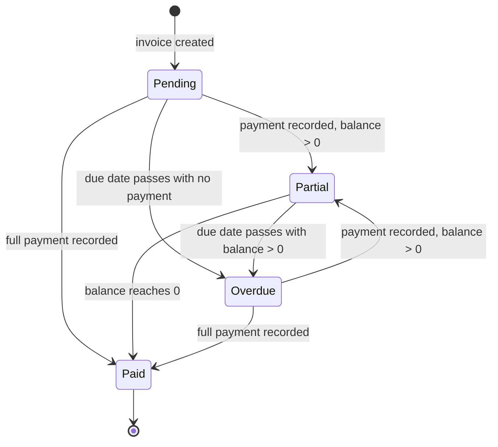
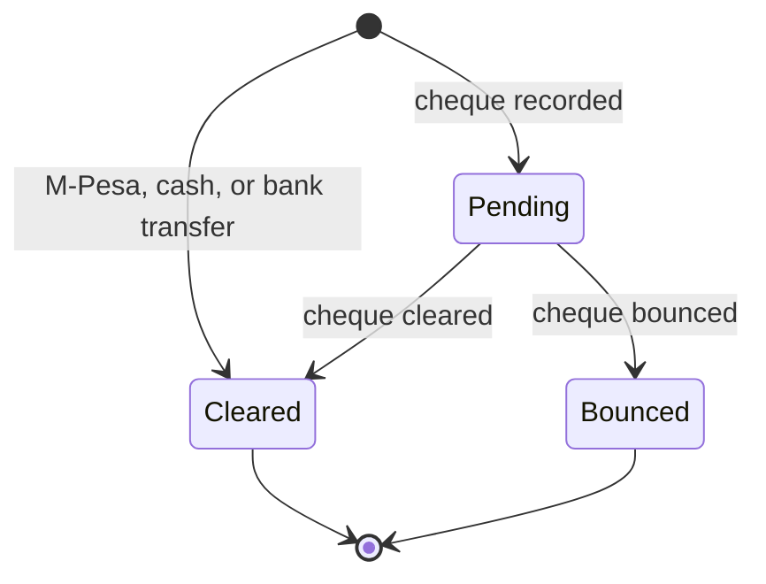
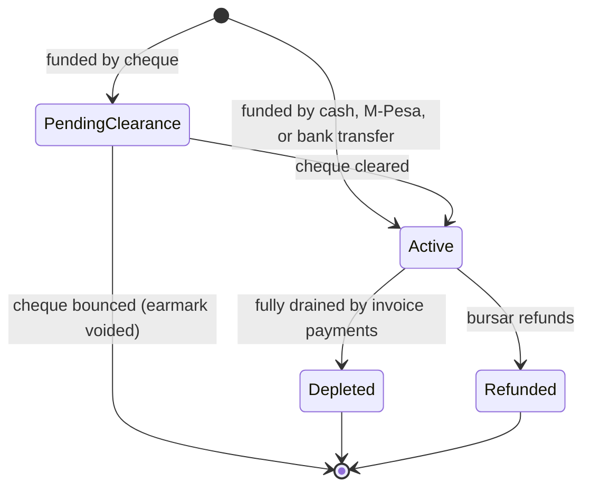

Finance covers everything a school does with money in Elimu Bora: defining fee items, issuing invoices, accepting and reconciling payments (including M-Pesa STK push and Paybill), running per-student wallets for canteen-style spending, and locking prepaid funds against specific charges with earmarks. Bursars run it day to day. School leadership uses it for oversight and reports. Guardians can view their children's invoices, payments, wallets, and earmarks, but cannot record payments or move money from the panel.

<Note>
  Finance is an optional module. A school can enable or disable it under Settings. When Finance is disabled, every Finance resource disappears from the sidebar, scheduled overdue checks are skipped for the tenant, and outbound finance notifications are dropped. Inbound M-Pesa callbacks are still received so that late callbacks for payments started before the module was disabled can still be reconciled.
</Note>

## Records you'll work with

| Record | What it is |
|---|---|
| Billable | A fee item that can be charged, such as tuition, transport, or lunch. |
| Billable group | A bundle of billables grouped together (for example, a Term 1 fees bundle). |
| Billable variant | A pricing variation of a billable when one fee has more than one price (for example, per bus route). |
| Per-stage amount | A stage-level override of a billable's price, so Grade 1 tuition can differ from Grade 8 tuition. |
| Invoice | A bill issued to a student, teacher, or staff member, scoped to a term. |
| Invoice line | One charge on an invoice, tied to a billable or recorded as ad-hoc. The line's discount is filled in automatically when the invoice is created, from any active discount the student's guardians hold for that billable. |
| Discount | A reduction held on a guardian, scoped to one billable, expressed as a percentage or a fixed amount, with an effective date range. Applied automatically to matching invoice lines. |
| Invoice payment | A payment recorded against an invoice. |
| Payment allocation | The split of one payment across the lines of its invoice. |
| Wallet | A per-student credit balance for student spending (school canteen and similar non-invoice use). |
| Wallet transaction | A credit or debit entry on a wallet, with a balance snapshot for audit. |
| Earmark | Prepaid funds locked against a specific billable for a student, drained automatically when a matching invoice payment is recorded. |
| Earmark transaction | A funding, drain, refund, or bounce entry on an earmark, with a balance snapshot for audit. |
| Sponsor | A third party paying for an invoice payment (Government, NGO, Corporate, or Individual). |
| M-Pesa integration | The school's stored M-Pesa credentials (Paybill shortcode, passkey, consumer key and secret) and the callback URLs registered with Safaricom. |

## What you can do

<CardGroup cols={2}>
  <Card title="Set up fees" icon="list-check" href="#set-up-fees">
    Define billables, variants, per-stage amounts, and guardian-level discounts.
  </Card>

  <Card title="Issue invoices" icon="file-text" href="#issue-invoices">
    Create invoices, add lines with optional discounts, and read the balance.
  </Card>

  <Card title="Record payments" icon="hand-coins" href="#record-payments">
    Cash, bank transfer, cheque, M-Pesa STK push, and Paybill (C2B).
  </Card>

  <Card title="Run wallets" icon="piggy-bank" href="#run-wallets">
    Credit a wallet for canteen-style spending, debit it as funds are used, and handle low-balance notifications.
  </Card>

  <Card title="Manage earmarks" icon="lock" href="#manage-earmarks">
    Lock prepaid funds against a billable; let them drain automatically, or refund what is left.
  </Card>

  <Card title="Attach sponsors" icon="handshake" href="#attach-sponsors">
    Tag payments with the sponsor that funded them for reconciliation.
  </Card>
</CardGroup>

## Set up fees

Fees are built from billables. Each billable has a pricing model that decides what other rows are required.

### Create a billable

<Steps>
  <Step title="Open Billables">
    In the sidebar, go to **Billables** and click **New billable**.
  </Step>
  <Step title="Name the billable and pick a pricing model">
    Pick one of three pricing models:

    - **Flat**: a single price for everyone. Enter the **Default amount**.
    - **Variants**: different prices for different choices (for example, three bus routes). You will add variant rows next.
    - **Per unit**: price multiplied by a quantity entered on each invoice line.
  </Step>
  <Step title="Optionally group the billable">
    Pick a **Billable group** to bundle this billable with related ones (for example, "Term 1 fees"). Groups make it easier to attach a full bundle to an invoice in one step.
  </Step>
  <Step title="Save">
    Click **Save**. The billable becomes available for invoice lines and earmarks.
  </Step>
</Steps>

[Insert screenshot: Billables list at /billables with columns Name, Pricing model, Default amount, Group, and the New billable button in the header]

### Add a billable variant

<Note>
  **You will need:** a billable whose pricing model is set to **Variants**. Variants do not apply to **Flat** or **Per unit** billables.
</Note>

When the pricing model is **Variants**, each variant carries its own amount.

<Steps>
  <Step title="Open the billable">
    From the Billables list, open the parent billable.
  </Step>
  <Step title="Add a variant row">
    In the **Variants** section, click **Add variant**. Enter a label (for example, "Route A: Karen") and the amount.
  </Step>
  <Step title="Save">
    Save the billable. The new variant becomes selectable when an invoice line uses this billable.
  </Step>
</Steps>

### Set a per-stage amount

Use per-stage amounts to charge different prices by curriculum stage (for example, Grade 1 tuition is lower than Grade 8 tuition). Curriculum stages ship pre-seeded and read-only, so there is no setup before this step.

<Steps>
  <Step title="Open the billable and scroll to Per-stage amounts">
    Open the parent billable and find the **Per-stage amounts** section.
  </Step>
  <Step title="Add an override row per stage">
    Pick a curriculum stage and enter the amount for that stage. Stages without a per-stage row fall back to the default amount.
  </Step>
  <Step title="Save">
    Save the billable. Invoice generation will use the per-stage amount for students in the matching stage.
  </Step>
</Steps>

### Hold a discount for a guardian

<Note>
  **You will need:** the billable the discount applies to, and the guardian record. Discounts are held on the **guardian**, not the student. When an invoice is later raised for one of that guardian's children for the matching billable, the system applies the discount automatically.
</Note>

A discount reduces the line amount for a specific billable on any invoice raised for the guardian's children. If a child has more than one guardian and more than one of them holds a discount for the same billable, the largest applicable discount is the one that lands on the line.

<Steps>
  <Step title="Open the guardian">
    Go to **Guardians** and open the guardian who is entitled to the discount.
  </Step>
  <Step title="Open the Discounts tab">
    Switch to the **Discounts** tab on the guardian's profile.
  </Step>
  <Step title="Add a discount">
    Click the create action. Pick the **Billable** the discount applies to, the **Type** (**Percentage** or **Amount**), and enter the value. Pick the **Effective From** date (defaults to today) and an optional **Effective Until** date. Leave **Active** on. Add notes if useful.
  </Step>
  <Step title="Save">
    Save. The discount is now in effect. The next invoice line raised for one of this guardian's children that charges the same billable, within the effective date range, will pick up the discount automatically.
  </Step>
</Steps>

## Issue invoices

An invoice is the document a school issues to a student, teacher, or staff member. Most invoices target students. The invoice is scoped to a single term.

### Create an invoice

<Note>
  **You will need:** an active term, the student, teacher, or staff member the invoice is for, and (if you want to use a billable rather than an ad-hoc line) the billable already created. If the billable does not exist yet, add it first under [Set up fees](#set-up-fees), or record the charge as an ad-hoc line with a typed label and amount.
</Note>

<Steps>
  <Step title="Open Invoices">
    Go to **Invoices** and click **New invoice**.
  </Step>
  <Step title="Pick the invoiceable">
    Pick whether the invoice is for a **Student**, **Teacher**, or **Staff** member, then pick the specific person.
  </Step>
  <Step title="Pick the term and due date">
    Pick the term this invoice covers, and an optional due date. The due date is what the overdue scan uses.
  </Step>
  <Step title="Add invoice lines">
    Add one line per charge. Each line is either tied to a billable (and inherits its amount, including any per-stage override for the student's grade stage) or recorded as an ad-hoc line with a label and amount you type in. The bursar does not enter discounts on the line itself: when the line is saved, the system looks up active **Discounts** the student's guardians hold for that billable and applies the largest applicable one automatically, snapshotting it onto the line. See [Hold a discount for a guardian](#hold-a-discount-for-a-guardian).
  </Step>
  <Step title="Save the invoice">
    Click **Save**. The invoice starts in **Pending** status. Adding lines automatically recomputes the invoice total. A notification is queued to the invoiceable's guardians (for student invoices) or to the staff or teacher themselves.
  </Step>
</Steps>

[Insert screenshot: New invoice form at /invoices/create showing the Invoiceable picker (Student/Teacher/Staff), Term selector, Due date, and the repeating Line Items block with Billable, Label, Unit Amount, and Qty columns]

### Read an invoice's balance and history

<Note>
  **Invoices are immutable once created.** The invoice's lines, amounts, and payments are part of the school's ledger and cannot be edited or deleted from the panel. If a charge was wrong, raise a new invoice for the corrected amount, or wait for the payment flow to balance things out (a refund happens on the earmark side, not on the invoice itself).
</Note>

The invoice view page shows the running total, the **Total paid**, and the current **Balance**. The **Lines** tab lists every charge with its discount and total. The **Payments** tab lists every payment with its method and status. The **Activity log** captures every change.

[Insert screenshot: Invoice view page at /invoices/{id} showing the header summary (Amount, Total paid, Balance, Status badge), the Lines relation manager, and the Payments relation manager with method and status columns]

## Record payments

All payments are recorded from one place: the **Record Invoice Payment** modal. Pick a method on the form, fill in the method-specific fields, and save. M-Pesa is one of the methods; selecting it reveals a phone-number input and lets the bursar send an STK push.

Payment methods available on the form: **M-Pesa**, **Cash**, **Bank Transfer**, **Cheque**. The system also sets two internal methods automatically when they apply: **Earmark** (when a payment is settled from an earmark balance) and **Wallet refund** (when an earmark is refunded back into a wallet).

### Record a cash or bank transfer payment

<Steps>
  <Step title="Open the invoice">
    Open the invoice from **Invoices**.
  </Step>
  <Step title="Open the payment modal">
    On the invoice view page, click **Record Invoice Payment**.
  </Step>
  <Step title="Pick the method and enter the amount">
    Pick **Cash** or **Bank Transfer**. Enter the amount. For bank transfers, record the bank reference.
  </Step>
  <Step title="Save">
    Save the payment. Cash and bank transfer payments go straight to **Cleared** status. The payment is allocated proportionally across the invoice's unpaid lines unless you override the allocation manually. The invoice status moves to **Partial** or **Paid** based on the new balance. A dashboard notification appears for the school, and a receipt PDF is emailed to the invoice owner (the guardian for a student invoice, or the staff or teacher for theirs).
  </Step>
</Steps>

### Record a cheque payment

Cheques start in **Pending** until a bursar marks them cleared or bounced.

<Steps>
  <Step title="Open the payment modal">
    On the invoice view page, click **Record Invoice Payment** and pick **Cheque** as the method.
  </Step>
  <Step title="Enter cheque details">
    Enter the cheque number, the drawing bank, the cheque drawn date, and the amount.
  </Step>
  <Step title="Save">
    Save the payment. The payment status is **Pending**. The invoice balance is not yet credited because the cheque has not cleared.
  </Step>
</Steps>

### Acknowledge a cheque

<Note>
  **You will need:** a cheque payment in **Pending** status on the invoice. The action is only available for cheque payments that have not yet cleared.
</Note>

<Steps>
  <Step title="Open the payment">
    On the invoice's **Payments** tab, find the cheque row.
  </Step>
  <Step title="Use Acknowledge">
    Use the **Acknowledge** action and confirm. The payment status becomes **Cleared** and the invoice is credited. The invoice status moves to **Partial** or **Paid**, and the receipt PDF is emailed to the invoice owner.
  </Step>
</Steps>

### Mark a cheque bounced

<Note>
  **You will need:** a cheque payment in **Pending** status on the invoice, and the system billable **Bounced Cheque Penalty** present in your Billables list (it is pre-seeded; if it is missing, ask a Super Admin to re-seed the billables).
</Note>

<Steps>
  <Step title="Open the payment">
    On the invoice's **Payments** tab, find the cheque row.
  </Step>
  <Step title="Use Mark bounced">
    Use the **Mark bounced** action.
  </Step>
  <Step title="Enter the bounce reason and the penalty amount">
    The modal prompts for a **Bounce reason** (free text) and a **Penalty amount** (the fine to charge the guardian). The penalty defaults to the **Bounced Cheque Penalty** billable's default amount; the bursar can override it for this case.
  </Step>
  <Step title="Confirm">
    Confirm. The payment status becomes **Bounced** (terminal). A new **Bounced cheque penalty** line is added to the same invoice for the penalty amount, increasing the balance. A **Cheque bounced** notification goes to the relevant guardians and a dashboard notification appears for the bursar.
  </Step>
</Steps>

### Trigger an M-Pesa STK push

<Note>
  **You will need:** the M-Pesa integration configured under [Configure M-Pesa](#configure-m-pesa), and a phone number for the guardian who will pay. The guardian's phone number is on their profile under [Users & Identity](/modules/users). Without the integration, the **Record Invoice Payment** modal does not show the phone-number input for the M-Pesa method, because there is nowhere to send the prompt.
</Note>

M-Pesa STK push is initiated from the school side. The bursar opens the **Record Invoice Payment** modal, picks M-Pesa, enters the guardian's phone number, and sends the prompt. Guardians cannot initiate STK push from their own logins; the **Record Invoice Payment** action is hidden from the Guardian role.

<Steps>
  <Step title="Open the invoice">
    Open the invoice from **Invoices**, or from the **Invoices** tab on the student's profile.
  </Step>
  <Step title="Open the payment modal and pick M-Pesa">
    Click **Record Invoice Payment** and pick **M-Pesa**. The phone-number input appears.
  </Step>
  <Step title="Enter the phone and amount, then send the prompt">
    Enter the guardian's phone number and the amount. Click **Record Payment** to send the prompt. The system creates an M-Pesa payment intent (status **Pending**) and Safaricom delivers a SIM Toolkit prompt to the guardian's phone.
  </Step>
  <Step title="Wait for the callback">
    The guardian enters their M-Pesa PIN on their phone. Safaricom posts a callback to the school's tenant subdomain. The system matches the callback to the payment intent, creates a cleared invoice payment, and recomputes the invoice balance. A dashboard notification appears for the school, and a receipt PDF is emailed to the invoice owner.
  </Step>
</Steps>

[Insert screenshot: Record Invoice Payment modal launched from a student invoice showing Method set to M-Pesa with the Phone number and Amount fields and the Record Payment button]

### Reconcile an M-Pesa Paybill (C2B) payment

<Note>
  **You will need:** the M-Pesa integration configured under [Configure M-Pesa](#configure-m-pesa), and the Paybill callback URLs registered with Safaricom Daraja. Without these URLs, deposits will land in the Paybill account but the system will not know about them.
</Note>

When a guardian pays the school's Paybill number from their own M-Pesa menu, the same callback infrastructure receives the deposit and applies it to the matching invoice automatically.

<Steps>
  <Step title="Guardian pays the Paybill">
    The guardian sends money to the school's M-Pesa Paybill number. The guardian enters the **invoice ID** as the account reference (this is the number shown on the invoice). The invoice ID, not the admission number, is what the system uses to match the deposit to the right invoice.
  </Step>
  <Step title="System receives the C2B callback">
    Safaricom posts a Confirmation callback to the school's tenant subdomain. The system writes an M-Pesa payment intent, looks up the invoice by the account reference, and creates a cleared invoice payment for the deposited amount.
  </Step>
  <Step title="Verify in the panel">
    The payment appears on the **Payments** tab of the resolved invoice within seconds. The invoice status moves to **Partial** or **Paid** based on the new balance.
  </Step>
</Steps>

## Run wallets

Each student has a single wallet. A wallet is auto-created when the student is admitted, so there is nothing to set up beforehand.

The wallet is a credit balance for **student spending outside the invoicing flow**: school canteen purchases, similar small-value drawdowns the school manages directly. **Wallets cannot be used to settle invoices.** Use [earmarks](#manage-earmarks) for prepaid funds that should pay down a specific invoice charge.

### Credit a wallet (top up)

<Note>
  **You will need:** for **M-Pesa** top-ups, the M-Pesa integration configured under [Configure M-Pesa](#configure-m-pesa) and a phone number on file for the guardian. Cash, bank transfer, and cheque top-ups do not need any integration.
</Note>

<Steps>
  <Step title="Open the wallet">
    Open **Wallets** and pick the student's wallet, or open the student profile and use the **Wallet** tab.
  </Step>
  <Step title="Click Credit Wallet">
    Click **Credit Wallet**. Pick the funding method: **M-Pesa**, **Cash**, **Bank Transfer**, or **Cheque**. For M-Pesa, enter the guardian's phone number to send the STK push. For cheque, enter the cheque number, the drawing bank, and the cheque drawn date. Add a short description so the ledger entry is self-explanatory.
  </Step>
  <Step title="Save">
    Save. For cash, bank transfer, and successful M-Pesa STK pushes, the wallet is credited immediately, the balance is updated with a before-and-after snapshot, and a **Wallet funded** notification is sent to the student's guardians. For cheques, the wallet transaction is **Pending** until the cheque is acknowledged or marked bounced. If a cheque bounces, you are prompted for a bounce reason and an optional penalty amount; when a penalty greater than zero is entered, a penalty invoice is raised against the student.
  </Step>
</Steps>

### Debit a wallet (record spending)

<Note>
  **You will need:** a wallet with a positive balance. The **Debit Wallet** action is hidden when the balance is zero. Debits cover student spending that happens **outside** the invoice flow (school canteen, kiosk, similar) and are recorded by the bursar to keep the wallet ledger accurate. To settle an invoice from prepaid funds, use an [earmark](#manage-earmarks) instead.
</Note>

<Steps>
  <Step title="Open the wallet">
    Open **Wallets** and pick the student's wallet, or open the student profile and use the **Wallet** tab.
  </Step>
  <Step title="Click Debit Wallet">
    Click **Debit Wallet**. Pick the method (**Cash** or **Bank Transfer**) and enter the amount; the form caps the amount at the available balance. Add a short description so the entry on the ledger explains what the money was spent on.
  </Step>
  <Step title="Save">
    Save. A debit wallet transaction is written, the balance is updated, and the **Wallet debited** notification is queued to the student's guardians. If the debit takes the balance below the low-balance threshold, the **Wallet low balance** notification fires as well.
  </Step>
</Steps>

### Acknowledge a cheque on a wallet

<Note>
  **You will need:** a cheque-funded wallet transaction in **Pending** status (from a Credit Wallet step that used the Cheque method).
</Note>

On the wallet's **Transactions** tab, find the pending cheque row and use the **Acknowledge Cheque** action. The wallet transaction status becomes Cleared, the wallet balance is updated, and the **Wallet funded** notification fires. If the cheque bounces instead, use **Mark Bounced**; the modal prompts for a bounce reason and an optional penalty amount that, when greater than zero, raises a penalty invoice against the student.

### Read the wallet ledger

Open the wallet and scroll to the **Transactions** tab. Every credit and debit is listed in date order with the amount, balance before, balance after, and the related earmark transaction (when the entry comes from an earmark refund-to-wallet). Use the **Wallet statement** header action to download a single-wallet PDF, or the **Wallet balances report** on the wallets list to export every wallet's balance to PDF or Excel.

[Insert screenshot: Wallet view page at /wallets/{id} showing the balance summary, the Transactions tab with columns Date, Type, Amount, Balance after, Related, and the Wallet statement action in the header]

### Wallet low-balance notification

When a debit takes a wallet below the configured low-balance threshold, the system sends a **Wallet low balance** notification to the student's guardians so they can top up. The threshold is set by the school's deployment and is not changed from the staff panel.

## Manage earmarks

An earmark is prepaid funds locked against a **specific billable** for a **specific student**. When the bursar later records a payment on an invoice that charges the same billable for the same student, the earmark drains automatically and settles that line. Earmarks are how a school accepts payment in advance for a known charge (for example, paying the Term 2 transport fee in January).

Earmarks are **separate from wallets**. Funding an earmark does not pull money from the wallet; it is its own deposit. Refunding an earmark can credit the wallet (one of the refund destinations) but the two balances are not the same balance.

### Lock funds with an earmark (Prepay)

<Note>
  **You will need:** the target billable to exist. For **M-Pesa** funding, the M-Pesa integration must be configured under [Configure M-Pesa](#configure-m-pesa) and a phone number must be on file for the guardian. Cash, bank transfer, and cheque funding do not need any integration.
</Note>

<Steps>
  <Step title="Open the student or the billable">
    Open the student profile and pick the **Earmarks** tab, or open the billable and use the **Prepay Billable** action.
  </Step>
  <Step title="Pick the billable and the funding method">
    Pick the billable the earmark is for. Pick the funding method: **Cash**, **M-Pesa**, **Bank Transfer**, or **Cheque**.
  </Step>
  <Step title="Enter the amount and confirm">
    Enter the amount. Confirm. For non-cheque methods the earmark starts in **Active**; a **Funding** entry is added to the earmark transaction ledger. For cheques the earmark starts in **Pending clearance** until the cheque clears; if the cheque bounces, the earmark funding is reversed and you are prompted for an optional penalty amount that, when greater than zero, raises a penalty invoice against the student. An **Earmark cheque bounced** notification is sent to the relevant guardians.
  </Step>
</Steps>

[Insert screenshot: Earmark view page at /earmarks/{id} showing the reserved amount, the linked billable, the student, the status badge (Active, Pending clearance, Depleted, Refunded), and the Refund action]

### Drain an earmark against an invoice payment

Earmark drain happens automatically. When the bursar records an invoice payment for the same student and the same billable the earmark covers, the system can settle the payment from the earmark instead of asking the guardian to pay again. A **Drain** entry is added to the earmark transaction ledger and the invoice is credited. When the earmark balance reaches zero, the earmark status moves to **Depleted**.

### Refund an earmark

<Note>
  **You will need:** an earmark in **Active** status with a positive remaining balance. Depleted, Refunded, and Pending clearance earmarks cannot be refunded.
</Note>

<Steps>
  <Step title="Open the earmark">
    Open the earmark from **Earmarks**, or from the **Earmarks** tab on the student's profile.
  </Step>
  <Step title="Pick a refund destination">
    Click **Refund** and pick:

    - **External payout**: the bursar pays out the remaining balance through a channel outside the system (cash at the office, bank transfer, M-Pesa B2C). The earmark transaction ledger gets a **Refund** entry. Elimu Bora records the refund but does not move the money.
    - **Credit to wallet**: the remaining balance is moved to the student's wallet. The earmark ledger gets a **Refund to wallet** entry, and the wallet records a matching credit.
  </Step>
  <Step title="Confirm">
    Confirm. The earmark status becomes **Refunded** (terminal).
  </Step>
</Steps>

### Read the earmark ledger

Open the earmark and scroll to the **Transactions** tab. Every funding, drain, refund, refund-to-wallet, and bounce entry is listed in date order.

## Attach sponsors

A sponsor is a third party paying for a student's charges, such as a government scholarship or an NGO. Sponsors are attached to **payments**, not invoices: when a sponsor pays, the bursar records the payment and tags it with the sponsor so the reconciliation report can group the payment under that sponsor.

### Add a sponsor record

<Steps>
  <Step title="Open Sponsors">
    Go to **Sponsors** and click **New sponsor**.
  </Step>
  <Step title="Pick a type and enter contact details">
    Pick a sponsor type: **Government**, **NGO**, **Individual**, or **Corporate**. Enter the sponsor's contact details.
  </Step>
  <Step title="Save">
    Save. The sponsor is now selectable on any new invoice payment.
  </Step>
</Steps>

### Attach a sponsor to a payment

<Note>
  **You will need:** the sponsor record to exist before you record the payment.
</Note>

When you record an invoice payment, pick the sponsor from the **Sponsor** field on the payment form. The payment is tagged. Later, the bursar can group payments by sponsor on the reconciliation reports.

## Configure M-Pesa

<Note>
  **You will need:** an M-Pesa Daraja account with the credentials Safaricom issued for your Paybill: shortcode, passkey, consumer key, and consumer secret. If you do not have these, contact Safaricom to register your school as a business and request Daraja API access.
</Note>

A school's M-Pesa credentials live on a **Payment integration** row. Read or change them is restricted to school leadership and bursars in the default role setup.

<Steps>
  <Step title="Open Payment Integrations">
    Go to **Payment Integrations** in the sidebar.
  </Step>
  <Step title="Add or edit the M-Pesa integration">
    Pick the M-Pesa row, or add one if missing. Enter the shortcode, the passkey, the consumer key, and the consumer secret. These come from the school's Safaricom Daraja account.
  </Step>
  <Step title="Register callback URLs with Safaricom">
    In Safaricom Daraja, set the callback URLs to point at the school's tenant subdomain:

    - STK push: `https://<your-subdomain>.elimuboraerp.com/api/mpesa/stk/callback`
    - C2B validation: `https://<your-subdomain>.elimuboraerp.com/api/mpesa/c2b/validation`
    - C2B confirmation: `https://<your-subdomain>.elimuboraerp.com/api/mpesa/c2b/confirmation`
    - B2C result: `https://<your-subdomain>.elimuboraerp.com/api/mpesa/b2c/result`

    Other Daraja callbacks (timeouts, status results, reversals, balance queries) use the matching paths under `/api/mpesa/`.
  </Step>
  <Step title="Test with a small STK push">
    Run a small test STK push against a real invoice to confirm the callback round-trips before going live.
  </Step>
</Steps>

## Statuses and lifecycle

Finance carries three lifecycle status lists. Each table lists every status, every transition is labelled with the actor or trigger that moves the record, and reversibility is stated.

### Invoice statuses

| Status | What it means | Who can act | What they can do |
|---|---|---|---|
| Pending | New invoice with no cleared payments yet. | Bursar, school leadership | Record a payment. |
| Partial | Some payment has cleared. Balance is still positive. | Bursar, school leadership | Record additional payments. |
| Paid | The full amount has cleared. Balance is zero. | Bursar, school leadership | View the receipt history. The invoice is settled. |
| Overdue | The due date has passed and the balance is positive. Set by the daily overdue scan at 08:00, which also sends an overdue notification. | Bursar, school leadership | Record a payment (returns to Partial or Paid). |

A cheque bounce on a previously-cleared cheque payment can reduce the **Total paid** and return a Paid invoice to Partial; in addition, a penalty line is added to the invoice for the bounce, which increases the **Amount**.

### Payment statuses

| Status | What it means | Who can act | What they can do |
|---|---|---|---|
| Pending | Recorded but not yet usable. Typically a cheque awaiting clearance. | Bursar | Acknowledge the cheque once funds arrive, or mark bounced if the cheque bounces. |
| Cleared | Funds confirmed. The payment counts toward the invoice's **Total paid**. | (none) | View the audit trail and the receipt. |
| Bounced | A cheque bounced. The credit is reversed and a penalty line is added to the invoice for the configured penalty amount. A **Cheque bounced** notification is sent to the relevant guardians. | (none) | View the bounce reason on the payment; record a replacement payment when the funds arrive again. |

Cleared and Bounced are terminal for the payment itself. To reverse a Cleared payment, mark the underlying cheque bounced (for cheque payments) or record a compensating earmark refund elsewhere; the original payment record is not edited or deleted.

### Earmark statuses

| Status | What it means | Who can act | What they can do |
|---|---|---|---|
| Pending clearance | Earmark was funded by a cheque that has not yet cleared. Not drainable. | Bursar | Mark cheque cleared (status becomes Active) or mark bounced. |
| Active | Funded and available to drain against the target billable. | Bursar | Refund. Drain is automatic when a matching invoice payment is recorded. |
| Depleted | The earmark has been fully drained by invoice payments. | (none) | View the audit trail. |
| Refunded | The remaining balance was refunded, either externally or back to the wallet. | (none) | View the audit trail. |

A bounced funding cheque voids the earmark and reverses the funding entry; the earmark does not transition to Refunded in that case.

### Categorical values used on forms

These are not lifecycles. They appear on form pickers when recording or reading finance records.

- **Payment method**: M-Pesa, Cash, Bank Transfer, Cheque, plus Earmark and Wallet refund which the system sets for you.
- **Pricing model**: Flat, Variants, or Per unit (on a billable).
- **Refund destination**: External payout (pay the guardian outside the system) or Credit to wallet (return the value to the student's wallet).
- **Sponsor type**: Government, NGO, Individual, or Corporate.
- **Discount type**: Percentage (reduce by N% of the line subtotal) or Amount (reduce by a fixed currency amount).
- **Earmark transaction type**: Funding (initial deposit), Drain (consumed by an invoice payment), Refund (paid out externally), Refund to wallet (returned to the wallet), Bounce (cheque-funded earmark voided).

## How records relate

A few relationships are worth keeping in mind:

- An invoice is made of one or more lines, and is paid by one or more payments. Each payment is split (allocated) across the invoice's unpaid lines. The allocation is automatic and proportional by default; a bursar can override it line by line.
- A discount is held on a guardian and scoped to a single billable. When an invoice line for one of that guardian's children charges the same billable, the system snapshots the discount amount onto the line; the value lives on the invoice line afterwards, independent of any later changes to the discount record.
- Each student has a single wallet. The wallet keeps a running ledger of every credit and debit. Wallets are spent outside the invoicing flow (canteen and similar).
- An earmark belongs to a student and is funded against a specific billable. It is independent of the wallet (refunding an earmark to the wallet is the only path where the two balances meet).
- An M-Pesa flow targets exactly one of an invoice, a wallet, or an earmark. The action a bursar takes in the panel, or the invoice ID the guardian uses as the Paybill account reference, tells the system where the cleared payment should land.

## Reports and analytics

Reports come in two shapes: downloads (PDF or Excel, generated when you click the action), and emailed receipts (sent automatically when a payment clears).

| Report | Where | Filters | Output |
|---|---|---|---|
| Invoice detail | **Download invoice** header action on a single invoice | None (single invoice) | Portrait PDF with lines, payments, and balance |
| Fee Collection Summary | Header action on the **Invoices** list | Date range, optional grade level, optional billable | Landscape PDF or Excel showing invoiced, paid, and outstanding totals |
| Outstanding Balances | Header action on the **Invoices** list | Optional "overdue only" toggle | PDF or Excel listing every unpaid or partial invoice |
| Line Statement | Per-row action on the **Lines** tab of an invoice (visible when the line has any payment) | None (single line) | Portrait PDF showing one invoice line with its payment allocations |
| Payment Receipt | Per-row action on the **Payments** tab of an invoice | None (single payment) | Portrait PDF receipt (same template as the emailed receipt) |
| Wallet Balances Report | Header action on the **Wallets** list | Optional grade level, stream, maximum-balance threshold | PDF or Excel listing every wallet balance |
| Wallet Statement | Header action on a single wallet | None (single wallet) | Portrait PDF showing every credit and debit on the wallet |
| Emailed receipt | Sent automatically when a payment clears | None | PDF receipt emailed to the invoice owner |

Every download inherits the same permission as its parent page, so a user who can see the invoice can pull the report.

## What guardians see

Guardians log in to the tenant panel under the locked **Guardian** role and have **read-only**, child-scoped access. They can read:

- Their children's invoices and the line breakdown.
- Payment history on each invoice, with the method and status.
- Each child's wallet balance and the wallet transaction ledger.
- Each child's earmarks and the earmark transaction ledger.

The Guardian role explicitly **cannot**:

- Record a payment (the **Record Invoice Payment** action is hidden).
- Credit or debit a wallet from the panel (the **Credit Wallet** and **Debit Wallet** actions are hidden).
- Lock funds with an earmark from the panel (the **Prepay Billable** action is hidden).
- Refund an earmark.
- See or manage M-Pesa payment integration credentials.

Notifications still reach guardians regardless of whether they log in. Invoice creation, overdue reminders, wallet funded, wallet debited, wallet low balance, cheque bounced, and earmark cheque bounced messages are sent to the guardian's stored contacts. M-Pesa STK push prompts are initiated by the school; the guardian sees them on their phone the same way they would for any other Daraja STK push.

## FAQs and troubleshooting

<AccordionGroup>
  <Accordion title="How do I apply a partial scholarship?">
    Hold a **discount** on the guardian if the reduction is a known amount or percentage off a specific billable: open the guardian, switch to the **Discounts** tab, and add a discount scoped to that billable (see [Hold a discount for a guardian](#hold-a-discount-for-a-guardian)). The next invoice line raised for one of the guardian's children that charges the same billable will pick up the discount automatically. Use a **Sponsor** if a third party is paying part of the balance: add the sponsor record under **Sponsors**, then when you record the payment from the sponsor, pick the sponsor on the payment form so the reconciliation report can group the payment under that sponsor.
  </Accordion>

  <Accordion title="What happens when a guardian overpays?">
    The cleared payment applies in full to the invoice and the invoice moves to **Paid**. To put the surplus to use, create an **earmark** for the student against the relevant billable for the surplus amount; the earmark will drain automatically the next time you record a payment on an invoice line that charges the same billable.
  </Accordion>

  <Accordion title="Can invoices be refunded?">
    No, invoice payments are not refundable inside Elimu Bora. Refunds exist only on **earmarks**: when an active earmark still has a positive balance, the bursar can refund what remains, either as an external payout (the bursar pays the guardian outside the system) or as a credit back to the student's wallet. If a guardian is owed money for a paid invoice, handle the payout outside the system; the invoice itself stays Paid.
  </Accordion>

  <Accordion title="Why did an M-Pesa Paybill payment not apply to the right invoice?">
    Paybill (C2B) deposits are matched using the **account reference** the guardian typed in their M-Pesa menu, which must be the **invoice ID** shown on the invoice. If the guardian typed something else (an admission number, a name, a wrong digit), the deposit will land in the school's M-Pesa account but the system will not match it to any invoice. Confirm with the guardian which reference they used. The system does not expose a manual match action; if the wrong reference was used, treat the deposit as an out-of-band payment and record a fresh payment against the correct invoice.
  </Accordion>

  <Accordion title="What happens when a cheque bounces?">
    For an invoice payment, mark the payment **Bounced** from the Payments tab. The bursar is prompted for a bounce reason and a penalty amount; on confirm, a new **Bounced cheque penalty** line is added to the same invoice for the penalty amount, the cheque payment status becomes **Bounced**, and a **Cheque bounced** notification is sent to the relevant guardians. For an earmark funded by cheque, the earmark is voided: the funding entry on its ledger is reversed, the bursar can record an optional penalty amount that raises a separate penalty invoice for the student, and an **Earmark cheque bounced** notification is sent. For a wallet top-up by cheque, the wallet credit is reversed, and a penalty invoice is raised if the bursar entered a penalty amount greater than zero. In every case, ask the guardian to send a replacement payment for the original amount.
  </Accordion>

  <Accordion title="Can a guardian pay an invoice directly from their login?">
    No. Guardians have read-only access to invoices, payments, wallets, and earmarks. The **Record Invoice Payment**, **Credit Wallet**, **Debit Wallet**, and **Prepay Billable** actions are hidden from the Guardian role. M-Pesa STK push prompts are initiated by the school side; the guardian then authorises the prompt on their phone. Guardians can still push payments to the school's Paybill from their own M-Pesa menu and use the invoice ID as the account reference; those payments reconcile automatically through C2B.
  </Accordion>

  <Accordion title="Why can I not edit or delete an invoice?">
    Invoices are part of the school's financial ledger and stay immutable once created. Lines, amounts, and statuses change only through valid actions (recording payments, marking cheques cleared or bounced, the daily overdue scan), never through manual edits. If a charge was wrong on an issued invoice, raise a new invoice for the correction or wait for the payment flow to reconcile.
  </Accordion>

  <Accordion title="Where do M-Pesa callbacks go if Finance is disabled?">
    They are still received and logged. Inbound Safaricom callbacks are intentionally not gated by the module so that late callbacks for payments started before the module was disabled can still be matched. With Finance disabled, however, no new payment intents are being created, so most inbound callbacks find nothing to resolve and become no-ops.
  </Accordion>
</AccordionGroup>
