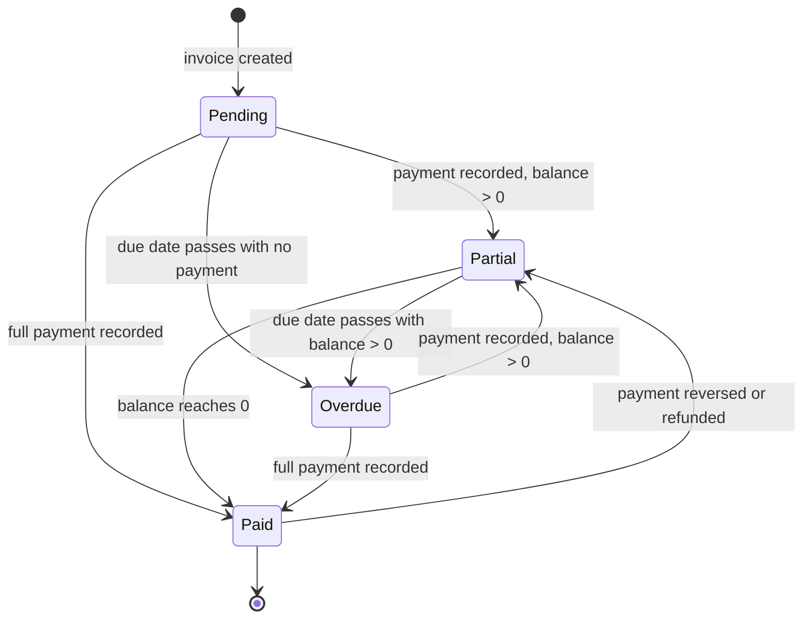
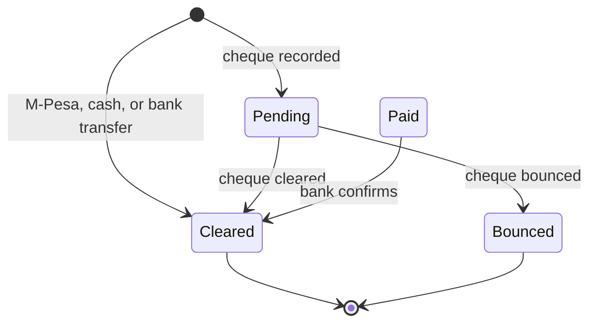
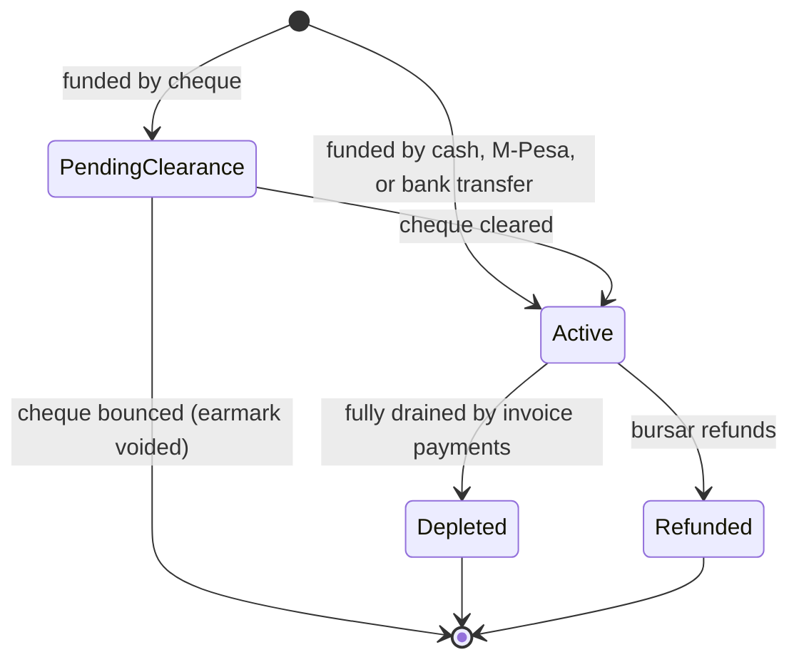
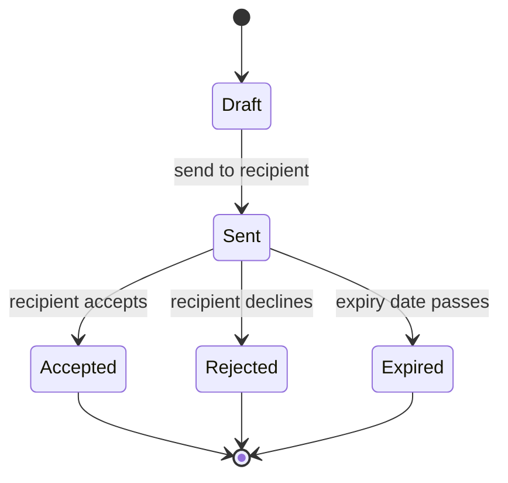

Finance covers everything a school does with money in Elimu Bora: defining fee items, issuing invoices, accepting and reconciling payments (including M-Pesa STK push and Paybill), tracking student wallets, and reserving funds for specific purposes with earmarks. Bursars run it day to day. School leadership uses it for oversight and reports. Guardians can view their children's invoices, payments, wallets, and earmarks, but cannot record payments or move money from the panel.

<Note>
  Finance is an optional module. A school can enable or disable it under Settings. When Finance is disabled, every Finance resource disappears from the sidebar, scheduled overdue checks are skipped for the tenant, and outbound finance notifications are dropped. Inbound M-Pesa callbacks are still received so that late callbacks for payments started before the module was disabled can still be reconciled.
</Note>

## Records you'll work with

| Record | What it is |
|---|---|
| Billable | A fee item that can be charged, such as tuition, transport, or lunch. |
| Billable group | A bundle of billables grouped together (for example, a Term 1 fees bundle). |
| Billable variant | A pricing variation of a billable when one fee has more than one price (for example, per bus route). |
| Per-stage amount | A grade-stage override of a billable's price, so Grade 1 tuition can differ from Grade 8 tuition. |
| Discount | A reduction applied to an invoice or a billable, either a percentage or a fixed amount. |
| Quotation | A pre-invoice quote a school can issue, which a recipient can accept or reject. |
| Sponsor | A third party paying for an invoice (Government, NGO, Corporate, or Individual). |
| Invoice | A bill issued to a student, teacher, or staff member, scoped to a term. |
| Invoice line | One charge on an invoice, tied to a billable or recorded as ad-hoc. |
| Invoice payment | A payment recorded against an invoice. |
| Payment allocation | The split of one payment across the lines of its invoice. |
| Wallet | A per-student credit balance held inside the platform. |
| Wallet transaction | A credit or debit entry on a wallet, with a balance snapshot for audit. |
| Earmark | A portion of wallet balance reserved for a specific billable. |
| Earmark transaction | A funding, drain, refund, or bounce entry on an earmark, with a balance snapshot for audit. |
| M-Pesa integration | The school's stored M-Pesa credentials (shortcode and passkey) and the callback URLs registered with Safaricom. |

## What you can do

<CardGroup cols={2}>
  <Card title="Set up fees" icon="list-check" href="#set-up-fees">
    Define billables, variants, per-stage amounts, and discounts.
  </Card>

  <Card title="Issue invoices" icon="file-text" href="#issue-invoices">
    Create invoices, add lines, edit, cancel, and read the balance.
  </Card>

  <Card title="Record payments" icon="hand-coins" href="#record-payments">
    Cash, bank transfer, cheque, M-Pesa STK push, Paybill (C2B), and refunds.
  </Card>

  <Card title="Run wallets" icon="piggy-bank" href="#run-wallets">
    Top up, spend, and read a student's wallet ledger.
  </Card>

  <Card title="Manage earmarks" icon="lock" href="#manage-earmarks">
    Reserve funds against a specific billable; release, refund, or drain them.
  </Card>

  <Card title="Quotations and sponsors" icon="handshake" href="#quotations-and-sponsors">
    Issue quotations and attach sponsors to invoices.
  </Card>
</CardGroup>

## Set up fees

Fees are built from billables. Each billable has a pricing model that decides what other rows are required.

### Create a billable

<Steps>
  <Step title="Open Billables">
    In the sidebar, go to **Billables** and click **New billable**.
  </Step>
  <Step title="Name the billable and pick a pricing model">
    Pick one of three pricing models:

    - **Flat**: a single price for everyone. Enter the **Default amount**.
    - **Variants**: different prices for different choices (for example, three bus routes). You will add variant rows next.
    - **Per unit**: price multiplied by a quantity entered on each invoice line.
  </Step>
  <Step title="Optionally group the billable">
    Pick a **Billable group** to bundle this billable with related ones (for example, "Term 1 fees"). Groups make it easier to attach a full bundle to an invoice in one step.
  </Step>
  <Step title="Save">
    Click **Save**. The billable becomes available for invoice lines and earmarks.
  </Step>
</Steps>

[Insert screenshot: Billables list at /admin/billables with columns Name, Pricing model, Default amount, Group, and the New billable button in the header]

### Add a billable variant

<Note>
  **You will need:** a billable whose pricing model is set to **Variants**. Variants do not apply to **Flat** or **Per unit** billables.
</Note>

When the pricing model is **Variants**, each variant carries its own amount.

<Steps>
  <Step title="Open the billable">
    From the Billables list, open the parent billable.
  </Step>
  <Step title="Add a variant row">
    In the **Variants** section, click **Add variant**. Enter a label (for example, "Route A: Karen") and the amount.
  </Step>
  <Step title="Save">
    Save the billable. The new variant becomes selectable when an invoice line uses this billable.
  </Step>
</Steps>

### Set a per-stage amount

<Note>
  **You will need:** curriculum stages already set up. Stages are configured under [Curriculum & Structure](/modules/curriculum). Without stages, there is nothing to override on.
</Note>

Use per-stage amounts to charge different prices by curriculum stage (for example, Grade 1 tuition is lower than Grade 8 tuition).

<Steps>
  <Step title="Open the billable and scroll to Per-stage amounts">
    Open the parent billable and find the **Per-stage amounts** section.
  </Step>
  <Step title="Add an override row per stage">
    Pick a curriculum stage and enter the amount for that stage. Stages without a per-stage row fall back to the default amount.
  </Step>
  <Step title="Save">
    Save the billable. Invoice generation will use the per-stage amount for students in the matching stage.
  </Step>
</Steps>

### Define a discount

<Steps>
  <Step title="Open Discounts">
    Go to **Discounts** and click **New discount**.
  </Step>
  <Step title="Pick a discount type and amount">
    Pick **Percentage** to reduce by a percent of the subtotal, or **Fixed** to reduce by a flat currency amount.
  </Step>
  <Step title="Optionally target a billable">
    Leave the target empty to make the discount available for any invoice line, or pick a specific billable to restrict its use.
  </Step>
  <Step title="Save">
    Save the discount. The reduction is capped at the subtotal and floored at zero, so a discount can never produce a negative line.
  </Step>
</Steps>

## Issue invoices

An invoice is the document a school issues to a student, teacher, or staff member. Most invoices target students. The invoice is scoped to a single term.

### Create an invoice

<Note>
  **You will need:** an active term, the student, teacher, or staff member the invoice is for, and (if you want to use a billable rather than an ad-hoc line) the billable already created. If the billable does not exist yet, add it first under [Set up fees](#set-up-fees), or record the charge as an ad-hoc line with a typed label and amount.
</Note>

<Steps>
  <Step title="Open Invoices">
    Go to **Invoices** and click **New invoice**.
  </Step>
  <Step title="Pick the invoiceable">
    Pick whether the invoice is for a **Student**, **Teacher**, or **Staff** member, then pick the specific person.
  </Step>
  <Step title="Pick the term and due date">
    Pick the term this invoice covers, and an optional due date. The due date is what the overdue scan uses.
  </Step>
  <Step title="Add invoice lines">
    Add one line per charge. Each line is either tied to a billable (and inherits its amount) or recorded as an ad-hoc line with a label and amount you type in.
  </Step>
  <Step title="Save the invoice">
    Click **Save**. The invoice starts in **Pending** status. Adding lines automatically recomputes the invoice total. A notification is queued to the invoiceable's guardians (or the staff/teacher themselves).
  </Step>
</Steps>

[Insert screenshot: New invoice form at /admin/invoices/create showing the Invoiceable picker (Student/Teacher/Staff), Term selector, Due date, and the repeating Lines block with Billable, Quantity, Amount, and Discount columns]

### Edit an invoice line

<Steps>
  <Step title="Open the invoice">
    Open the invoice from the list. Use the **Lines** relation manager on the view page.
  </Step>
  <Step title="Edit the line and save">
    Edit the quantity, amount, or discount on the line, then save. The invoice total is recomputed automatically. Direct edits to the invoice's overall **Amount**, **Total paid**, and **Status** fields should not be made by hand because the system maintains those.
  </Step>
</Steps>

### Cancel or delete an invoice

<Steps>
  <Step title="Open the invoice">
    Open the invoice from the list.
  </Step>
  <Step title="Soft delete">
    Use the **Delete** action. This is a soft delete: the invoice can be restored later by a bursar.
  </Step>
  <Step title="Hard delete (Super Admin only)">
    Hard delete (which permanently removes the invoice and cannot be undone) is reserved for Super Admin.
  </Step>
</Steps>

### Read an invoice's balance and history

The invoice view page shows the running total, the **Total paid**, and the current **Balance**. The **Lines** tab lists every charge. The **Payments** tab lists every payment with its method and status. The **Activity log** captures every change.

[Insert screenshot: Invoice view page at /admin/invoices/{id} showing the header summary (Amount, Total paid, Balance, Status badge), the Lines relation manager, and the Payments relation manager with method and status columns]

## Record payments

Payments are recorded against a specific invoice. Five payment methods can be picked manually: **M-Pesa**, **Cash**, **Bank Transfer**, **Cheque**, and the implicit **Earmark** and **Wallet refund** which the system sets for you when those are the source of funds.

### Record a cash or bank transfer payment

<Steps>
  <Step title="Open the invoice">
    Open the invoice from **Invoices**.
  </Step>
  <Step title="Add a payment">
    On the **Payments** relation manager, click **Add payment**.
  </Step>
  <Step title="Pick the method and enter the amount">
    Pick **Cash** or **Bank Transfer**. Enter the amount. For bank transfers, record the bank reference.
  </Step>
  <Step title="Save">
    Save the payment. Cash and bank transfer payments go straight to **Cleared** status. The payment is allocated proportionally across the invoice's unpaid lines unless you override the allocation manually. The invoice status moves to **Partial** or **Paid** based on the new balance, and a receipt PDF is queued to email to the contact.
  </Step>
</Steps>

### Record a cheque payment

Cheques start in **Pending** until a bursar marks them cleared or bounced.

<Steps>
  <Step title="Add a cheque payment">
    On the invoice's **Payments** relation manager, click **Add payment** and pick **Cheque**.
  </Step>
  <Step title="Enter cheque details">
    Enter the cheque number, the drawing bank, the cheque drawn date, and the amount.
  </Step>
  <Step title="Mark cleared or bounced">
    When the cheque clears at the bank, open the payment and use the **Mark cleared** action. The status becomes **Cleared** and the invoice is credited. If the cheque bounces, use **Mark bounced**: the payment status becomes **Bounced**, the credit is reversed, and a **Cheque bounced** notification is sent to the bursar and the relevant guardians.
  </Step>
</Steps>

### Trigger an M-Pesa STK push

<Note>
  **You will need:** the M-Pesa integration configured under [Configure M-Pesa](#configure-m-pesa), and a phone number on file for the guardian who will pay. The guardian's phone number is added when the guardian profile is created under [Users & Identity](/modules/users). Without the integration, the **Pay via M-Pesa** action has no phone-number input because there is nowhere to send the prompt.
</Note>

M-Pesa STK push is initiated from the school side. The bursar opens an invoice and triggers the push to the guardian's phone. Guardians cannot initiate STK push from their own logins; the **Pay via M-Pesa** action is hidden from the Guardian role.

<Steps>
  <Step title="Open the invoice">
    Open the invoice from **Invoices**, or from the **Invoices** tab on the student's profile.
  </Step>
  <Step title="Click Pay via M-Pesa">
    Click **Pay via M-Pesa**. Enter the guardian's phone number and the amount.
  </Step>
  <Step title="Confirm and send the prompt">
    Click **Send prompt**. An M-Pesa payment intent is created (status **Pending**) and Safaricom delivers a SIM Toolkit prompt to the guardian's phone.
  </Step>
  <Step title="Wait for the callback">
    The guardian enters their M-Pesa PIN on their phone. Safaricom posts a callback to the school's tenant subdomain. The system matches the callback to the payment intent, creates an invoice payment, and recomputes the invoice balance. The guardian receives the standard M-Pesa SMS receipt; the school receives a payment receipt email.
  </Step>
</Steps>

[Insert screenshot: Pay via M-Pesa modal launched from a student invoice showing the Phone number and Amount fields and the Send prompt button]

### Reconcile an M-Pesa Paybill (C2B) payment

<Note>
  **You will need:** the M-Pesa integration configured under [Configure M-Pesa](#configure-m-pesa), and the Paybill callback URLs registered with Safaricom Daraja. Without these URLs, deposits will land in the Paybill account but the system will not know about them, so they will not flow into Elimu Bora automatically.
</Note>

When a guardian pays the school's Paybill number from their own M-Pesa menu, the same callback infrastructure receives the deposit and applies it automatically.

<Steps>
  <Step title="Guardian pays the Paybill">
    The guardian sends money to the school's M-Pesa Paybill number, using the student's admission number as the account reference.
  </Step>
  <Step title="System receives the C2B callback">
    Safaricom posts a Confirmation callback to the school's tenant subdomain. The system writes an M-Pesa payment intent and resolves it to the matching invoice, wallet, or earmark using the account reference.
  </Step>
  <Step title="Verify in the panel">
    The payment appears on the **Payments** tab of the resolved invoice (or as a wallet credit, or as earmark funding) within seconds.
  </Step>
</Steps>

### Refund a payment

<Note>
  **You will need:** a cleared payment on the invoice. Pending and bounced payments cannot be refunded; they are reversed by marking them bounced instead.
</Note>

A refund either pays the guardian back externally or credits the value back into the student's wallet for future invoices.

<Steps>
  <Step title="Open the payment">
    Open the payment from the **Payments** relation manager on the invoice.
  </Step>
  <Step title="Pick a refund destination">
    Click **Refund** and pick a destination:

    - **External payout**: the bursar pays the guardian back through a channel outside the system (cash, bank transfer, or M-Pesa B2C). The system records the refund but does not move the money.
    - **Credit to wallet**: the system moves the value into the student's wallet as a credit, ready to settle future invoices.
  </Step>
  <Step title="Confirm">
    Confirm the refund. The original invoice payment is reversed, the invoice balance is recomputed, and (for the wallet path) a wallet credit and a matching earmark transaction are created.
  </Step>
</Steps>

## Run wallets

Each student has a single wallet. The wallet holds a credit balance the school can apply to future invoices.

### Top up a wallet

<Note>
  **You will need:** for **M-Pesa** top-ups, the M-Pesa integration configured under [Configure M-Pesa](#configure-m-pesa) and a phone number on file for the guardian. Cash, bank transfer, and cheque top-ups do not need any integration.
</Note>

<Steps>
  <Step title="Open the wallet">
    Open **Wallets** and pick the student's wallet, or open the student profile and use the **Wallet** tab.
  </Step>
  <Step title="Pick the funding method">
    Pick the method. For **M-Pesa**, click **Top up via M-Pesa** and follow the STK push flow on the guardian's phone. For **Cash**, **Bank Transfer**, or **Cheque**, record a wallet transaction directly (cheque transactions clear or bounce just like cheque invoice payments).
  </Step>
  <Step title="Confirm">
    On success, a wallet transaction is recorded, the balance is updated with a before-and-after snapshot, and a **Wallet funded** notification is sent to the student's guardians.
  </Step>
</Steps>

### Spend from a wallet

The wallet is spent when an invoice payment is recorded with the **Wallet** source. The bursar opens an invoice, records a payment, and picks the wallet as the source. A debit wallet transaction is written, and the corresponding invoice payment is allocated to the invoice's unpaid lines.

If the debit takes the wallet below a configured low-balance threshold, a **Wallet low balance** notification is sent to the guardians.

### Read the wallet ledger

Open the wallet and scroll to the **Transactions** tab. Every credit and debit is listed in date order with the amount, balance before, balance after, and the related invoice payment or earmark transaction. Use the **Wallet statement** header action to download a single-wallet PDF, or **Wallet balances report** on the wallets list to export every wallet's balance to PDF or Excel.

[Insert screenshot: Wallet view page at /admin/wallets/{id} showing the balance summary, the Transactions tab with columns Date, Type, Amount, Balance after, Related, and the Wallet statement action in the header]

## Manage earmarks

An earmark reserves part of a wallet's balance against a specific billable so the bursar cannot accidentally use it for anything else.

### Lock funds with an earmark (Prepay)

<Note>
  **You will need:** the target billable to exist (so the earmark has something to be reserved for). For **M-Pesa** or **Cheque** funding, the M-Pesa integration must be configured under [Configure M-Pesa](#configure-m-pesa). Cash and bank transfer funding do not need any integration.
</Note>

<Steps>
  <Step title="Open the student or the billable">
    Open the student profile and pick the **Earmarks** tab, or open the billable and use the **Prepay** action.
  </Step>
  <Step title="Pick the billable and the funding method">
    Pick the billable the earmark is for. Pick the funding method: **Cash**, **M-Pesa**, **Bank Transfer**, or **Cheque**.
  </Step>
  <Step title="Enter the amount and confirm">
    Enter the amount. Confirm. The earmark is created. For non-cheque methods it starts in **Active** and a funding entry is added to the earmark transaction ledger. For cheques it starts in **Pending clearance** until the cheque clears; if the cheque bounces, an **Earmark cheque bounced** notification is sent.
  </Step>
</Steps>

[Insert screenshot: Earmark view page at /admin/earmarks/{id} showing the reserved amount, the linked billable, the source wallet, status badge (Active, Pending clearance, Depleted, Refunded), and the Refund action]

### Drain an earmark against an invoice payment

Earmark drain happens automatically. When a bursar records a payment on an invoice for the billable the earmark covers, and the student has an active earmark for that billable, the system can settle the payment from the earmark. The earmark transaction ledger gets a **Drain** entry, the wallet records a matching debit, and the invoice is credited. When the earmark balance reaches zero, the status moves to **Depleted**.

### Refund an earmark

<Steps>
  <Step title="Open the earmark">
    Open the earmark from **Earmarks**.
  </Step>
  <Step title="Pick a refund destination">
    Click **Refund** and pick:

    - **External payout**: the bursar pays out the remaining balance through a channel outside the system. The earmark transaction ledger gets a **Refund** entry.
    - **Credit to wallet**: the remaining balance returns to the student's wallet. The ledger gets a **Refund to wallet** entry, and the wallet gets a credit.
  </Step>
  <Step title="Confirm">
    Confirm. The earmark status becomes **Refunded**.
  </Step>
</Steps>

### Read the earmark ledger

Open the earmark and scroll to the **Transactions** tab. Every funding, drain, refund, refund-to-wallet, and bounce entry is listed in date order.

## Quotations and sponsors

### Issue a quotation

<Steps>
  <Step title="Create a quotation">
    Open **Quotations** and click **New quotation**. Add line items the same way you would on an invoice, plus an expiry date.
  </Step>
  <Step title="Send the quotation">
    Save the quotation as **Draft**, then use **Send** to mark it **Sent** and deliver it to the recipient.
  </Step>
  <Step title="Convert or close">
    When the recipient accepts, mark it **Accepted** and convert it to an invoice. If declined, mark it **Rejected**. If the expiry date passes with no response, the status becomes **Expired**.
  </Step>
</Steps>

### Attach a sponsor to a payment

<Note>
  **You will need:** the sponsor record to exist before you record the payment. Add the sponsor first if it does not.
</Note>

<Steps>
  <Step title="Add the sponsor record">
    Open **Sponsors** and click **New sponsor**. Pick a type (**Government**, **NGO**, **Individual**, **Corporate**) and enter contact details.
  </Step>
  <Step title="Record a payment with the sponsor">
    When recording an invoice payment, pick the sponsor from the **Sponsor** field. The payment is tagged so the bursar can run a sponsor-by-sponsor reconciliation later.
  </Step>
</Steps>

## Configure M-Pesa

<Note>
  **You will need:** an M-Pesa Daraja account with the credentials Safaricom issued for your Paybill: shortcode, passkey, consumer key, and consumer secret. If you do not have these, contact Safaricom to register your school as a business and request Daraja API access.
</Note>

A school's M-Pesa credentials live on a **Payment integration** row. The permission to read or change them is restricted to school leadership and bursars in the default role setup.

<Steps>
  <Step title="Open Payment Integrations">
    Go to **Payment Integrations** in the sidebar.
  </Step>
  <Step title="Add or edit the M-Pesa integration">
    Pick the M-Pesa row, or add one if missing. Enter the shortcode, the passkey, the consumer key, and the consumer secret. These come from the school's Safaricom Daraja account.
  </Step>
  <Step title="Register callback URLs with Safaricom">
    In Safaricom Daraja, set the callback URLs to point at the school's tenant subdomain:

    - STK push: `https://<your-subdomain>.elimuboraerp.com/api/mpesa/stk/callback`
    - C2B validation: `https://<your-subdomain>.elimuboraerp.com/api/mpesa/c2b/validation`
    - C2B confirmation: `https://<your-subdomain>.elimuboraerp.com/api/mpesa/c2b/confirmation`
    - B2C result: `https://<your-subdomain>.elimuboraerp.com/api/mpesa/b2c/result`

    Other Daraja callbacks (timeouts, status results, reversals, balance queries) use the matching paths under `/api/mpesa/`.
  </Step>
  <Step title="Test with a small STK push">
    Run a small test STK push against a real invoice to confirm the callback round-trips before going live.
  </Step>
</Steps>

## Statuses and lifecycle

Finance carries four lifecycle status enums. Each status table lists every case, every transition is labelled with the actor or trigger that moves the record, and reversibility is stated.

### Invoice statuses

| Status | What it means | Who can act | What they can do |
|---|---|---|---|
| Pending | Invoice was created. No payments yet, or all payments have been reversed. | Bursar, school leadership | Add lines, edit lines, record a payment, soft-delete. |
| Partial | Some payment has cleared. Balance is still positive. | Bursar, school leadership | Record additional payments, edit lines (carefully), refund a payment. |
| Paid | The full amount has cleared. Balance is zero. | Bursar, school leadership | Refund a payment (returns the invoice to Partial), view the receipt history. |
| Overdue | The due date has passed and the balance is positive. Set by the system's daily overdue scan at 08:00, which also sends an overdue notification. | Bursar, school leadership | Record a payment (returns to Partial or Paid). |

A refund on a Paid invoice returns it to Partial (or Pending if the refund covered every cleared payment). Overdue is not a terminal state; once any payment clears, the invoice returns to Partial or Paid.

### Payment statuses

| Status | What it means | Who can act | What they can do |
|---|---|---|---|
| Pending | Recorded but not yet usable. Typically a cheque awaiting clearance. | Bursar | Mark cleared once funds arrive, or mark bounced if the cheque bounces. |
| Partial | Partial clearance (rare; used for multi-stage bank settlements). | Bursar | Mark cleared once the remainder lands. |
| Paid | Recorded as paid but not yet bank-cleared (legacy or manual override). | Bursar | Mark cleared once the bank confirms. |
| Cleared | Funds confirmed. The payment counts toward the invoice balance. | Bursar | Refund the payment (issues a refund and reverses the cleared amount). |
| Bounced | Cheque or M-Pesa reversal bounced the payment. The credit is reversed and a notification is sent to the bursar and the relevant guardians. | Bursar | View the bounce reason; record a replacement payment. |

Cleared and Bounced are terminal. To reverse a Cleared payment, a refund is recorded against it; that creates a new transaction rather than mutating the original payment.

### Earmark statuses

| Status | What it means | Who can act | What they can do |
|---|---|---|---|
| Pending clearance | Earmark was funded by a cheque that has not yet cleared. Not drainable. | Bursar | Mark cheque cleared (status becomes Active) or wait for bounce. |
| Active | Funded and available to drain against the target billable. | Bursar | Drain (automatic when a matching invoice payment is recorded), refund. |
| Depleted | The earmark has been fully drained by invoice payments. | (none) | View the audit trail. |
| Refunded | The remaining balance was refunded, either externally or back to the wallet. | (none) | View the audit trail. |

A bounced cheque voids the earmark and reverses the funding entry; the earmark does not transition to Refunded in that case.

### Quotation statuses

| Status | What it means | Who can act | What they can do |
|---|---|---|---|
| Draft | Being assembled, not yet sent. | Bursar | Edit lines, send. |
| Sent | Delivered to the recipient. | Bursar | Mark accepted, mark rejected, or wait for the expiry date. |
| Accepted | The recipient accepted. Typically converted to an invoice. | Bursar | Convert to invoice. |
| Rejected | The recipient declined. | (none) | View the audit trail. |
| Expired | The expiry date passed with no response. | Bursar | Reissue a new quotation if needed. |

### Categorical values used on forms

These are not lifecycles. They appear on form pickers when recording or reading finance records.

- **Payment method**: M-Pesa, Cash, Bank Transfer, Cheque, plus Earmark and Wallet refund which the system sets for you.
- **Payment provider**: M-Pesa today. The system is structured so additional providers can be added later without schema changes.
- **Pricing model**: Flat, Variants, or Per unit (on a billable).
- **Discount type**: Percentage or Fixed (on a discount).
- **Refund destination**: External payout (pay the guardian outside the system) or Credit to wallet (return the value to the student wallet).
- **Sponsor type**: Government, NGO, Individual, or Corporate.
- **Earmark transaction type**: Funding (initial deposit), Drain (consumed by an invoice payment), Refund (paid out externally), Refund to wallet (returned to the wallet), Bounce (cheque-funded earmark voided).

## How records relate

A few relationships are worth keeping in mind:

- An invoice is made of one or more lines, and is paid by one or more payments. Each payment is split (allocated) across the invoice's unpaid lines. The allocation is automatic and proportional by default; a bursar can override it line by line.
- Each student has a single wallet, and a wallet keeps a running ledger of every credit and debit.
- An earmark belongs to a student and reserves part of the wallet for one specific billable. An earmark keeps its own ledger of every funding, drain, refund, or bounce entry.
- An M-Pesa flow targets exactly one of an invoice, a wallet, or an earmark. The account reference the guardian uses (or the action a bursar takes) tells the system where the cleared payment should land.

## Reports and analytics

Reports come in two shapes: downloads (PDF or Excel, generated when you click the action), and emailed receipts (sent automatically when a payment clears).

| Report | Where | Filters | Output |
|---|---|---|---|
| Invoice detail | **Download invoice** header action on a single invoice | None (single invoice) | Portrait PDF with lines, payments, and balance |
| Fee Collection Summary | Header action on the **Invoices** list | Date range, optional grade level, optional billable | Landscape PDF or Excel showing invoiced, paid, and outstanding totals |
| Outstanding Balances | Header action on the **Invoices** list | Optional "overdue only" toggle | PDF or Excel listing every unpaid or partial invoice |
| Line Statement | Per-row action on the **Lines** tab of an invoice (visible when the line has any payment) | None (single line) | Portrait PDF showing one invoice line with its payment allocations |
| Payment Receipt | Per-row action on the **Payments** tab of an invoice | None (single payment) | Portrait PDF receipt (same template as the emailed receipt) |
| Wallet Balances Report | Header action on the **Wallets** list | Optional grade level, stream, maximum-balance threshold | PDF or Excel listing every wallet balance |
| Wallet Statement | Header action on a single wallet | None (single wallet) | Portrait PDF showing every credit and debit on the wallet |
| Emailed receipt | Sent automatically when a payment clears | None | PDF receipt emailed to the contact via the **Send payment receipt** job |

Every download inherits the same permission as its parent page (for example, **invoices.viewAny** for the invoice reports), so a user who can see the invoice can pull the report.

## What guardians see

Guardians log in to the tenant panel under the locked **Guardian** role and have **read-only**, child-scoped access. They can read:

- Their children's invoices and the line breakdown.
- Payment history on each invoice, with the method and status.
- Each child's wallet balance and the wallet transaction ledger.
- Each child's earmarks and the earmark transaction ledger.

The Guardian role explicitly **cannot**:

- Record a payment (the **Add payment** and **Pay via M-Pesa** actions are hidden).
- Refund a payment (the **Refund** action is hidden).
- Top up a wallet from the panel (the wallet top-up actions are hidden).
- Lock funds with an earmark from the panel (the **Prepay** action is hidden).
- Edit any invoice, line, payment, or wallet record.
- See or manage M-Pesa payment integration credentials.

Notifications still reach guardians regardless of whether they log in. Invoice creation, overdue reminders, wallet funded, wallet debited, wallet low balance, cheque bounced, and earmark cheque bounced messages are sent to the guardian's stored contacts. M-Pesa STK push prompts are initiated by the school; the guardian sees them on their phone the same way they would for any other Daraja STK push.

## FAQs and troubleshooting

<AccordionGroup>
  <Accordion title="How do I handle a partial scholarship?">
    Use a **Discount** if the reduction is a known amount or percentage off the billable price: create a discount of the right type and amount, then apply it on the invoice line during invoice creation. Use a **Sponsor** if a third party is paying the balance: add the sponsor record, then when you record the payment, pick the sponsor on the payment form so the reconciliation report can group the payment under that sponsor.
  </Accordion>

  <Accordion title="What happens when a guardian overpays?">
    The cleared payment still applies in full to the invoice, which moves the invoice to **Paid**. To return the surplus, record a **Refund** on the relevant payment and pick **Credit to wallet** to keep the value on the student's account for future invoices, or **External payout** if the bursar is paying the guardian back through a channel outside the system.
  </Accordion>

  <Accordion title="How do refunds reach a guardian?">
    The school decides. **External payout** records the refund in Elimu Bora but the money movement happens outside the system (cash at the office, bank transfer, M-Pesa B2C). **Credit to wallet** keeps the value inside the platform by moving it into the student's wallet, ready for the next invoice. Either way the original invoice payment is reversed and the invoice balance is recomputed.
  </Accordion>

  <Accordion title="Why did an M-Pesa Paybill payment not apply to the right invoice?">
    Paybill (C2B) deposits are matched using the **account reference** the guardian typed in their M-Pesa menu. If that reference does not match a student admission number, the deposit will land but will not auto-apply. Open the M-Pesa payment intents list, find the unresolved deposit, and use the manual resolution action to apply it to the right invoice or wallet.
  </Accordion>

  <Accordion title="What happens when a cheque bounces?">
    For an invoice payment, mark the payment **Bounced**. The cleared credit is reversed, the invoice balance is recomputed, and the **Cheque bounced** notification is sent to the bursar and the relevant guardians. For an earmark funded by cheque, the earmark is voided: the funding entry on its ledger is reversed and the **Earmark cheque bounced** notification is sent. In both cases the bursar should record a replacement payment when the funds arrive again.
  </Accordion>

  <Accordion title="Can a guardian pay an invoice directly from their login?">
    No. Guardians have read-only access to invoices, payments, wallets, and earmarks. The **Pay via M-Pesa**, **Add payment**, **Top up**, and **Prepay** actions are hidden from the Guardian role. M-Pesa STK push prompts are initiated by the school side; the guardian then authorises the prompt on their phone. Guardians can still push payments to the school's Paybill from their own M-Pesa menu, and those will reconcile automatically through C2B.
  </Accordion>

  <Accordion title="Where do M-Pesa callbacks go if Finance is disabled?">
    They are still received and logged. Inbound Safaricom callbacks are intentionally not gated by the module so that late callbacks for payments started before the module was disabled can still be matched. With Finance disabled, however, no new payment intents are being created, so most inbound callbacks find nothing to resolve and become no-ops.
  </Accordion>

  <Accordion title="Why can I not delete an invoice?">
    Standard delete is a soft delete and is available to bursars and school leadership. The invoice can be restored later. **Hard delete** (which permanently removes the invoice and cannot be undone) is reserved for Super Admin. If a soft-deleted invoice is in your way, ask a bursar to restore it instead of hard-deleting.
  </Accordion>
</AccordionGroup>
