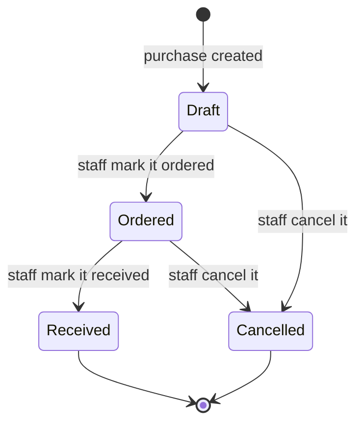
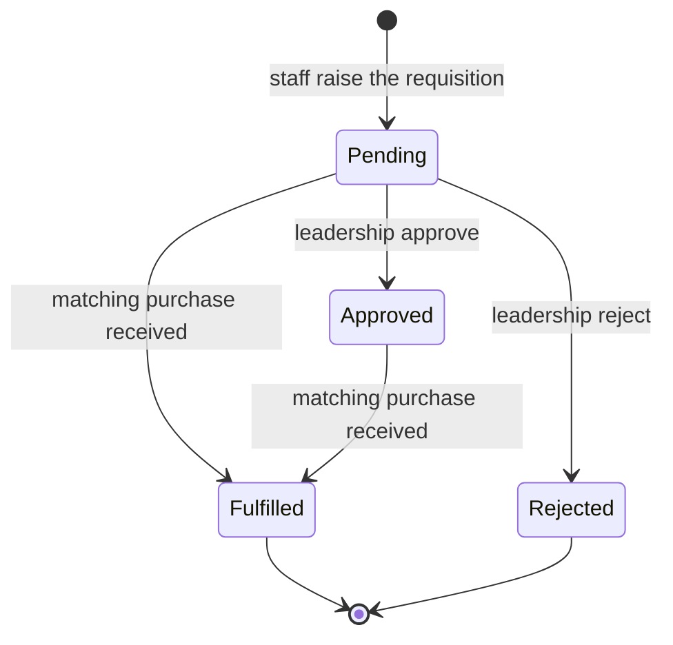
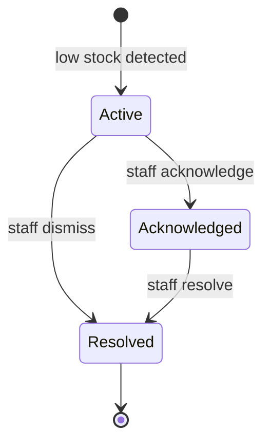

Inventory & Procurement is the school's stockroom in Elimu Bora. It keeps a catalogue of the physical goods a school holds (stationery, kitchen supplies, cleaning materials, library books, sports gear, and more), tracks how much of each item is on hand, and records the procurement chain that replenishes them: the suppliers you buy from, the purchases you place, the requisitions staff raise for stock, and the low-stock alerts the system raises on its own. Storekeepers, procurement, catering, and library staff run it day to day; school leadership approves requisitions and reviews stock value. Everything sits under the **Inventory Management** group in the sidebar.

<Note>
  Inventory & Procurement is an optional module. A school that does not run a stockroom can disable it under **Modules** in Settings. When it is disabled, every Inventory page disappears from the sidebar, the daily low-stock check is skipped, and inventory notifications stop. The **Assigned Items** list on a student, teacher, or staff profile shows a locked notice until the module is turned back on.
</Note>

## Records you'll work with

| Record | What it is |
|---|---|
| Product | A catalogue item the school stocks, such as exam paper, cooking oil, or a textbook title. Carries a category, a unit of measure, a unit price, and a reorder level. |
| Stock | The current quantity on hand for a product, with its storeroom location and the date it was last restocked. There is one stock record per product. |
| Stock movement | A single line in the running history of a product's stock: every receipt, issue, adjustment, return, or wastage, with the quantity before and after the change and who made it. |
| Supplier | A vendor the school buys from. Holds the supplier's contact details and payment terms, and links to the products they supply and the purchases placed with them. |
| Purchase | A procurement order placed with a supplier, made up of one or more item lines. Carries an order status and a payment status. |
| Purchase item | One product line on a purchase, with the quantity ordered, the quantity received, the unit price, and the line subtotal. |
| Requisition | A staff member's request for stock of a product, with a reason and a priority, routed through an approval lifecycle. |
| Low-stock alert | A flag the system raises on its own when a product drops to or below its reorder level. |

## What you can do

<CardGroup cols={2}>
  <Card title="Catalogue" icon="boxes-stacked" href="#catalogue">
    Add and categorise the products you track.
  </Card>

  <Card title="Suppliers" icon="store" href="#suppliers">
    Keep supplier contacts and review their purchase history.
  </Card>

  <Card title="Purchases" icon="cart-shopping" href="#purchases">
    Place orders and receive delivered goods into stock.
  </Card>

  <Card title="Stock" icon="warehouse" href="#stock">
    Read stock levels, adjust counts, and follow movement history.
  </Card>

  <Card title="Requisitions" icon="clipboard-list" href="#requisitions">
    Raise, approve, or reject staff requests for stock.
  </Card>

  <Card title="Low-stock alerts" icon="bell" href="#low-stock-alerts">
    Review what is running low and act on it.
  </Card>
</CardGroup>

## Catalogue

A product is one item the school stocks. Before you can track stock, place a purchase, or raise a requisition, the product must exist in the catalogue. Open **Products** in the sidebar, or go to `/products`.

### Add a product

<Steps>
  <Step title="Open the form">
    Go to **Products** and click **New product**.
  </Step>
  <Step title="Fill in the basic info">
    In **Basic Info**, enter the **Name**, an optional **SKU** (a stock-keeping code of your own), and an optional **Description**.
  </Step>
  <Step title="Set the category and unit">
    In **Category & Measurement**, pick the **Category** (see [the categories below](#product-categories)) and enter the **Unit of Measure**, the label this item is counted in, such as `box`, `kg`, `ream`, or `each`.
  </Step>
  <Step title="Set the supplier and price">
    In **Supplier & Pricing**, optionally pick a default **Supplier** for the item, and enter the **Unit Price** in KES.
  </Step>
  <Step title="Set the reorder rules">
    In **Stock Management**, enter the **Reorder Level** (the quantity at or below which the item counts as low stock and triggers an alert) and the **Reorder Quantity** (the amount the system suggests reordering when it runs low).
  </Step>
  <Step title="Save">
    Click **Create**. The product is added to the catalogue and a stock record is started for it at zero on hand, ready to receive deliveries.
  </Step>
</Steps>

[Insert screenshot: New product form at /products/create showing the Basic Info section (Name, SKU, Description), the Category & Measurement section (Category, Unit of Measure), the Supplier & Pricing section (Supplier, Unit Price), and the Stock Management section (Reorder Level, Reorder Quantity)]

### Edit or categorise a product

Open a product from **Products** and click **Edit** to change any detail. The product list can be filtered by **Category**, and a **Low Stock** toggle narrows it to items at or below their reorder level. Changing a product's **Reorder Level** changes which items the next low-stock check flags. A product can be deleted from the list; deleting it removes it from the catalogue without erasing the stock history already recorded against it.

[Insert screenshot: Products list at /products with columns Name, Category badge, Supplier, Unit Price, Current Stock, Reorder Level, the Category filter, and the Low Stock toggle]

### Product categories

Every product is filed under one category. The category groups products on the dashboard charts and the report filters. The categories are:

- **Library Books**
- **Kitchen Food**
- **Kitchen Equipment**
- **Stationery**
- **Cleaning**
- **Medical**
- **Sports**
- **Other**

## Suppliers

A supplier is a vendor the school buys from. Recording a supplier lets you set them as a product's default vendor, place purchases against them, and review everything you have ordered from them in one place. Open **Suppliers** in the sidebar, or go to `/suppliers`.

### Add a supplier

<Steps>
  <Step title="Open the form">
    Go to **Suppliers** and click **New supplier**.
  </Step>
  <Step title="Enter the supplier details">
    Enter the **Name**, the **Contact Person**, the **Email**, the **Phone**, the **Address**, the **Payment Terms** (for example, "30 days"), and any **Notes**. Only the name is required.
  </Step>
  <Step title="Save">
    Click **Create**. The supplier becomes selectable on products and purchases.
  </Step>
</Steps>

[Insert screenshot: New supplier form at /suppliers/create showing Name, Contact Person, Email, Phone, Address, Payment Terms, and Notes fields]

### Review a supplier's purchase history

Open a supplier from **Suppliers** to view their record. The **Products** tab lists the catalogue items for which this supplier is the default vendor, and the **Purchases** tab lists every order placed with them, with each purchase's date, invoice number, total amount, amount paid, payment status, and order status. Use **Edit** to update the supplier's contacts or terms.

[Insert screenshot: Supplier view page at /suppliers/{id} showing the supplier details and the Purchases tab with columns Purchase Date, Invoice Number, Total Amount, Amount Paid, Payment Status, and Status]

## Purchases

A purchase is an order placed with one supplier, made up of one or more item lines. Receiving a purchase is what posts the delivered goods into stock. Open **Purchases** in the sidebar, or go to `/purchases`.

### Create a purchase

<Note>
  **You will need:** the supplier and at least one product already in the system. Add the supplier under [Suppliers](#suppliers) and the products under [Catalogue](#catalogue) first, so they can be picked on the order.
</Note>

<Steps>
  <Step title="Open the form">
    Go to **Purchases** and click **New purchase**.
  </Step>
  <Step title="Fill in the order details">
    In **Order Details**, pick the **Supplier**, set the **Purchase Date**, enter an optional **Invoice Number** (the supplier's own document number), and add any **Notes**.
  </Step>
  <Step title="Add the item lines">
    In **Items**, add one line per product. For each line pick the **Product** (the **Unit Price** fills in from the catalogue, and you can override it) and enter the **Quantity**. The line **Subtotal** is worked out for you, and the order **Total Amount** is the sum of the lines.
  </Step>
  <Step title="Record any payment up front (optional)">
    In **Payment**, set the **Payment Status** and the **Amount Paid** if you are paying with the order. These can also be updated later from the purchase list.
  </Step>
  <Step title="Save">
    Click **Create**. The purchase is saved as a **Draft**, with its lines still editable.
  </Step>
</Steps>

[Insert screenshot: New purchase form at /purchases/create showing the Order Details section (Supplier, Purchase Date, Invoice Number, Notes), the Items repeater with Product, Quantity, Unit Price, and Subtotal columns, and the Payment section (Total Amount, Payment Status, Amount Paid, Status)]

### Place an order

When the order is sent to the supplier, open the purchase row on the **Purchases** list and use **Mark as Ordered**. The status moves from **Draft** to **Ordered**, recording that the order is now placed and awaiting delivery.

### Receive a purchase into stock

<Note>
  **You will need:** a purchase in the **Ordered** status. The **Mark as Received** action appears only on ordered purchases, so place the order first.
</Note>

<Steps>
  <Step title="Open the action">
    On the **Purchases** list, find the ordered purchase and use **Mark as Received**.
  </Step>
  <Step title="Set the received date">
    Enter the **Received At** date (it defaults to today) and confirm.
  </Step>
  <Step title="Stock is posted automatically">
    The purchase status moves to **Received**. Each item line's received quantity is posted into stock as a receipt movement, the on-hand quantity for each product goes up, and each product's last-restocked date is stamped. Any open requisitions for those products are marked fulfilled, and staff who handle inventory are notified that the delivery arrived.
  </Step>
</Steps>

[Insert screenshot: Purchases list at /purchases with columns Purchase Date, Supplier, Invoice #, Total Amount, Payment Status badge, Status badge, and the Mark as Ordered, Mark as Received, and Record Payment row actions]

### Record a payment on a purchase

Use the **Record Payment** action on a purchase row to log money paid to the supplier. Enter the **Amount Paid** in KES. The amount is added to what has been paid so far, and the purchase's payment status moves to **Partial** while a balance remains, or **Paid** once the total is covered. This payment tracks what the school owes the supplier; it is separate from the fee payments guardians make in [Finance](/modules/finance).

### Cancel a purchase

A purchase that will not be received can be set to **Cancelled** from its **Edit** page by changing the status. A cancelled order does not post anything into stock. Cancellation is final: a cancelled purchase stays cancelled.

## Stock

The **Stock** page is the live count of what the school holds. There is one stock row per product, started at zero when the product is created and changed only through the actions below, never typed in directly. Open **Stock** in the sidebar, or go to `/stock`.

### View stock levels

The **Stock** list shows each product, its category, the **Quantity In Stock** (shown in red when at or below the reorder level), the reorder level, the storeroom location, and the date it was last restocked. Filter by **Category**, by **Stock Level** (Low, OK, or Out of Stock), or with the **Low Stock** toggle.

[Insert screenshot: Stock list at /stock with columns Product, Category badge, Quantity In Stock, Reorder Level, Location, Last Restocked, the Category and Stock Level filters, and the Low Stock toggle]

### Adjust stock

<Note>
  **You will need:** the product already in the catalogue, with a stock row (created automatically when the product is added). Use an adjustment for corrections such as a stock-take difference, breakage, or expiry, when the count on hand does not match the count in the system.
</Note>

<Steps>
  <Step title="Open the action">
    On the **Stock** list, find the product and use **Adjust Stock**.
  </Step>
  <Step title="Enter the corrected count">
    Enter the **New Quantity** (the true count you have physically confirmed) and a short **Notes** explaining the reason, so the history stays clear.
  </Step>
  <Step title="Save">
    Confirm. The on-hand quantity is set to the new count, and an adjustment movement is recorded for the difference, with your name against it.
  </Step>
</Steps>

[Insert screenshot: Adjust Stock modal launched from the Stock list showing the New Quantity field and the Notes field]

### Issue stock to a person

Stock is issued to a student, teacher, or staff member from their own profile, not from the Stock page. Open the person's profile in [Users & Identity](/modules/users) and use the **Assigned Items** tab. Click **Issue Item**, pick the item (the available stock shows beside it), enter the **Quantity to Issue**, and add a note. The on-hand quantity drops by the amount issued, an issue movement is recorded against that person, and the item appears in their **Assigned Items** list. See the [Assigned Items report](/modules/users) on the student profile.

### View movement history

Every change to a product's stock is kept as a movement. Open a product from **Products** and use the **Movements** tab to read its full history, or use the **Movements Report** on the **Stock** list to export movements across products. Each movement is one of these types:

- **Purchase** (incoming): stock received from a delivered purchase. Also stamps the last-restocked date.
- **Return** (incoming): stock returned into the store.
- **Issue** (outgoing): stock issued to a person or destination.
- **Adjustment** (outgoing correction): a stock-take or correction that lowers the recorded count.
- **Wastage** (outgoing): stock written off as damaged, expired, or lost.

## Requisitions

A requisition is a staff member's request for stock of a product. It records what is needed, why, and how urgently, and routes the request to leadership for a decision. Open **Requisitions** in the sidebar, or go to `/stock-requisitions`. The sidebar shows a badge with the number of requisitions still awaiting a decision.

### Raise a requisition

<Note>
  **You will need:** the product already in the [catalogue](#catalogue), so it can be picked on the request.
</Note>

<Steps>
  <Step title="Open the form">
    Go to **Requisitions** and click **New requisition**.
  </Step>
  <Step title="Fill in the request">
    Pick the **Product**, enter the **Requested Quantity**, pick the **Reason** and the **Priority** (see [the values below](#requisition-reasons-and-priorities)), and add any **Notes**.
  </Step>
  <Step title="Submit">
    Click **Create**. The requisition starts as **Pending** and the staff who handle requisitions are notified that a new request needs a decision.
  </Step>
</Steps>

[Insert screenshot: New requisition form at /stock-requisitions/create showing Product, Requested Quantity, Reason, Priority, and Notes fields]

### Approve or reject a requisition

<Note>
  **You will need:** a requisition in the **Pending** status, and the permission to approve requisitions (held by school leadership in the default role setup). The **Approve** and **Reject** actions appear only on pending requisitions.
</Note>

On the **Requisitions** list, find the pending request and use **Approve** to accept it or **Reject** to decline it. Rejecting prompts for a **Rejection Reason**, which is recorded and sent back to the requester. Approving moves the requisition to **Approved**; rejecting moves it to **Rejected** and ends it. The person who raised a requisition can edit or delete it only while it is still **Pending**.

[Insert screenshot: Requisitions list at /stock-requisitions with columns Product, Requested By, Quantity, Priority badge, Status badge, Created date, and the Approve, Reject, and Edit row actions]

### Fulfil a requisition

A requisition is fulfilled by buying the stock. When you receive a [purchase](#receive-a-purchase-into-stock) that includes the requested product, the system marks any matching pending or approved requisition for that product as **Fulfilled** automatically. There is no separate "issue against requisition" step; receiving the goods into stock closes the request.

### Requisition reasons and priorities

When raising a requisition you pick a reason and a priority. Neither is a status; they describe the request for its lifetime.

- **Reason:** Low Stock, Out of Stock, New Requirement, or Damaged Items.
- **Priority:** Low, Medium, High, or Urgent.

## Low-stock alerts

A low-stock alert flags a product that has dropped to or below its reorder level. The system raises alerts on its own, in two ways: a daily check runs each morning, and an alert is also raised the moment a stock movement leaves a product at or below its reorder level. Only one active alert exists per product per day, so you are not flooded with duplicates. Open **Low Stock Alerts** in the sidebar, or go to `/low-stock-alerts`. A red badge on the sidebar entry counts the active alerts.

### Review and act on an alert

The list shows each alert's product, category, current quantity, reorder level, the date it was raised, and its status. The actions available depend on the status:

- **Acknowledge** (on an active alert) records that staff have seen it and are acting, moving it to **Acknowledged**.
- **Dismiss** (on an active alert) closes it straight away, moving it to **Resolved**, for cases where no action is needed.
- **Create Requisition** (on an acknowledged alert) opens a pre-filled requisition for the flagged product, so you can request a restock in one step. The quantity defaults to the product's reorder quantity, and the priority defaults to High, or Urgent when the product is fully out of stock.

You can also select several alerts and use **Acknowledge Selected** or **Resolve Selected** to act on them in bulk.

[Insert screenshot: Low Stock Alerts list at /low-stock-alerts with columns Product, Category badge, Current Qty, Reorder Level, Alert Date, Status badge, and the Acknowledge, Create Requisition, and Dismiss row actions]

## Statuses and lifecycle

Inventory carries three status lifecycles: one on purchases, one on requisitions, and one on low-stock alerts.

### Purchase statuses

| Status | What it means | Who can act | What they can do |
|---|---|---|---|
| Draft | The order is being assembled. Its lines are still editable. | Procurement, leadership | Edit the lines; mark the order placed; cancel it. |
| Ordered | The order has been placed with the supplier and is awaiting delivery. | Procurement, leadership | Mark the purchase received when the goods arrive; cancel it. |
| Received | The goods have been delivered. The items are posted into stock and any matching requisitions are fulfilled. | Procurement, leadership | Read the purchase; record payments against it. |
| Cancelled | The order was abandoned before receipt. Nothing was posted into stock. | (none) | Read the purchase. |

Received and Cancelled are final; there is no action that returns a purchase to an earlier status. A purchase also carries a separate **Payment Status** (Pending, Partial, or Paid) that tracks how much of the order the school has paid the supplier; recording a payment moves it from Pending to Partial and then to Paid.

### Requisition statuses

| Status | What it means | Who can act | What they can do |
|---|---|---|---|
| Pending | A new request awaiting a decision. New requisitions start here. | Requester, leadership | The requester can edit or delete it; leadership can approve or reject it. |
| Approved | Leadership accepted the request. It now waits for the stock to be bought and received. | Leadership, procurement | Place a purchase for the product; the requisition is fulfilled when that purchase is received. |
| Ordered | A purchase has been raised to satisfy the request. | Procurement | The requisition is fulfilled when the matching purchase is received. |
| Fulfilled | The requested stock has arrived. Set automatically when a received purchase covers the product. | (none) | Read the requisition. |
| Rejected | The request was declined, with a reason recorded. | (none) | Read the requisition and its rejection reason. |

Receiving a purchase fulfils any pending, approved, or ordered requisition for the same product, so a request can move to **Fulfilled** as soon as the goods arrive. Fulfilled and Rejected are final.

### Low-stock alert statuses

| Status | What it means | Who can act | What they can do |
|---|---|---|---|
| Active | The alert has just been raised; the product is still at or below its reorder level. | Inventory staff | Acknowledge it, dismiss it, or restock the product. |
| Acknowledged | Staff have seen the alert and are acting on it. | Inventory staff | Create a requisition for the product, or resolve the alert. |
| Resolved | The alert is closed, either because the stock was replenished or because it was dismissed. | (none) | Read the alert. |

Resolved is final. If the same product drops low again later, the system raises a fresh alert.

## How records relate

A few user-visible relationships are worth keeping in mind:

- A product has exactly one stock record and a running history of stock movements. The stock count is never typed in directly; it moves only through receipts, issues, adjustments, returns, and wastage.
- A supplier supplies many products and fulfils many purchases. A product can name one supplier as its default vendor.
- A purchase belongs to one supplier and is made of one or more item lines, each tied to a product. Receiving the purchase posts each line's received quantity into the matching product's stock.
- A requisition is for one product. Receiving a purchase that includes that product fulfils the requisition.
- A low-stock alert belongs to one product. From an acknowledged alert you can spin up a requisition for that product in one step.
- Stock issued to a student, teacher, or staff member is recorded against that person and shows on their **Assigned Items** list in [Users & Identity](/modules/users).

## Reports and analytics

Inventory reports are generated from the page that owns the data. The first three are prepared in the background and you are notified when each is ready; the low-stock report downloads straight away.

| Report | Where | Filters | Output |
|---|---|---|---|
| Stock Levels Report | **Stock Levels Report** header action on the **Stock** list | Optional category, format, low-stock-only toggle | PDF or Excel of products and their on-hand quantities |
| Movements Report | **Movements Report** header action on the **Stock** list | Date range, optional product, optional movement type, format | PDF or Excel of stock movements over the period |
| Requisitions Report | **Requisitions Report** header action on the **Requisitions** list | Optional priority, approved-only toggle, format | PDF or Excel of requisitions and their statuses |
| Low Stock Report | **Low Stock Report** header action on the **Low Stock Alerts** list | Optional category, format | PDF or Excel of products at or below their reorder level |

The leadership dashboard also carries Inventory widgets covering total stock value, stock by category, recent requisitions, and current low-stock alerts.

## What guardians see

Guardians sign in to the same tenant subdomain as staff under the locked, read-only **Guardian** role. They do not see the Inventory pages: the **Products**, **Suppliers**, **Purchases**, **Stock**, **Requisitions**, and **Low Stock Alerts** sidebar entries are all staff-only.

The one place inventory reaches a guardian is the **Assigned Items** tab on their own child's profile, which lists items the school has issued to that child (the item, category, quantity issued, who issued it, any note, and the date). This list is read-only for guardians: the **Issue Item** action is hidden from the Guardian role, so a guardian can see what their child has been given but cannot issue, return, or change anything.

## FAQs and troubleshooting

<AccordionGroup>
  <Accordion title="How do I correct a wrong stock count?">
    Use **Adjust Stock** on the **Stock** list. Enter the true count you have physically confirmed as the new quantity and add a note explaining why (a stock-take difference, breakage, or expiry). The system records an adjustment movement for the difference, with your name against it, so the history stays auditable. Stock counts are never typed directly into the stock row; they only change through receipts, issues, adjustments, returns, and wastage.
  </Accordion>

  <Accordion title="I marked a purchase received with the wrong quantity. How do I fix the stock?">
    Receiving a purchase is final and cannot be reversed, so do not re-receive it. Correct the on-hand count with **Adjust Stock** on the **Stock** list instead, entering the true quantity and a note explaining the receipt error. The adjustment leaves a clear trail of the correction.
  </Accordion>

  <Accordion title="Can a requisition be edited after it is submitted?">
    Only while it is still **Pending**, and only by the person who raised it (or a staff member with permission to update requisitions). Once leadership approves or rejects it, the requisition is locked. If an approved request is no longer needed, it simply will not be fulfilled, since fulfilment happens when a matching purchase is received.
  </Accordion>

  <Accordion title="Why was a requisition marked Fulfilled when I did not touch it?">
    Requisitions are fulfilled automatically. When you receive a purchase that includes the requested product, the system marks any pending, approved, or ordered requisition for that product as **Fulfilled**. That is the intended flow: you satisfy a request by buying and receiving the stock, not by a separate manual step.
  </Accordion>

  <Accordion title="Why didn't a low-stock alert appear for an item I know is low?">
    An alert is raised only when a product's on-hand quantity is at or below its **Reorder Level**, and only one active alert exists per product per day. Check the product's reorder level on the **Products** list: if it is set to zero or lower than you expect, raise it so the item is flagged sooner. The daily check also runs each morning, so an item that just dropped low may be flagged at the next run if no movement triggered an immediate alert.
  </Accordion>

  <Accordion title="What is the difference between dismissing and resolving an alert?">
    Both close the alert and move it to **Resolved**. **Dismiss** is the action on an active alert for cases where no action is needed; **Resolve Selected** is the bulk equivalent. Resolving after acknowledging is the path you take once the stock has actually been replenished. In every case the alert ends as Resolved, and a fresh alert is raised if the product drops low again later.
  </Accordion>

  <Accordion title="How do I write off damaged or expired stock?">
    Issuing and adjustment cover most corrections. For a downward correction such as a stock-take difference, breakage, or expiry, use **Adjust Stock** and enter the lower count with a note. The change is recorded as an adjustment movement so the loss is visible in the product's movement history.
  </Accordion>
</AccordionGroup>
