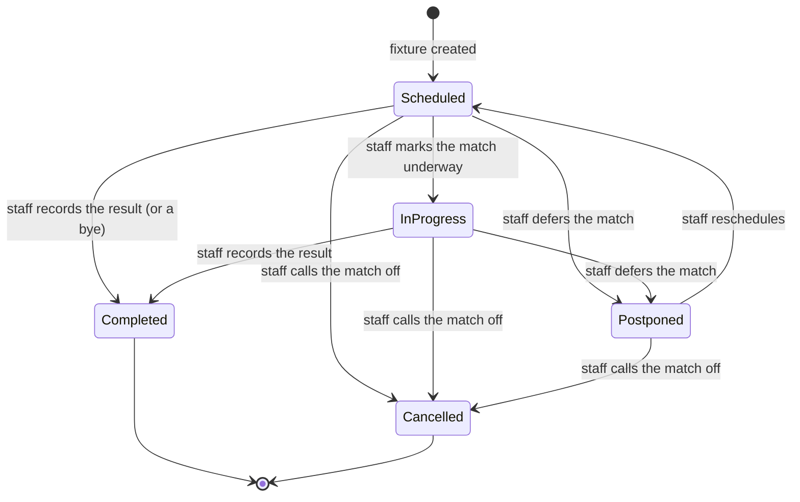
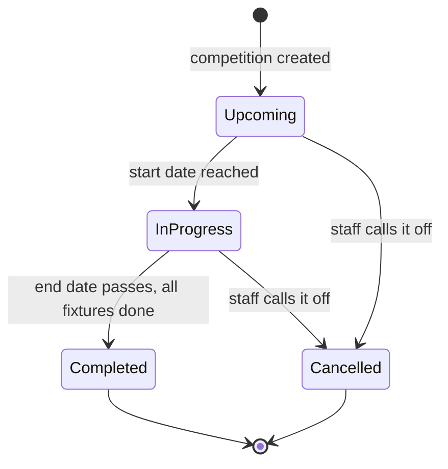

Sports & Games is where the school runs its competitive and recreational sport: the catalogue of sports offered, the houses students belong to, the teams fielded for each sport, the competitions and fixtures played, the results recorded, the awards granted, and the inter-house points leaderboard. A sports coordinator or PE head runs the day-to-day. Teachers who coach a team can record results and update their own team's fixtures. School leadership oversees it all. Guardians do not record anything; they see a read-only summary of their own children's team memberships, fixtures, and awards.

<Note>
  Sports & Games is an optional module. A school can enable or disable it under Settings. When the module is off, the whole **Sports & Games** group disappears from the sidebar and sport notifications stop going out. Turn it back on and everything returns exactly as it was.
</Note>

## Records you'll work with

| Record | What it is |
|---|---|
| Sport | A sport the school offers, such as Football or Athletics. Marked **Team** or **Individual**, which decides how its results are recorded. |
| House | A school house, such as a colour-named house, with a name, colour, and motto. Students belong to a house, and houses collect points. |
| Team | A squad fielded for one sport in one academic year, with a category (age and gender band), a type (House or School), an optional house, and an optional coach. |
| Team member | A student on a team's roster, with an optional position, a captain flag, and the date they joined. |
| External school | A rival school the school plays against, used as the opponent on inter-school fixtures. |
| Competition | A tournament or league for one sport, with a level, scope, format, dates, and an academic-year and term context. |
| Fixture | A single scheduled match, with a date, venue, the two sides (or a team and an external school), and a status. May belong to a competition. |
| Match result | The score for a team fixture: home score, away score, and a derived outcome (Home Win, Away Win, or Draw). One per fixture. |
| Individual result | One athlete's result in an individual-sport fixture: the event, the position, an optional time or distance, and a personal-best flag. |
| Award | A recognition granted to a student for a sport, such as MVP or Top Scorer, scoped to a term and an optional competition. |
| House point entry | A points row credited to a house, either swept in automatically from a house-level result or recorded by hand for a non-sport category such as Cleanliness or Discipline. |

## What you can do

<CardGroup cols={2}>
  <Card title="Set up sports and houses" icon="trophy" href="#set-up-sports-and-houses">
    Add the sports the school offers, the houses students belong to, and the rival schools you play.
  </Card>

  <Card title="Build teams" icon="users" href="#build-teams">
    Field a team for a sport, fill the roster, and appoint patrons and house leaders.
  </Card>

  <Card title="Competitions and fixtures" icon="flag" href="#competitions-and-fixtures">
    Create a competition, schedule fixtures, and draw a knockout bracket.
  </Card>

  <Card title="Record results" icon="pencil" href="#record-results">
    Enter team scores and individual placements, and grant awards.
  </Card>

  <Card title="Inter-house points" icon="building" href="#inter-house-points">
    Read the automatic sweep on house results, award points by hand, and read the standings.
  </Card>
</CardGroup>

## Set up sports and houses

Everything else in this module hangs off a sport, a house, or an external school, so set these up first. Open **Sports & Games** in the sidebar.

### Add a sport

To offer a new sport, add it to the sports catalogue.

<Steps>
  <Step title="Open Sports">
    Go to **Sports** and click the create action, or go to `/sports`.
  </Step>
  <Step title="Fill in the sport">
    Enter the **Name**, pick the **Type** (**Team** or **Individual**), and add an optional **Description**. Leave **Active** on so the sport can be picked when building teams and competitions.
  </Step>
  <Step title="Save">
    Save. The **Type** is what decides how results are recorded later: a Team sport is scored with a home and away score, an Individual sport with per-athlete placements. Pick it carefully, because it changes the result form.
  </Step>
</Steps>

[Insert screenshot: New sport form at /sports/create showing the Name field, the Type selector (Team, Individual), the Description box, and the Active toggle]

### Add a house

Houses are the basis of the inter-house points system. Add each of the school's houses once.

<Steps>
  <Step title="Open Houses">
    Go to **Houses** and click the create action, or go to `/houses`.
  </Step>
  <Step title="Fill in the house">
    Enter the **Name**, pick a **Color**, add an optional **Motto** and **Description**, and leave **Active** on.
  </Step>
  <Step title="Save">
    Save. Students are placed into a house from their own profile under [Users & Identity](/modules/users); the house is a tag on the student record. Once a house exists, you can assign its patrons and leaders and it starts collecting points.
  </Step>
</Steps>

[Insert screenshot: Houses list at /houses showing the colour swatch, Name, Motto, Students count, and Active columns]

### Assign house patrons and leaders

Each house carries a slate of staff patrons and student leaders for an academic year. Open a house and use its tabs.

- On the **Patrons** tab, add a teacher and pick their role (**Head Patron** or **Assistant Patron**) for an academic year.
- On the **Leaders** tab, add a student (from that house) and pick their role (**Captain**, **Vice Captain**, **Secretary**, or **Sports Captain**) for an academic year, with the date they were appointed. One student holds each role per house per year.

The **Students** tab lists the house's members for reference. The **Point Entries** tab is covered under [Inter-house points](#inter-house-points).

### Add an external school

Record a rival school once, then pick it as the opponent on any inter-school fixture.

<Steps>
  <Step title="Open External Schools">
    Go to **External Schools** and click the create action, or go to `/external-schools`.
  </Step>
  <Step title="Fill in the school">
    Enter the **Name**, and optionally the **County**, **Town**, **Contact Person**, **Phone**, **Email**, and **Notes**.
  </Step>
  <Step title="Save">
    Save. The school is now selectable as the opponent on inter-school fixtures. You can also add one on the fly from the fixture form without leaving the page.
  </Step>
</Steps>

## Build teams

A team is a squad fielded for one sport in one academic year. Build the team first, then fill its roster.

### Create a team

<Note>
  **You will need:** at least one **Team**-type [sport](#add-a-sport) marked Active, and, for a house team, the [house](#add-a-house) it belongs to. The **Sport** picker lists only active team sports, and the **House** picker lists only active houses.
</Note>

<Steps>
  <Step title="Open Teams">
    Go to **Teams** and click the create action, or go to `/teams`.
  </Step>
  <Step title="Fill in the team">
    Pick the **Sport** and enter a **Name** (for example, "Under-16 Football"). Pick the **Category** (the age and gender band) and the **Type** (**House** or **School**). When you pick **House**, a **House** picker appears and is required. Pick the **Academic Year**. Optionally pick a **Coach** (a teacher) and add a **Description**. Leave **Active** on.
  </Step>
  <Step title="Save">
    Save. The team now exists with an empty roster. The coach you pick can record results and update this team's fixtures without holding the full sports permission.
  </Step>
</Steps>

[Insert screenshot: New team form at /teams/create showing the Sport, Name, Category, and Type selectors, the conditional House picker, the Coach picker, the Academic Year selector, and the Active toggle]

### Select the roster

Add students to a team from the team's own **Team Roster** tab.

<Note>
  **You will need:** the team to exist, and the students to be admitted under [Users & Identity](/modules/users) so they appear in the **Student** picker.
</Note>

<Steps>
  <Step title="Open the team">
    Open the team from **Teams** and go to the **Team Roster** tab.
  </Step>
  <Step title="Add a member">
    Click **Add Member**. Pick the **Student**, enter an optional **Position**, tick **Team Captain** if they captain the side, and set the **Joined On** date. A student already on the roster cannot be added twice.
  </Step>
  <Step title="Save">
    Save. The student joins the roster, and their guardians are notified that the child has been selected for the team.
  </Step>
</Steps>

[Insert screenshot: Team Roster tab on a team's view page showing the student name, Position, Captain, and Joined columns, with the Add Member action]

### Edit a team

Open a team from **Teams** and click **Edit** to change any detail, the coach, or the active flag. To take a student off a team, open the **Team Roster** tab and remove their row. Renaming or deactivating a team does not delete its history; past fixtures and results stay readable.

## Competitions and fixtures

A competition groups fixtures into a tournament or league. A fixture is a single match. You can schedule a one-off friendly fixture without a competition, or create a competition and schedule its fixtures under it.

### Create a competition

<Note>
  **You will need:** the [sport](#add-a-sport) the competition is for, and the academic year it runs in. Years and terms are seeded under [Academic Years & Terms](/modules/academic-years) and ready to pick.
</Note>

<Steps>
  <Step title="Open Competitions">
    Go to **Competitions** and click the create action, or go to `/competitions`.
  </Step>
  <Step title="Fill in the competition">
    Pick the **Sport** and enter a **Name**. Pick the **Level** (**House**, **School**, **Sub-County**, **County**, **Regional**, or **National**), the **Scope** (**Intra-School** or **Inter-School**), and the **Format** (**League**, **Knockout**, or **Group + Knockout**). For a knockout or group-and-knockout format, optionally set the **Total Rounds**. Pick the **Academic Year** and an optional **Term**, set the **Start Date** and an optional **End Date**, and add an optional **Venue** and **Description**.
  </Step>
  <Step title="Save">
    Save. The competition starts as **Upcoming**. Setting the **Level** to **House** is what turns on the automatic inter-house points sweep when its results are recorded (see [Inter-house points](#inter-house-points)).
  </Step>
</Steps>

### Schedule a fixture

<Note>
  **You will need:** the [sport](#add-a-sport), the [teams](#create-a-team) playing (for an intra-school match) or the [external school](#add-an-external-school) (for an inter-school match). A fixture can stand alone as a friendly, or belong to a [competition](#create-a-competition).
</Note>

<Steps>
  <Step title="Open Fixtures">
    Go to **Fixtures** and click the create action, or go to `/fixtures`.
  </Step>
  <Step title="Fill in the fixture">
    Pick the **Sport** and an optional **Competition**. Set the **Fixture date** and optional **Start time** and **End time**. Pick the **Scope**:

    - **Intra-School** shows a **Home Team** and an **Away Team** picker, both drawn from the chosen sport's teams.
    - **Inter-School** shows a **Home Team** picker and an **Opponent School** picker for the external school. You can add a new external school here without leaving the form.

    For an **Individual** sport, the team pickers are hidden; you'll add each athlete's placement when you record the result. The **Opponent School** picker still appears for an Inter-School fixture.

    Enter an optional **Venue** and **Notes**. The **Status** defaults to **Scheduled**.
  </Step>
  <Step title="Save">
    Save. The fixture is created as **Scheduled**, and the guardians of the players on both sides are notified that the match is set. When the [Events](/modules/events) module is on, the fixture also appears on the school calendar.
  </Step>
</Steps>

[Insert screenshot: New fixture form at /fixtures/create showing the Sport and Competition selectors, the date and time fields, the Scope selector, the Home Team and Away Team or Opponent School pickers, and the Status selector defaulting to Scheduled]

### Generate a knockout bracket

<Note>
  **You will need:** a **Knockout** or **Group + Knockout** [competition](#create-a-competition) that has no bracket yet, and the [teams](#create-a-team) to seed into it.
</Note>

For a knockout competition, the system draws the whole bracket for you instead of you scheduling each round by hand.

<Steps>
  <Step title="Open the competition">
    Open the competition from **Competitions** and find the header actions.
  </Step>
  <Step title="Generate the draw">
    Click **Generate Draw**. Tick the teams to include. Optionally turn on **Apply standard seeding** to pair the strongest against the weakest (1 vs N, 2 vs N-1, and so on); leave it off for a random draw.
  </Step>
  <Step title="Confirm">
    Confirm. The system creates one fixture per bracket slot and wires the rounds together so that winning a match advances a team to the next one. If there is an odd team out, that team gets a bye and is advanced automatically. The drawn bracket appears on the competition's **Bracket** tab.
  </Step>
</Steps>

You can redraw a bracket with **Reset Draw** while the competition is still **Upcoming**; this permanently removes the drawn fixtures and any results, so use it before play begins. A **Group + Knockout** competition has a separate **Generate Knockout Bracket** action to seed the qualifying teams into the knockout phase once the group stage is set.

## Record results

A result is recorded straight onto a fixture, from the **Record Result** action on the **Fixtures** list. The form matches the sport: team sports take a score, individual sports take per-athlete placements. There is no separate publish step; recording the result is what completes the fixture and triggers notifications and any house-points sweep.

### Record a team result

<Note>
  **You will need:** a **Scheduled** or **In Progress** fixture for a **Team** sport. The **Record Result** action is hidden once a fixture is **Completed**, **Postponed**, or **Cancelled**.
</Note>

<Steps>
  <Step title="Open the action">
    On the **Fixtures** list, find the fixture and click **Record Result**.
  </Step>
  <Step title="Enter the score">
    Enter the **Home Score** and the **Away Score**. Tick **Walkover** if the match was awarded without play. Add optional result **Notes**.
  </Step>
  <Step title="Save">
    Save. The fixture moves to **Completed**, the outcome (Home Win, Away Win, or Draw) is worked out from the scores, the players' guardians are notified that the result is recorded, and, in a knockout competition, the winner advances to the next fixture. For a **House**-level competition, house points are swept in automatically (see [Inter-house points](#inter-house-points)).
  </Step>
</Steps>

[Insert screenshot: Record Result modal for a team fixture showing the Home Score and Away Score fields, the Walkover toggle, and the Notes box]

### Record individual results

<Note>
  **You will need:** a **Scheduled** or **In Progress** fixture for an **Individual** sport, and the athletes admitted under [Users & Identity](/modules/users) so they appear in the **Student** picker.
</Note>

<Steps>
  <Step title="Open the action">
    On the **Fixtures** list, find the individual-sport fixture and click **Record Result**.
  </Step>
  <Step title="Add each athlete's result">
    Click **Add Result** for each athlete. Pick the **Student**, enter the **Event** name, the finishing **position**, an optional **time** or **distance** record, and tick **Personal Best** if it was one.
  </Step>
  <Step title="Save">
    Save. The fixture moves to **Completed** and the athletes' guardians are notified. For a **House**-level competition, the top three placements earn their house 5, 3, and 1 points respectively.
  </Step>
</Steps>

You can also view and adjust individual results on a fixture's **Individual Results** tab after the match.

### Grant an award

<Note>
  **You will need:** the recipient [student](/modules/users), the [sport](#add-a-sport) the award is for, and the term. An optional [competition](#create-a-competition) can be attached.
</Note>

<Steps>
  <Step title="Open Awards">
    Go to **Awards** and click the create action, or go to `/awards`.
  </Step>
  <Step title="Fill in the award">
    Pick the **Student**, the **Sport**, and an optional **Competition**. Pick the **Award type** (**MVP**, **Best Player**, **Most Improved**, **Top Scorer**, **Sportsmanship**, or **Custom**). For a **Custom** award, a **Custom Title** field appears and is required. Pick the **Term** and **Academic Year**, and add an optional **Citation / Reason**.
  </Step>
  <Step title="Save">
    Save. The recipient's guardians are notified that the award was granted.
  </Step>
</Steps>

## Inter-house points

Houses collect points from two sources: an automatic sweep when a house-level competition result is recorded, and manual entries a coordinator records for non-sport categories. The running leaderboard is shown on the dashboard.

### How the automatic sweep works

When you record a result for a fixture in a competition whose **Level** is **House**, the system writes the house points for you, with no extra step:

- **Team results** credit the winning team's house 3 points, and a draw credits each house 1 point. A loss earns nothing.
- **Individual results** credit the athlete's house 5, 3, or 1 points for finishing first, second, or third.

These swept entries carry the **Sports** category and point back to the result that produced them. If you correct a result, the swept points are recalculated to match; if you delete a result, its swept points are removed. You cannot edit or delete a swept entry by hand, because it is owned by the result.

### Award house points by hand

For categories that are not sport, such as cleanliness or discipline, record the points yourself.

<Note>
  **You will need:** at least one active [house](#add-a-house) and a term to file the points under. This action is available to staff who hold the award-house-points permission, granted through [Roles & permissions](/roles-permissions).
</Note>

<Steps>
  <Step title="Open Award House Points">
    Go to **Award House Points** under **Sports & Games**.
  </Step>
  <Step title="Fill in the entry">
    Pick the **Category** (**Cleanliness**, **Academics**, **Discipline**, **Co-Curricular**, **Sports**, or **Other**), set the **Date**, write a **Description**, and pick the **Term**. Enter the points for each house in the same step; leave a house blank or at zero to skip it.
  </Step>
  <Step title="Submit">
    Submit. One entry is created per house you gave points to, and the standings update. You can also add a single manual entry from a house's **Point Entries** tab.
  </Step>
</Steps>

[Insert screenshot: Award House Points page showing the Category selector, Date, Description, and Term fields, and a points input per house]

### Read the standings

The **House Leaderboard** on the leadership dashboard shows each house's total points for the current term, ordered highest first. A house's own **Point Entries** tab lists every entry behind its total, with the date, category, points, and whether each came from a result or was recorded by hand.

## Statuses and lifecycle

Sports & Games has two records that move through a real lifecycle: fixtures and competitions. Teams, sports, and houses do not carry a lifecycle status; they have an **Active** flag that simply controls whether they can be picked on new records, which is described under [Build teams](#build-teams) and [Set up sports and houses](#set-up-sports-and-houses).

### Fixture statuses

| Status | What it means | Who can act | What they can do |
|---|---|---|---|
| Scheduled | The fixture is set but not yet played. New fixtures start here. | Coordinator, the teams' coaches, leadership | Record the result, or mark the fixture In Progress, Postponed, or Cancelled by editing it. |
| In Progress | The match is underway. | Coordinator, coaches, leadership | Record the result, or mark it Postponed or Cancelled. |
| Completed | The result has been recorded. | (none) | Read the result. The result can still be corrected on the fixture. |
| Postponed | The match was deferred. The affected players' guardians are notified. | Coordinator, coaches, leadership | Reschedule it back to Scheduled, or cancel it. |
| Cancelled | The match was called off. The affected players' guardians are notified. Also set in bulk when the parent competition is cancelled. | (none) | Read the fixture. |

Recording a result moves a fixture straight to **Completed**. The other moves are made by editing the fixture and changing its **Status**.

### Competition statuses

A competition's status is maintained for you, by date, except for cancellation, which is a manual choice.

| Status | What it means | Who can act | What they can do |
|---|---|---|---|
| Upcoming | Created but not yet started. New competitions start here. A knockout bracket can only be drawn or reset while the competition is Upcoming. | Coordinator, leadership | Schedule fixtures, draw or reset a knockout bracket, or cancel the competition. |
| In Progress | The start date has been reached. | Coordinator, leadership | Record results; cancel the competition. |
| Completed | The end date has passed and no fixtures are left outstanding. | (none) | Read the competition and its results. |
| Cancelled | The competition was called off. Every still-scheduled fixture in it is cancelled too. | (none) | Read the competition. |

The move from Upcoming to In Progress and from In Progress to Completed happens on its own as the dates pass. Cancelling is the only status a staff member sets by hand, and it cascades to the competition's scheduled fixtures.

### Categorical values used on forms

These are not lifecycles. They appear on form pickers when setting up sports records.

- **Sport type:** Team or Individual. Set on the sport; decides whether results are a score or per-athlete placements.
- **Team category:** the age and gender band a team competes in (U-14 Boys, U-14 Girls, U-16 Boys, U-16 Girls, U-19 Boys, U-19 Girls, Open Boys, Open Girls, or Mixed).
- **Team type:** House (the team belongs to a house) or School (the team represents the whole school).
- **Competition level:** House, School, Sub-County, County, Regional, or National. The House level is what turns on the automatic inter-house points sweep.
- **Competition scope:** Intra-School (within the school) or Inter-School (against another school, using an external school as the opponent).
- **Competition format:** League, Knockout (a single-elimination bracket), or Group + Knockout.
- **Match outcome:** Home Win, Away Win, or Draw. Worked out from the scores, not entered.
- **Award type:** MVP, Best Player, Most Improved, Top Scorer, Sportsmanship, or Custom (which uses a free-text title).
- **House patron role:** Head Patron or Assistant Patron.
- **House leader role:** Captain, Vice Captain, Secretary, or Sports Captain.
- **House point category:** Sports, Cleanliness, Academics, Discipline, Co-Curricular, or Other.

## How records relate

A few user-visible relationships are worth keeping in mind:

- A sport is the root of its teams, competitions, and fixtures. A team belongs to one sport and one academic year, and a house team also belongs to a house.
- A team's roster is its students. A student can be on more than one team, across different sports.
- A fixture is for one sport and is played between two teams, or between a team and an external school. It may belong to a competition, or stand alone as a friendly.
- A team fixture has one match result; an individual fixture has one result per athlete.
- An award belongs to one student and one sport, scoped to a term and an optional competition.
- A house collects points from house-level results (swept in automatically) and from manual entries. The student's house is set on the student record under [Users & Identity](/modules/users).
- A student's per-term sports participation, teams, fixtures, and awards, also appears as a summary on their report card under [Assessments & Report Cards](/modules/assessments) when both modules are in use.

## Reports and analytics

Sports & Games surfaces its analytics as dashboard widgets rather than downloadable files. On the leadership dashboard, staff who can view sports see:

| Widget | What it shows |
|---|---|
| Sports | Headline counts for the current term: upcoming fixtures, fixtures played, wins, and awards. |
| House Leaderboard | Each house's total points for the current term, ordered highest first. |
| Recent Results | The latest recorded match results. |
| Top Performers | The students with the most awards this term, by sport. |

A house's **Point Entries** tab is the per-house breakdown behind the leaderboard total.

## What guardians see

Guardians sign in to the same tenant subdomain as staff. Their account holds the locked **Guardian** role, which is read-only and scoped to their own children. In this area, a guardian sees the **Sports & Games** widget on their dashboard, which summarises, per child, for the current term:

- The child's number of active team memberships.
- The number of fixtures the child played this term.
- The number of awards the child received this term.

Guardians also receive notifications, whether or not they log in, when a child is selected for a team, when a fixture for the child is scheduled, postponed, or cancelled, when a match result for the child is recorded, and when the child is granted an award.

The Guardian role does **not** see the **Sports**, **Teams**, **Fixtures**, **Competitions**, **Awards**, **External Schools**, or **Houses** pages, nor the **Award House Points** page. Every recording action, creating a team, selecting a roster, scheduling a fixture, recording a result, granting an award, awarding house points, is staff-only and never exposed to a guardian.

## FAQs and troubleshooting

<AccordionGroup>
  <Accordion title="How do I correct a score I recorded wrong?">
    Open the fixture and update its match result, or, for an individual sport, adjust the rows on the **Individual Results** tab. The outcome is recalculated from the corrected scores, and if the fixture is in a house-level competition the swept house points are recalculated to match. There is no separate publish step to undo.
  </Accordion>

  <Accordion title="Why is the Record Result button missing on a fixture?">
    It only appears while a fixture is **Scheduled** or **In Progress**. A **Completed**, **Postponed**, or **Cancelled** fixture does not show it. If the fixture is already Completed and you need to change the score, open it and edit the result directly rather than recording a new one.
  </Accordion>

  <Accordion title="How are inter-house points calculated?">
    They are swept in automatically when you record a result for a fixture in a competition whose **Level** is **House**. A team win earns the winning team's house 3 points and a draw earns each house 1; an individual first, second, or third place earns the athlete's house 5, 3, or 1 points. Points for other categories, such as cleanliness or discipline, are recorded by hand on the **Award House Points** page. If your house standings are not changing after a match, check that the competition's Level is set to House and that the teams or athletes are assigned to a house.
  </Accordion>

  <Accordion title="Can a student be on more than one team?">
    Yes. A student can be on several teams across different sports. Within a single team's roster, the same student cannot be added twice.
  </Accordion>

  <Accordion title="How do I draw a knockout tournament?">
    Create the competition with a **Knockout** format while it is still **Upcoming**, open it, and click **Generate Draw**. Pick the teams, optionally apply standard seeding, and confirm. The system builds the full bracket and advances winners automatically as results come in. To redraw, use **Reset Draw**, which is available only while the competition is still Upcoming.
  </Accordion>

  <Accordion title="What happens to a competition's fixtures if I cancel it?">
    Cancelling a competition cancels every fixture in it that is still **Scheduled**. Fixtures that were already completed keep their results. The affected players' guardians are notified that their fixtures were cancelled.
  </Accordion>

  <Accordion title="How do I record the school's results against another school?">
    Set the competition or fixture **Scope** to **Inter-School**, then pick the rival from the **Opponent School** picker. Add the rival under **External Schools** first, or create it inline from the fixture form. Record the result the same way you would for any team fixture.
  </Accordion>
</AccordionGroup>
